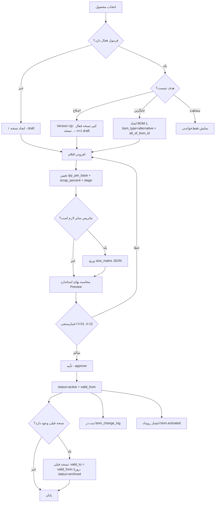

# 01-production-formulas.md
## زیرگروه ۱ — فرمول‌های تولید (BOM — Bill of Materials)

---

## ۱. هدف ماژول

تعریف **«دستور ساخت»** هر محصول: چه موادی، چقدر، با چه ضایعاتی، در چه مرحله‌ای.
این ماژول **هیچ سند حسابداری تولید نمی‌کند** — داده پایه (Master Data) است. اما **مبنای هر چهار ماژول اجرایی (۲، ۳، ۷، ۸) و برآورد (۵)** است.

**اهداف عملیاتی برای ترنم:**
1. حذف محاسبه دستی مصرف پارچه — «چند متر کتان برای ۳۰۰ عدد مانتو ترمه؟»
2. قفل کردن استاندارد → امکان سنجش انحراف
3. نسخه‌بندی → «فرمول قبل از عید» ≠ «فرمول بعد از عید»
4. فرمول جایگزین → پارچه سبز تمام شد، با پارچه یشمی بزن
5. ماتریس سایز → مصرف سایز ۴۸ ≠ سایز ۳۸

---

## ۲. موجودیت‌ها (Entities)

| موجودیت | جدول | نقش |
|---------|------|-----|
| سرفصل فرمول | `bom_headers` | محصول، نسخه، اعتبار، وضعیت |
| اقلام فرمول | `bom_lines` | مواد و مقادیر |
| تاریخچه تغییرات | `bom_change_log` | ECO — چه کسی، کِی، چه چیزی |
| مراحل (اختیاری) | `bom_operations` | فقط در ماژول ۴ |
| خروجی‌ها (اختیاری) | `bom_outputs` | فقط در ماژول ۴ |

> در این ماژول (۱) فقط **فرمول تک‌سطحی بدون Routing** ساخته می‌شود:
> `is_multilevel=0`, `has_routing=0`, `has_coproducts=0`
> ماژول ۴ همین ساختار را با سه جدول دیگر کامل می‌کند.

## ۳. روابط

```
products (1) ────< bom_headers (N)          هر کالا چند نسخه فرمول
bom_headers (1) ──< bom_lines (N)           هر فرمول چند قلم
bom_headers (1) ──< bom_change_log (N)
bom_lines (N) ────> products (1)            هر قلم به یک کالا اشاره دارد
bom_headers (N) ──> bom_headers (1)         alt_of_bom_id — فرمول جایگزین
products (1) ─────> bom_headers (1)         default_bom_id
```

**قید یکتایی:** `UNIQUE(product_id, version, revision)`
**قید کسب‌وکار:** برای هر `product_id` در هر بازه زمانی، **حداکثر یک** فرمول با `status='active'` و `is_default=1`.

---

## ۴. چرخه حیات (State Machine)

```
        ┌──────── ویرایش آزاد ───────┐
        ▼                             │
  ┌──────────┐   تأیید      ┌──────────┐
  │  draft   │─────────────►│  active  │
  │ پیش‌نویس │              │  فعال    │
  └────┬─────┘              └────┬─────┘
       │ حذف                     │ نسخه جدید
       ▼                          ▼
  ┌──────────┐              ┌──────────┐   منسوخ   ┌──────────┐
  │ (deleted)│              │ archived │◄──────────│ obsolete │
  └──────────┘              │  بایگانی │           │  منسوخ   │
                            └──────────┘           └──────────┘
```

**قواعد گذار:**
| از | به | شرط |
|----|-----|-----|
| `draft` → `active` | حداقل ۱ قلم + `valid_from` معتبر + مجوز `approve` | trigger قفل خطوط فعال می‌شود |
| `active` → `archived` | نسخه جدیدی `active` شده باشد **یا** کاربر admin | سفارش باز نداشته باشد |
| `active` → *ویرایش* | **ممنوع** — فقط با `version_up` | `E_BOM_LOCKED` |
| `archived` → `active` | فقط admin + دلیل | نسخه فعلی archive می‌شود |
| هر → `obsolete` | کالا از رده خارج | فقط اطلاعاتی |

---

## ۵. Workflow کامل



---

## ۶. الگوریتم‌ها و فرمول‌ها

### ۶.۱ محاسبه مقدار موردنیاز (Requirement Calculation)

```
برای هر قلم L در فرمول B، برای تولید مقدار Q از محصول:

  factor = Q / B.base_qty

  qty_net   = (L.fixed_qty > 0 ? L.fixed_qty : L.qty_per_base × factor)
  qty_gross = qty_net / (1 − L.scrap_percent/100)
  qty_final = qty_gross / (B.yield_percent/100)
```

**چرا تقسیم و نه ضرب؟**
اگر ۴٪ ضایعات داریم، برای اینکه ۱.۶ متر **سالم** بماند، باید ۱.۶ / ۰.۹۶ = **۱.۶۶۷ متر** برداریم. ضرب در ۱.۰۴ (= ۱.۶۶۴) اشتباه رایج و **غلط** است.

**مثال ترنم:**
```
تولید ۳۰۰ عدد مانتو ترمه، فرمول base_qty=1، yield=97٪
پارچه: qty_per_base=1.60، scrap=4٪

  factor    = 300 / 1 = 300
  qty_net   = 1.60 × 300 = 480.00 متر
  qty_gross = 480 / 0.96 = 500.00 متر
  qty_final = 500 / 0.97 = 515.46 متر   ← این عدد به انبار می‌رود
```

### ۶.۲ ماتریس سایز (Size Matrix)

```
اگر L.size_matrix خالی نباشد و order.size_breakdown موجود باشد:

  qty_net = Σ(size) [ size_matrix[size] × size_breakdown[size] ]

در غیر این صورت از qty_per_base × factor استفاده کن.
```

**مثال:**
```
size_breakdown = {"38":30, "40":60, "42":80, "44":70, "46":40, "48":20}   جمع=300
size_matrix    = {"38":1.45,"40":1.50,"42":1.55,"44":1.60,"46":1.70,"48":1.80}

qty_net = 30×1.45 + 60×1.50 + 80×1.55 + 70×1.60 + 40×1.70 + 20×1.80
        = 43.5 + 90 + 124 + 112 + 68 + 36 = 473.5 متر
qty_gross = 473.5 / 0.96 = 493.23
qty_final = 493.23 / 0.97 = 508.48 متر

⇒ صرفه‌جویی ۶.۹۸ متر نسبت به محاسبه ساده (515.46)  ≈ ۶.۶ میلیون ریال
```

> **این تنها دلیل کافی برای پیاده‌سازی ماتریس سایز است.**

### ۶.۳ بهای استاندارد فرمول

```
std_material_rial = Σ(L) [ qty_final(L) × price(L) ]

price(L) بر اساس settings/price_basis:
  average        → products.average_cost_rial
  last_purchase  → آخرین purchase_invoice_items.unit_price_rial
  std            → products.std_cost_rial
  manual         → bom_lines.std_cost_rial

std_unit_rial = std_material_rial / Q       (فقط مواد — دستمزد و سربار در ماژول ۴)
```

### ۶.۴ حل نسخه فرمول (BOM Version Resolution)

```
resolveBom(productId, date, preferredBomId?, altAllowed=false):
  اگر preferredBomId موجود → همان (فقط اعتبارسنجی تاریخ)

  candidates = SELECT * FROM bom_headers
    WHERE product_id = :productId
      AND status = 'active'
      AND deleted_at IS NULL
      AND (valid_from = '' OR valid_from <= :date)
      AND (valid_to   = '' OR valid_to   >= :date)
      AND (altAllowed OR bom_type = 'standard')

  اگر candidates خالی → E_NO_ACTIVE_BOM
  اگر len(candidates) == 1 → همان
  در غیر این صورت:
     ۱) is_default = 1 را ترجیح بده
     ۲) در صورت تساوی، جدیدترین valid_from
     ۳) در صورت تساوی، بیشترین version
     ۴) اگر باز هم چند تا → E_AMBIGUOUS_BOM (نباید رخ دهد)
```

### ۶.۵ گروه اقلام جایگزین (Substitute Group)

```
اقلامی که substitute_group یکسان دارند = جایگزین یکدیگر.
مجموع qty_per_base آن‌ها معنی ندارد — فقط یکی مصرف می‌شود.

هنگام محاسبه نیاز:
  برای هر گروه g:
    اقلام = lines with substitute_group = g، مرتب بر substitute_priority (صعودی)
    برای هر قلم به ترتیب:
        available = warehouse_stock(item, WH-RAW) − reserved
        اگر available >= qty_final → انتخاب همین، خروج از حلقه
    اگر هیچ‌کدام کافی نبود → قلم با priority=0 انتخاب و کسری گزارش شود
```

### ۶.۶ Version Up (کپی نسخه)

```
versionUp(bomId, reason):
  old = bom_headers[bomId]
  اگر old.status != 'active' → E_ONLY_ACTIVE_CAN_VERSION_UP

  new = clone(old) با:
      version   = old.version + 1
      revision  = nextRevision(old.revision)   // A→B→C
      status    = 'draft'
      valid_from = ''
      valid_to   = ''
      is_default = 0
      code      = allocateNumber('bom','BOM')
      approved_by = NULL, approved_at = NULL

  کپی همه bom_lines / bom_operations / bom_outputs با bom_id جدید
  ثبت bom_change_log(change_type='version_up', reason)
  return new.id
```

### ۶.۷ فعال‌سازی (Activate)

```
activate(bomId, validFrom, userId):
  b = bom_headers[bomId]
  اجرای اعتبارسنجی‌های V-01..V-12 → در صورت خطا abort

  transaction:
     prev = SELECT * FROM bom_headers
            WHERE product_id=b.product_id AND status='active'
              AND bom_type=b.bom_type AND id<>bomId
     اگر prev موجود:
        prev.valid_to = jalaliAddDays(validFrom, -1)
        prev.status   = 'archived'
        log(prev.id, 'archive', reason='نسخه جدید ' + b.version)

     b.status     = 'active'
     b.valid_from = validFrom
     b.is_default = (prev ? prev.is_default : 1)
     b.approved_by = userId
     b.approved_at = now()

     products[b.product_id].default_bom_id = b.id   (اگر is_default)
     log(b.id, 'activate')
     emit('bom.activated', {bomId, productId})
```

---

## ۷. قوانین اعتبارسنجی

| کد | قانون | خطا |
|----|-------|-----|
| V-01 | فرمول باید حداقل یک قلم `line_type='material'` داشته باشد | `E_BOM_EMPTY` |
| V-02 | `qty_per_base > 0` یا `fixed_qty > 0` (نه هر دو صفر) | `E_BOM_QTY_ZERO` |
| V-03 | `0 ≤ scrap_percent < 100` | `E_BOM_SCRAP_RANGE` |
| V-04 | `0 < yield_percent ≤ 100` | `E_BOM_YIELD_RANGE` |
| V-05 | `component_product_id ≠ bom.product_id` (خودارجاعی) | `E_BOM_SELF_REF` |
| V-06 | حلقه چندسطحی ممنوع (DFS تا عمق ۱۰) | `E_BOM_CIRCULAR` |
| V-07 | `component_product_id` تکراری نباشد مگر `substitute_group` متفاوت | `E_BOM_DUP_LINE` |
| V-08 | واحد قلم با `products.unit_id` سازگار باشد | `E_BOM_UNIT_MISMATCH` |
| V-09 | بازه `valid_from..valid_to` با نسخه فعال دیگر هم‌پوشانی نداشته باشد | `E_BOM_OVERLAP` |
| V-10 | `valid_to ≥ valid_from` (اگر هر دو پر) | `E_BOM_DATE_ORDER` |
| V-11 | فرمول `active` قابل ویرایش/حذف نیست | `E_BOM_LOCKED` |
| V-12 | فرمول با سفارش تولید باز، قابل archive نیست | `E_BOM_IN_USE` |
| V-13 | `bom_type='alternative'` باید `alt_of_bom_id` داشته باشد | `E_BOM_ALT_NO_PARENT` |
| V-14 | `size_matrix` باید JSON معتبر با کلیدهای عددی ۳۶..۵۶ باشد | `E_BOM_SIZE_MATRIX` |
| V-15 | کالای `item_type='finished'` نمی‌تواند `component` باشد مگر `is_manufactured=1` (نیمه‌ساخته) | `E_BOM_COMP_TYPE` |
| V-16 | `stage_cost_center_id` باید `is_stage=1` باشد | `E_BOM_STAGE_INVALID` |
| V-17 | `substitute_group` باید حداقل ۲ عضو داشته باشد | `E_BOM_SUB_SINGLE` |
| V-18 | فعال‌سازی نیاز به مجوز `production:approve` | `E_FORBIDDEN` |

### تشخیص حلقه (V-06)

```js
function detectCircular(db, bomId, rootProductId, depth = 0, seen = new Set()) {
  if (depth > 10) throw new Error('E_BOM_TOO_DEEP');
  const lines = db.prepare('SELECT component_product_id FROM bom_lines WHERE bom_id=?').all(bomId);
  for (const l of lines) {
    if (l.component_product_id === rootProductId) throw new Error('E_BOM_CIRCULAR');
    if (seen.has(l.component_product_id)) continue;
    seen.add(l.component_product_id);
    const child = db.prepare(
      "SELECT id FROM bom_headers WHERE product_id=? AND status='active' LIMIT 1"
    ).get(l.component_product_id);
    if (child) detectCircular(db, child.id, rootProductId, depth + 1, seen);
  }
  return true;
}
```

---

## ۸. کنترل‌های سیستمی

| کنترل | پیاده‌سازی |
|-------|-----------|
| قفل فرمول فعال | trigger `trg_bomline_lock_active` در DB + چک در سرویس |
| یک پیش‌فرض | trigger `trg_bom_single_default` |
| خودارجاعی | trigger `trg_bom_no_self` + DFS در کد |
| تاریخچه کامل | هر CUD → `bom_change_log` با `before_json`/`after_json` |
| حسابرسی | `audit(userId, action, 'bom', id, desc)` |
| مجوز | `requirePermission('production','approve')` روی activate |
| هشدار بهای غیرعادی | اگر `std_unit_rial` بیش از ۳۰٪ از نسخه قبل فاصله دارد → هشدار (نه خطا) |

---

## ۹. سناریوهای واقعی تولید

| # | سناریو | رفتار سیستم |
|---|--------|-------------|
| S-01 | مدل جدید «مانتو کتان یقه انگلیسی» | ایجاد BOM v1 draft → افزودن ۶ قلم → activate از `1405/05/01` |
| S-02 | تولیدکننده پارچه، عرض را از ۱۴۰ به ۱۵۰ تغییر داد | `versionUp` → v2 با `qty_per_base=1.50` → activate از تاریخ محموله جدید |
| S-03 | پارچه سبز تمام شد، پارچه یشمی هست | BOM `alternative` با `alt_of_bom_id=v2` → در سفارش انتخاب دستی |
| S-04 | همان مدل، رنگ‌های مختلف | یک BOM با `substitute_group='fabric'` و ۵ قلم پارچه با priority |
| S-05 | ضایعات برش از ۴٪ به ۶٪ رفت | `versionUp` → `scrap_percent=6` (**نه ویرایش نسخه فعال**) |
| S-06 | سفارش خاص مشتری: بدون آستر | BOM `alternative` با حذف قلم آستر |
| S-07 | فرمول اشتباه فعال شد | Admin: activate نسخه قبلی → نسخه غلط `archived` + `bom_change_log` |
| S-08 | مصرف سایز ۴۸ خیلی بیشتر است | پر کردن `size_matrix` |
| S-09 | دکمه ۲۰ میل جای ۱۸ میل | `versionUp` + تغییر `component_product_id` |
| S-10 | فرمول را کپی کن برای مدل مشابه | `POST /boms/:id/clone?product_id=X` |
| S-11 | فرمول نسخه ۳ ولی سفارش با تاریخ ۱۴۰۵/۰۲ | `resolveBom(date='1405/02/15')` → نسخه ۲ برمی‌گردد ✅ |
| S-12 | کاربر می‌خواهد فرمول فعال را حذف کند | `E_BOM_LOCKED` + پیشنهاد archive |

---

## ۱۰. سناریوهای حسابداری

> **این ماژول هیچ سند حسابداری صادر نمی‌کند.** ✅
> BOM داده پایه است، نه رویداد مالی.

**تنها اثر مالی غیرمستقیم:**
| موضوع | اثر |
|-------|-----|
| `std_cost_rial` روی خطوط | مبنای محاسبه انحراف نرخ در ماژول‌های ۳ و ۸ |
| `products.std_cost_rial` | با فعال‌سازی BOM به‌روزرسانی **اختیاری** (تنظیم `bom_update_std_cost`) |
| قیمت‌گذاری فروش | `suggested_price = std_unit × (1 + 0.35)` — قاعده ترنم |

**⚠️ هشدار مهم:** فعال‌سازی BOM **نباید** `products.average_cost_rial` را تغییر دهد. میانگین موزون فقط با تراکنش واقعی (خرید/تولید) عوض می‌شود.

---

## ۱۱. Edge Case ها

| # | حالت | راه‌حل |
|---|------|--------|
| E-01 | `base_qty = 0` | V-02 جلوگیری می‌کند |
| E-02 | `scrap_percent = 100` | V-03 → تقسیم بر صفر |
| E-03 | فرمول با `valid_from` آینده | `resolveBom` آن را برنمی‌گرداند تا تاریخ برسد ✅ |
| E-04 | دو فرمول فعال با بازه‌های هم‌پوشان | V-09 در `activate` جلوگیری می‌کند |
| E-05 | قلمی که خودش `is_manufactured=1` است | مجاز — در ماژول ۴ به‌عنوان نیمه‌ساخته Explode می‌شود |
| E-06 | `size_matrix` ناقص (سایز ۴۸ ندارد) | Fallback به `qty_per_base` + هشدار در UI |
| E-07 | حذف کالایی که در BOM استفاده شده | `products` DELETE → چک `Where-Used` → `E_PRODUCT_IN_BOM` |
| E-08 | فرمول با ۲۰۰ قلم | صفحه‌بندی UI + `LIMIT` در API |
| E-09 | تغییر `unit_id` کالا بعد از ساخت BOM | هشدار در health-check؛ نیاز به `versionUp` |
| E-10 | دو کاربر همزمان `versionUp` می‌زنند | `UNIQUE(product_id, version, revision)` → دومی `E_BOM_DUP_VERSION` → retry با version+1 |
| E-11 | `substitute_group` با تنها یک عضو | V-17 |
| E-12 | BOM جایگزینِ BOM جایگزین | `alt_of_bom_id` باید به `bom_type='standard'` اشاره کند → `E_BOM_ALT_CHAIN` |
| E-13 | `yield_percent=100` و `scrap=0` | مجاز — فرمول ایده‌آل |
| E-14 | فعال‌سازی BOM با `valid_from` در ماه بسته‌شده | مجاز (BOM سند مالی نیست) ولی هشدار |
| E-15 | فرمولی که هیچ‌وقت استفاده نشده | گزارش «فرمول‌های بلااستفاده» |

---

## ۱۲. خطاهای احتمالی (Error Catalog)

| کد | HTTP | پیام فارسی |
|----|------|-----------|
| `E_BOM_EMPTY` | 422 | فرمول باید حداقل یک قلم ماده اولیه داشته باشد |
| `E_BOM_QTY_ZERO` | 422 | مقدار مصرف قلم «{name}» باید بزرگ‌تر از صفر باشد |
| `E_BOM_SCRAP_RANGE` | 422 | درصد ضایعات باید بین ۰ تا ۹۹.۹ باشد |
| `E_BOM_YIELD_RANGE` | 422 | درصد بازده باید بین ۰.۱ تا ۱۰۰ باشد |
| `E_BOM_SELF_REF` | 422 | کالا نمی‌تواند جزء فرمول خودش باشد |
| `E_BOM_CIRCULAR` | 422 | حلقه در درخت فرمول: {path} |
| `E_BOM_DUP_LINE` | 422 | قلم «{name}» تکراری است |
| `E_BOM_UNIT_MISMATCH` | 422 | واحد قلم «{name}» با واحد کالا مطابقت ندارد |
| `E_BOM_OVERLAP` | 409 | بازه اعتبار با فرمول نسخه {v} هم‌پوشانی دارد |
| `E_BOM_DATE_ORDER` | 422 | تاریخ پایان اعتبار نباید قبل از شروع باشد |
| `E_BOM_LOCKED` | 409 | فرمول فعال قابل ویرایش نیست — نسخه جدید بسازید |
| `E_BOM_IN_USE` | 409 | فرمول در {n} سفارش تولید باز استفاده شده است |
| `E_NO_ACTIVE_BOM` | 404 | برای این کالا در تاریخ {date} فرمول فعالی وجود ندارد |
| `E_AMBIGUOUS_BOM` | 409 | چند فرمول فعال یافت شد — یکی را انتخاب کنید |
| `E_BOM_TOO_DEEP` | 422 | عمق درخت فرمول بیش از ۱۰ سطح است |
| `E_BOM_DUP_VERSION` | 409 | نسخه {v} از قبل وجود دارد |
| `E_PRODUCT_IN_BOM` | 409 | کالا در {n} فرمول استفاده شده و قابل حذف نیست |

---

## ۱۳. Undo و اصلاح

| عملیات | روش بازگشت |
|--------|------------|
| ایجاد فرمول draft | `DELETE` مستقیم (هیچ اثری ندارد) |
| افزودن/ویرایش قلم در draft | `DELETE`/`UPDATE` آزاد |
| فعال‌سازی اشتباه | `POST /boms/:id/deactivate` → `status='draft'` **فقط اگر هیچ سفارشی استفاده نکرده** |
| فعال‌سازی با سفارش موجود | `POST /boms/:prevId/reactivate` → نسخه قبلی برمی‌گردد، اشتباهی archive می‌شود |
| حذف فرمول فعال | ممنوع — فقط `archive` |
| بازیابی archived | `POST /boms/:id/restore` (admin only) + دلیل اجباری |

**هیچ‌گاه** `DELETE` فیزیکی روی BOM با `status != 'draft'` انجام نشود.

---

## ۱۴. گزارش‌ها

| گزارش | شرح | endpoint |
|-------|-----|----------|
| R1-01 لیست فرمول‌ها | فیلتر کالا/وضعیت/تاریخ | `GET /boms` |
| R1-02 درخت فرمول | Explode چندسطحی نمایشی | `GET /boms/:id/tree` |
| R1-03 کاربرد کالا (Where-Used) | این پارچه در چه فرمول‌هایی است؟ | `GET /boms/where-used/:productId` |
| R1-04 مقایسه نسخه‌ها | Diff نسخه ۲ و ۳ | `GET /boms/compare?a=&b=` |
| R1-05 بهای استاندارد فرمول | تفکیک قلم به قلم | `GET /boms/:id/std-cost` |
| R1-06 تاریخچه تغییرات | `bom_change_log` | `GET /boms/:id/history` |
| R1-07 فرمول‌های بدون استفاده | هیچ سفارشی نداشته‌اند | `GET /boms/unused` |
| R1-08 کالاهای بدون فرمول | `is_manufactured=1 AND default_bom_id IS NULL` | `GET /boms/missing` |
| R1-09 تحلیل ضایعات فرمول | مقایسه `scrap_percent` با ضایعات واقعی | `GET /boms/scrap-analysis` |
| R1-10 روند بهای استاندارد | نمودار بهای هر نسخه در زمان | `GET /boms/:productId/cost-trend` |

---

## ۱۵. دسترسی کاربران

| نقش | view | create | edit | delete | approve | export |
|-----|:----:|:------:|:----:|:------:|:-------:|:------:|
| admin | ✅ | ✅ | ✅ | ✅ | ✅ | ✅ |
| accounting | ✅ | ✅ | ✅ | ❌ | ❌ | ✅ |
| production_manager *(نقش جدید)* | ✅ | ✅ | ✅ | ❌ | ✅ | ✅ |
| production_operator *(نقش جدید)* | ✅ | ❌ | ❌ | ❌ | ❌ | ❌ |
| sales_manager | ✅ | ❌ | ❌ | ❌ | ❌ | ✅ |
| field_sales | ❌ | ❌ | ❌ | ❌ | ❌ | ❌ |

منبع RBAC: `production` (جدید) و `production_bom` (زیرمنبع اختیاری).

---

## ۱۶. APIهای موردنیاز

```
GET    /api/production/boms                       فهرست + فیلتر (product_id, status, q, page)
POST   /api/production/boms                       ایجاد draft
GET    /api/production/boms/:id                   جزئیات + lines
PUT    /api/production/boms/:id                   ویرایش سرفصل (فقط draft)
DELETE /api/production/boms/:id                   حذف (فقط draft)

POST   /api/production/boms/:id/lines             افزودن قلم
PUT    /api/production/boms/:id/lines/:lineId     ویرایش قلم
DELETE /api/production/boms/:id/lines/:lineId     حذف قلم
POST   /api/production/boms/:id/lines/bulk        ورود گروهی (Excel paste)

POST   /api/production/boms/:id/activate          {valid_from}
POST   /api/production/boms/:id/deactivate
POST   /api/production/boms/:id/archive
POST   /api/production/boms/:id/restore
POST   /api/production/boms/:id/version-up        {reason} → BOM جدید draft
POST   /api/production/boms/:id/clone             {product_id, name}
POST   /api/production/boms/:id/create-alternative {reason}

GET    /api/production/boms/:id/tree              درخت چندسطحی
GET    /api/production/boms/:id/std-cost          ?price_basis=average|last_purchase|std
GET    /api/production/boms/:id/history
GET    /api/production/boms/:id/explode           ?qty=300&size_breakdown={...}
GET    /api/production/boms/compare               ?a=1&b=2
GET    /api/production/boms/where-used/:productId
GET    /api/production/boms/unused
GET    /api/production/boms/missing
GET    /api/production/boms/resolve               ?product_id=101&date=1405/04/20
POST   /api/production/boms/validate              اعتبارسنجی بدون ذخیره
```

**نمونه پاسخ `GET /boms/:id/explode?qty=300`:**
```json
{
  "bom_id": 1, "bom_code": "BOM-000101", "version": 1,
  "product": { "id": 101, "name": "مانتو کتان ترمه — سبز" },
  "qty": 300, "factor": 300,
  "size_matrix_applied": true,
  "lines": [
    { "line_no":1, "product_id":201, "name":"پارچه کتان ۱۴۰ سانت — سبز",
      "unit":"متر", "qty_net":473.5, "qty_gross":493.23, "qty_final":508.48,
      "scrap_percent":4, "unit_cost_rial":950000, "amount_rial":483056000,
      "stage":"CC-10 برش", "on_hand":620, "shortage":0 },
    { "line_no":2, "product_id":202, "name":"آستر ساده",
      "unit":"متر", "qty_net":105, "qty_gross":108.25, "qty_final":111.60,
      "scrap_percent":3, "unit_cost_rial":180000, "amount_rial":20088000,
      "stage":"CC-10 برش", "on_hand":80, "shortage":31.60 }
  ],
  "totals": { "material_rial":517_432_000, "packaging_rial":4_500_000,
              "unit_material_rial":1_724_773 },
  "warnings": [ "کسری آستر ساده: ۳۱.۶ متر" ]
}
```

---

## ۱۷. رویدادها (Events)

| رویداد | زمان | Payload |
|--------|------|---------|
| `bom.created` | ایجاد draft | `{bomId, productId, version}` |
| `bom.line.changed` | CUD قلم | `{bomId, lineId, action}` |
| `bom.activated` | فعال‌سازی | `{bomId, productId, version, validFrom, prevBomId}` |
| `bom.archived` | بایگانی | `{bomId, reason}` |
| `bom.version_up` | نسخه جدید | `{oldBomId, newBomId, reason}` |
| `bom.std_cost.changed` | تغییر بهای استاندارد > ۱۰٪ | `{bomId, oldRial, newRial, pct}` |

**مصرف‌کننده‌ها:**
- `bom.activated` → به‌روزرسانی `products.default_bom_id` + `app_notifications` برای حسابداری
- `bom.std_cost.changed` → هشدار به مدیر (قیمت فروش باید بازنگری شود؟)
- `bom.line.changed` → invalidate کش `std-cost`

---

## ۱۸. Trigger ها

بخش «۳. Trigger های SQLite» در `database-schema.md` — موارد ۱، ۲، ۳، ۶.

---

## ۱۹. نمونه داده

بخش «۸. نمونه داده واقعی ترنم» در `database-schema.md`.

**داده تست اضافی — فرمول جایگزین:**
```json
{
  "code": "BOM-000102", "product_id": 101, "version": 1, "revision": "A",
  "bom_type": "alternative", "alt_of_bom_id": 1,
  "alt_reason": "پارچه کتان سبز موجود نیست — یشمی جایگزین",
  "name": "مانتو ترمه — پارچه یشمی",
  "status": "active", "valid_from": "1405/04/01",
  "lines": [
    { "line_no":1, "component_product_id":211, "qty_per_base":1.60, "scrap_percent":4 }
  ]
}
```

---

## ۲۰. پیشنهاد UI

### صفحه «فرمول‌های تولید» — `/#production/boms`

```
┌────────────────────────────────────────────────────────────────────┐
│  فرمول‌های تولید                          [+ فرمول جدید]  [درخت]   │
├────────────────────────────────────────────────────────────────────┤
│ 🔍 [جستجو کالا...]  کالا:[همه ▾] وضعیت:[فعال ▾] تاریخ:[۱۴۰۵/۰۴/۲۴]│
├──────┬─────────────────────┬────┬──────┬────────────┬──────┬───────┤
│ کد   │ محصول               │ نس │ وضع  │ اعتبار از  │ بهای │ عملیات│
├──────┼─────────────────────┼────┼──────┼────────────┼──────┼───────┤
│BOM..1│مانتو کتان ترمه—سبز  │ v1 │🟢فعال│ ۱۴۰۵/۰۱/۰۱│۱٬۷۲۴│👁✏️📋⋮ │
│BOM..2│مانتو ترمه—یشمی(جایگ)│ v1 │🟢فعال│ ۱۴۰۵/۰۴/۰۱│۱٬۶۸۰│👁✏️📋⋮ │
│BOM..3│شومیز ساتن           │ v2 │📝پیش │     —      │۱٬۱۲۰│👁✏️🗑⋮ │
│BOM..4│مانتو ترمه—سبز       │ v0 │📦بایگ│۱۴۰۴/۰۶..۱۲│۱٬۵۰۰│👁    ⋮ │
└──────┴─────────────────────┴────┴──────┴────────────┴──────┴───────┘
```

### فرم ویرایش فرمول

```
┌────────────────────────────────────────────────────────────────────┐
│ فرمول: BOM-000101  ·  مانتو کتان ترمه — سبز  ·  نسخه ۱-A  🟢 فعال  │
│ [🔒 قفل — برای ویرایش «نسخه جدید» بزنید]      [نسخه جدید] [بایگانی]│
├────────────────────────────────────────────────────────────────────┤
│ مقدار پایه: [1] عدد   بازده: [97] %   اعتبار: [۱۴۰۵/۰۱/۰۱]–[    ] │
│ محدوده سایز: [38-48]  □ پیش‌فرض ☑                                  │
├────────────────────────────────────────────────────────────────────┤
│ ▸ اقلام مصرفی                                        [+ افزودن قلم]│
│ ┌──┬───────────────┬────────┬─────┬───────┬────────┬──────────┬──┐│
│ │# │ کالا          │ مقدار  │واحد │ضایعات │ مرحله  │ بهای واحد│  ││
│ ├──┼───────────────┼────────┼─────┼───────┼────────┼──────────┼──┤│
│ │1 │پارچه کتان سبز │  1.60  │متر  │  4%   │برش     │  950,000 │📐││ ← 📐 = ماتریس سایز
│ │2 │آستر ساده      │  0.35  │متر  │  3%   │برش     │  180,000 │  ││
│ │3 │نخ پلی‌استر    │  0.08  │قرقره│  0%   │دوخت    │   85,000 │  ││
│ │4 │دکمه چوبی ۲۰   │  6     │عدد  │  2%   │یراق    │   12,000 │  ││
│ │5 │لیبل ترنم      │  1     │عدد  │  0%   │اتو     │    6,000 │📦││ ← 📦 = بسته‌بندی
│ │6 │نایلون         │  1     │عدد  │  0%   │اتو     │    9,000 │📦││
│ └──┴───────────────┴────────┴─────┴───────┴────────┴──────────┴──┘│
├────────────────────────────────────────────────────────────────────┤
│ 💰 بهای استاندارد مواد هر عدد:  ۱٬۷۲۴٬۷۷۳ ریال  (۱۷۲٬۴۷۷ تومان)   │
│    قیمت پیشنهادی فروش (۳۵٪):    ۲٬۳۲۸٬۴۴۳ ریال  (۲۳۲٬۸۴۴ تومان)   │
│    ⚠️ فقط مواد — دستمزد و سربار در فرمول پیشرفته                   │
├────────────────────────────────────────────────────────────────────┤
│ ▸ محاسبه‌گر سریع:  تولید [300] عدد  →  [محاسبه]                    │
│   پارچه: ۵۰۸.۴۸ متر (موجود ۶۲۰ ✅)  ·  آستر: ۱۱۱.۶ متر (موجود ۸۰ ❌)│
└────────────────────────────────────────────────────────────────────┘
```

### مودال ماتریس سایز

```
┌──────────────────────────────────┐
│ ماتریس سایز — پارچه کتان سبز     │
├──────┬──────────┬────────────────┤
│ سایز │ مصرف(متر)│                │
├──────┼──────────┤ ▁▂▃▄▅▆          │
│  38  │  [1.45]  │ نمودار مصرف    │
│  40  │  [1.50]  │                │
│  42  │  [1.55]  │ میانگین: 1.60  │
│  44  │  [1.60]  │                │
│  46  │  [1.70]  │ [پاک کردن]     │
│  48  │  [1.80]  │ [ذخیره]        │
└──────┴──────────┴────────────────┘
```

**جزئیات طراحی:**
- RTL، فونت Vazirmatn، اعداد فارسی با جداکننده هزارگان
- رنگ‌ها: هدر `#1B5C4A`، دکمه اصلی `#2D7A5F`، برجسته `#C9A84C`
- Badge وضعیت: فعال=سبز `#2D7A5F` · پیش‌نویس=خاکستری · بایگانی=آبی‌خاکستری · منسوخ=قرمز کم‌رنگ
- Mobile: جدول → کارت عمودی
- قلم قفل‌شده: پس‌زمینه `#f5f5f5` + آیکون 🔒 + tooltip «برای ویرایش نسخه جدید بسازید»

---

## ۲۱. تست‌کیس‌ها

| # | عنوان | ورودی | انتظار |
|---|-------|-------|--------|
| T1-01 | ایجاد BOM ساده | product=101، ۶ قلم | `status='draft'`، `id` برگردد |
| T1-02 | فعال‌سازی | activate(valid_from='1405/01/01') | `status='active'`، `products.default_bom_id=id` |
| T1-03 | ویرایش فعال ممنوع | PUT روی line | `409 E_BOM_LOCKED` |
| T1-04 | نسخه جدید | version-up | v2 draft با همان ۶ قلم |
| T1-05 | فعال‌سازی v2 | activate(valid_from='1405/05/01') | v1: `valid_to='1405/04/31'`, `archived`؛ v2 `active` |
| T1-06 | حل نسخه تاریخی | resolve(date='1405/03/10') | v1 برگردد |
| T1-07 | حل نسخه جاری | resolve(date='1405/05/10') | v2 برگردد |
| T1-08 | Explode بدون ماتریس | qty=300 | پارچه = 515.46 متر (±0.01) |
| T1-09 | Explode با ماتریس | qty=300 + breakdown | پارچه = 508.48 متر (±0.01) |
| T1-10 | خودارجاعی | افزودن قلم 101 به BOM 101 | `422 E_BOM_SELF_REF` |
| T1-11 | حلقه دو سطحی | A→B، B→A | `422 E_BOM_CIRCULAR` |
| T1-12 | ضایعات ۱۰۰٪ | scrap=100 | `422 E_BOM_SCRAP_RANGE` |
| T1-13 | هم‌پوشانی بازه | activate v3 با valid_from داخل بازه v2 فعال | `409 E_BOM_OVERLAP` |
| T1-14 | Where-Used | productId=201 | لیست شامل BOM-000101 |
| T1-15 | فرمول بدون قلم | activate | `422 E_BOM_EMPTY` |
| T1-16 | archive با سفارش باز | archive | `409 E_BOM_IN_USE` |
| T1-17 | نسخه همزمان | دو request موازی version-up | یکی موفق، دیگری retry موفق با v3 |
| T1-18 | گروه جایگزین | ۳ پارچه با group='fabric' | Explode فقط اولین موجود را انتخاب کند |
| T1-19 | بدون BOM فعال | resolve(product=999) | `404 E_NO_ACTIVE_BOM` |
| T1-20 | مجوز | operator → activate | `403 E_FORBIDDEN` |
| T1-21 | بهای استاندارد | std-cost با price_basis=average | مجموع = Σ(qty_final × avg) |
| T1-22 | Clone | clone(product_id=102) | BOM جدید draft با همان خطوط، product متفاوت |
| T1-23 | حذف کالای درگیر | DELETE products/201 | `409 E_PRODUCT_IN_BOM` |
| T1-24 | Sync | ایجاد BOM روی دستگاه → pull سرور | ردیف در سرور موجود |

---

## ۲۲. شبه‌کد (Pseudo Code)

```js
// server/lib/production/bom.js

const { getDB, allocateNumber, audit } = require('../../db');

/** حل نسخه فرمول برای یک تاریخ */
function resolveBom(db, { productId, date, preferredBomId = null, allowAlternative = false }) {
  if (preferredBomId) {
    const b = db.prepare('SELECT * FROM bom_headers WHERE id=? AND deleted_at IS NULL').get(preferredBomId);
    if (!b) throw err('E_NO_ACTIVE_BOM', 404);
    if (b.status !== 'active') throw err('E_BOM_NOT_ACTIVE', 409);
    return b;
  }
  const rows = db.prepare(`
    SELECT * FROM bom_headers
    WHERE product_id=? AND status='active' AND deleted_at IS NULL
      AND (valid_from='' OR valid_from<=?) AND (valid_to='' OR valid_to>=?)
      ${allowAlternative ? '' : "AND bom_type='standard'"}
    ORDER BY is_default DESC, valid_from DESC, version DESC
  `).all(productId, date, date);
  if (!rows.length) throw err('E_NO_ACTIVE_BOM', 404, { productId, date });
  return rows[0];
}

/** محاسبه نیاز مواد */
function explodeBom(db, { bomId, qty, sizeBreakdown = null, priceBasis = 'average', level = 0 }) {
  if (level > 10) throw err('E_BOM_TOO_DEEP', 422);
  const bom   = db.prepare('SELECT * FROM bom_headers WHERE id=?').get(bomId);
  const lines = db.prepare('SELECT * FROM bom_lines WHERE bom_id=? ORDER BY line_no').all(bomId);
  const factor = qty / bom.base_qty;
  const yieldF = (bom.yield_percent || 100) / 100;
  const out = [];

  // --- حل گروه‌های جایگزین ---
  const chosen = resolveSubstitutes(db, lines, factor, yieldF);

  for (const L of chosen) {
    let qtyNet;
    const matrix = L.size_matrix ? safeJson(L.size_matrix) : null;
    if (matrix && sizeBreakdown) {
      qtyNet = Object.entries(sizeBreakdown).reduce((s, [size, cnt]) => {
        const per = matrix[size];
        if (per == null) { warn(`سایز ${size} در ماتریس نیست — از مقدار پایه استفاده شد`); return s + L.qty_per_base * cnt; }
        return s + per * cnt;
      }, 0);
    } else if (L.fixed_qty > 0) {
      qtyNet = L.fixed_qty;                       // مستقل از تعداد
    } else {
      qtyNet = L.qty_per_base * factor;
    }

    const scrapF   = 1 - (L.scrap_percent || 0) / 100;
    if (scrapF <= 0) throw err('E_BOM_SCRAP_RANGE', 422);
    const qtyGross = qtyNet / scrapF;
    const qtyFinal = round6(qtyGross / yieldF);

    const unitCost = getPrice(db, L.component_product_id, priceBasis, L);
    out.push({
      line_no: L.line_no,
      product_id: L.component_product_id,
      line_kind: L.line_type,
      stage_cost_center_id: L.stage_cost_center_id,
      qty_net: round6(qtyNet), qty_gross: round6(qtyGross), qty_final: qtyFinal,
      scrap_percent: L.scrap_percent,
      unit_cost_rial: unitCost,
      amount_rial: Math.round(qtyFinal * unitCost),
    });

    // --- چندسطحی: اگر قلم خودش ساخته می‌شود (ماژول ۴) ---
    const comp = db.prepare('SELECT is_manufactured FROM products WHERE id=?').get(L.component_product_id);
    if (bom.is_multilevel && comp?.is_manufactured) {
      const childBom = resolveBom(db, { productId: L.component_product_id, date: todayJalali() });
      const child = explodeBom(db, { bomId: childBom.id, qty: qtyFinal, priceBasis, level: level + 1 });
      out.push(...child.lines.map(x => ({ ...x, level: level + 1, parent_line_no: L.line_no })));
    }
  }
  return { bom, factor, lines: out, totals: sumTotals(out) };
}

function resolveSubstitutes(db, lines, factor, yieldF) {
  const groups = {}, plain = [];
  for (const L of lines) {
    if (L.substitute_group) (groups[L.substitute_group] ||= []).push(L);
    else plain.push(L);
  }
  const picked = [];
  for (const g of Object.values(groups)) {
    g.sort((a, b) => a.substitute_priority - b.substitute_priority);
    let sel = g[0];
    for (const L of g) {
      const need  = (L.qty_per_base * factor) / (1 - L.scrap_percent / 100) / yieldF;
      const avail = availableQty(db, L.component_product_id);
      if (avail >= need) { sel = L; break; }
    }
    picked.push(sel);
  }
  return [...plain, ...picked].sort((a, b) => a.line_no - b.line_no);
}

function getPrice(db, productId, basis, line) {
  const p = db.prepare('SELECT average_cost_rial, std_cost_rial FROM products WHERE id=?').get(productId);
  switch (basis) {
    case 'std':           return line?.std_cost_rial || p?.std_cost_rial || 0;
    case 'manual':        return line?.std_cost_rial || 0;
    case 'last_purchase': return lastPurchasePrice(db, productId) || p?.average_cost_rial || 0;
    default:              return p?.average_cost_rial || 0;
  }
}

/** فعال‌سازی */
function activateBom(db, bomId, validFrom, userId) {
  return db.transaction(() => {
    const b = db.prepare('SELECT * FROM bom_headers WHERE id=?').get(bomId);
    if (!b) throw err('E_NOT_FOUND', 404);
    if (b.status !== 'draft') throw err('E_BOM_NOT_DRAFT', 409);
    validateBom(db, bomId);                                    // V-01..V-17

    const prev = db.prepare(`
      SELECT * FROM bom_headers
      WHERE product_id=? AND bom_type=? AND status='active' AND id<>?
    `).get(b.product_id, b.bom_type, bomId);

    if (prev) {
      if (prev.valid_from && prev.valid_from >= validFrom) throw err('E_BOM_OVERLAP', 409, { prev: prev.version });
      db.prepare("UPDATE bom_headers SET valid_to=?, status='archived' WHERE id=?")
        .run(jalaliAddDays(validFrom, -1), prev.id);
      logBomChange(db, prev.id, 'archive', { reason: `جایگزینی با نسخه ${b.version}` }, userId);
    }

    db.prepare(`UPDATE bom_headers SET status='active', valid_from=?, is_default=?, approved_by=?, approved_at=? WHERE id=?`)
      .run(validFrom, prev ? prev.is_default : 1, userId, nowUnix(), bomId);

    if (!prev || prev.is_default)
      db.prepare('UPDATE products SET default_bom_id=? WHERE id=?').run(bomId, b.product_id);

    logBomChange(db, bomId, 'activate', { valid_from: validFrom }, userId);
    audit(userId, 'approve', 'bom', bomId, `فعال‌سازی فرمول ${b.code} نسخه ${b.version}`);
    emit(db, 'bom.activated', { bomId, productId: b.product_id, version: b.version, validFrom, prevBomId: prev?.id });
    return { ok: true, bomId, archivedPrev: prev?.id || null };
  })();
}

/** نسخه جدید */
function versionUpBom(db, bomId, reason, userId) {
  return db.transaction(() => {
    const old = db.prepare('SELECT * FROM bom_headers WHERE id=?').get(bomId);
    if (!old) throw err('E_NOT_FOUND', 404);
    if (old.status !== 'active') throw err('E_ONLY_ACTIVE_CAN_VERSION_UP', 409);

    const code = allocateNumber(db, 'bom', 'BOM');
    const info = db.prepare(`
      INSERT INTO bom_headers (code,product_id,version,revision,name,bom_type,alt_of_bom_id,
        base_qty,unit_id,status,is_default,is_multilevel,has_routing,has_coproducts,
        yield_percent,size_range,color_variant,note,created_by)
      VALUES (?,?,?,?,?,?,?,?,?,'draft',0,?,?,?,?,?,?,?,?)
    `).run(code, old.product_id, old.version + 1, nextRev(old.revision), old.name, old.bom_type,
           old.alt_of_bom_id, old.base_qty, old.unit_id, old.is_multilevel, old.has_routing,
           old.has_coproducts, old.yield_percent, old.size_range, old.color_variant,
           `نسخه‌برداری از v${old.version} — ${reason}`, userId);
    const newId = info.lastInsertRowid;

    copyRows(db, 'bom_lines',      'bom_id', bomId, newId);
    copyRows(db, 'bom_operations', 'bom_id', bomId, newId);
    copyRows(db, 'bom_outputs',    'bom_id', bomId, newId);

    logBomChange(db, newId, 'version_up', { from: bomId, reason }, userId);
    emit(db, 'bom.version_up', { oldBomId: bomId, newBomId: newId, reason });
    return { id: newId, code, version: old.version + 1 };
  })();
}
```

---

## ۲۳. پرامپت اجرایی مخصوص Cursor

````
# TASK: پیاده‌سازی ماژول ۱ — فرمول‌های تولید (BOM)

## زمینه
مخزن: crm-taranom (Node.js + Express + better-sqlite3)
اسناد مرجع (بخوان قبل از شروع):
  - docs/Production/Production-Master-Architecture.md
  - docs/Production/database-schema.md
  - docs/Production/01-production-formulas.md
  - docs/Production/api.md  (بخش BOM)
  - docs/Production/permissions.md

## الزامات قطعی
1. همه پول: INTEGER ریال با پسوند `_rial`. هرگز REAL.
2. تاریخ: TEXT جلالی 'YYYY/MM/DD' — از server/jalali.js استفاده کن.
3. هر تغییر schema داخل server/db.js → initDB() با `CREATE TABLE IF NOT EXISTS`
   و `ensureColumn(db, table, col, type)`. هیچ ALTER دستی.
4. جداول جدید را به انتهای SYNCABLE_TABLES در server/sync/tables.js اضافه کن.
   ⚠️ ترتیب موجود را تغییر نده — آرایه APPEND-ONLY است.
5. RBAC: منبع جدید 'production' را به RESOURCES در server/lib/rbac.js اضافه کن
   و ماتریس نقش‌ها را طبق docs/Production/permissions.md به‌روز کن.
6. این ماژول هیچ سند حسابداری صادر نمی‌کند. postToLedger صدا نزن.
7. هر عملیات چندمرحله‌ای داخل db.transaction(() => {...})().
8. audit(userId, action, 'bom', id, description) روی همه CUD.

## گام‌ها

### گام ۱ — Schema
در server/db.js داخل initDB():
- ensureColumn های products و cost_centers و warehouses طبق §1 در database-schema.md
- CREATE TABLE: bom_headers, bom_lines, bom_operations, bom_outputs, bom_change_log
- همه ایندکس‌ها
- Trigger های ۱، ۲، ۳، ۶ از §3 در database-schema.md
- افزودن 'bom' به PROD_SEQUENCES در number_sequences
- Seed مراکز هزینه ترنم و انبارها (فقط اگر جدول خالی است)
- Seed حساب‌های تولید در chart_of_accounts (فقط اگر code موجود نیست)

### گام ۲ — coa-map
در server/lib/coa-map.js:
- کلیدهای جدید coa_* را به LEGACY اضافه کن (طبق §2.1 Master-Architecture)
- KIND_KEY و KIND_TYPE را برای production_order / cost_center_oh / cost_center_lb گسترش بده

### گام ۳ — سرویس
فایل جدید server/lib/production/bom.js با توابع:
  resolveBom, explodeBom, resolveSubstitutes, getPrice,
  validateBom (V-01..V-17), detectCircular,
  activateBom, deactivateBom, archiveBom, versionUpBom, cloneBom,
  bomTree, whereUsed, stdCost, compareBoms, logBomChange
شبه‌کد کامل در §22 از 01-production-formulas.md است — دقیقاً همان منطق.

### گام ۴ — Route
فایل جدید server/routes/production-boms.js با ۲۵ endpoint از §16.
- استفاده از middleware: auth + requirePermission('production', action)
- ثبت در server/server.js:
    app.use('/api/production/boms', require('./routes/production-boms'));

### گام ۵ — UI
در server/public/index.html:
- منوی «عملیات تولید» → زیرمنوی «فرمول‌های تولید» (acc-nav.js)
- صفحه لیست + فرم ویرایش + مودال ماتریس سایز + محاسبه‌گر سریع
- طبق §20 (طرح ASCII موجود است)
- RTL, Vazirmatn, رنگ‌ها: #1B5C4A / #2D7A5F / #C9A84C
- Mobile-first: جدول → کارت زیر ۷۶۸px

### گام ۶ — تست
فایل جدید server/scripts/test-production-bom.js
- ۲۴ تست‌کیس از §21 را پیاده کن
- الگو را از server/scripts/test-v4-features.js بگیر
- خروجی: PASS/FAIL رنگی + exit code

## معیار پذیرش
- [ ] `node server/scripts/test-production-bom.js` → همه سبز
- [ ] سرور بدون خطا بالا می‌آید روی DB خالی **و** روی DB موجود production
- [ ] BOM فعال قابل ویرایش نیست (409)
- [ ] explode با ماتریس سایز عدد ۵۰۸.۴۸ را برای مثال §6.2 برمی‌گرداند
- [ ] `git diff` هیچ تغییری در ترتیب SYNCABLE_TABLES ندارد
- [ ] هیچ ستون پولی از نوع REAL اضافه نشده

## ممنوعیت‌ها
- ❌ ORM اضافه نکن (Prisma/Sequelize) — better-sqlite3 خام
- ❌ TypeScript اضافه نکن
- ❌ فایل‌های موجود را بازنویسی نکن — فقط افزودن
- ❌ production_runs قدیمی را حذف نکن
- ❌ سند حسابداری در این ماژول نزن
````

---

## ۲۴. خروجی‌های این ماژول

| خروجی | مسیر |
|-------|------|
| Migration | `server/db.js` (initDB) |
| سرویس | `server/lib/production/bom.js` |
| Route | `server/routes/production-boms.js` |
| UI | `server/public/index.html` + `acc-nav.js` |
| تست | `server/scripts/test-production-bom.js` |
| Sync | `server/sync/tables.js` (append) |
| RBAC | `server/lib/rbac.js` |
