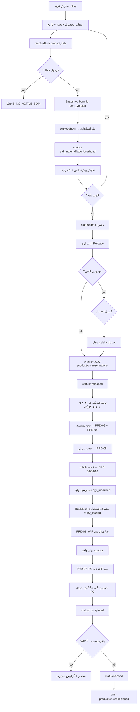

# 02-fixed-analysis.md
## زیرگروه ۲ — تولید آنالیز ثابت (Fixed / Standard-Consumption Production)

---

## ۱. هدف ماژول

تولید **تک‌مرحله‌ای** که در آن **مصرف مواد دقیقاً طبق فرمول محاسبه و از انبار کسر می‌شود** (Backflush).
کاربر مصرف واقعی را وارد نمی‌کند — سیستم از BOM استنتاج می‌کند.

**کاربرد در ترنم:** تولید تکراری مدل‌های تثبیت‌شده که ضایعات‌شان قابل پیش‌بینی است. سریع‌ترین حالت ثبت — اپراتور فقط «۳۰۰ عدد تولید شد» را می‌زند.

**تفاوت با ماژول ۳:**
| | آنالیز ثابت (۲) | آنالیز متغیر (۳) |
|-|----------------|------------------|
| مقدار مصرف | از BOM | ورودی کاربر |
| انحراف مقدار | **همیشه صفر** | محاسبه می‌شود |
| انحراف نرخ | دارد (میانگین انبار ≠ استاندارد BOM) | دارد |
| سرعت ثبت | ۱ فرم | ۲ فرم |
| دقت | متوسط | بالا |

> **⚠️ نکته حیاتی حسابداری:** «ثابت» به معنای بهایابی استاندارد کامل **نیست**. مواد به **بهای واقعی (میانگین موزون لحظه‌ای)** از انبار خارج می‌شوند، فقط **مقدارشان** استاندارد است. این تصمیم آگاهانه است: میانگین موزون دائمی (ADR-003) با استاندارد کردن نرخ خروج ناسازگار می‌شود.

---

## ۲. ساختار دیتابیس

جداول درگیر (تعریف کامل در `database-schema.md`):

| جدول | نقش در این ماژول |
|------|-------------------|
| `production_orders` | سرفصل سفارش · `analysis_type='fixed'` |
| `production_material_issues` | حواله مواد · `issue_type='backflush'` |
| `production_labor_entries` | دستمزد |
| `production_overhead_applications` | جذب سربار |
| `production_waste` | ضایعات ۴ نوع |
| `production_receipts` | رسید کالای ساخته‌شده |
| `production_reservations` | رزرو مواد هنگام Release |
| `cost_center_rates` | نرخ جذب سربار |
| `bom_headers` / `bom_lines` | مبنای Backflush |

**جدولی که در این ماژول استفاده نمی‌شود:** `production_order_stages` (تک‌مرحله‌ای است)، `bom_operations`، `bom_outputs`.

---

## ۳. موجودیت‌ها و روابط

```
production_orders (1)
   ├──< production_material_issues (N)     issue_type='backflush'
   ├──< production_labor_entries (N)
   ├──< production_overhead_applications (N)
   ├──< production_waste (N)
   ├──< production_receipts (N)
   ├──< production_reservations (N)
   └──> bom_headers (1)      snapshot: bom_id + bom_version
        └──< bom_lines (N)   منبع مقدار استاندارد

journal_entries (1) ◄── je_id در هر یک از جداول تراکنشی
```

---

## ۴. چرخه حیات سفارش

```
┌───────┐  آزادسازی   ┌──────────┐  اولین ثبت  ┌─────────────┐
│ draft │────────────►│ released │────────────►│ in_progress │
│پیش‌نویس│             │ آزادشده  │             │ در جریان    │
└───┬───┘             └────┬─────┘             └──────┬──────┘
    │ حذف                  │ لغو                      │ رسید نهایی
    ▼                      ▼                          ▼
 (deleted)            ┌───────────┐             ┌───────────┐
                      │ cancelled │◄────────────│ completed │
                      │   لغوشده  │  ابطال       │ تکمیل‌شده │
                      └───────────┘             └─────┬─────┘
                                                      │ بستن
                                                      ▼
                                                 ┌────────┐
                                                 │ closed │  WIP = 0
                                                 │ بسته   │
                                                 └────────┘
```

| گذار | شرط | اثر |
|------|-----|-----|
| `draft→released` | BOM حل شود + مجوز | رزرو موجودی + Snapshot استاندارد |
| `released→in_progress` | اولین حواله/دستمزد | — |
| `in_progress→completed` | `qty_produced > 0` + رسید ثبت شود | محاسبه بهای واحد |
| `completed→closed` | WIP باقی‌مانده = ۰ + دوره باز | قفل سفارش |
| هر→`cancelled` | فقط `draft`/`released` بدون تراکنش | آزادسازی رزرو |
| `completed`→ابطال | همه اسناد Reversal شوند | `status='cancelled'` + دلیل |
| `closed`→ | **غیرقابل بازگشت** مگر admin با `reopen` | — |

---

## ۵. Workflow کامل



---

## ۶. الگوریتم‌ها و فرمول‌ها

### ۶.۱ پایه Backflush

```
qty_started = qty_produced + qty_waste_normal + qty_waste_abnormal + qty_rework_failed

Backflush برای هر قلم L:
  qty_consume = explodeBom(bom, qty_started).lines[L].qty_final
  unit_cost   = products[L].average_cost_rial      ← میانگین لحظه صدور
  amount      = round(qty_consume × unit_cost)
```

**چرا `qty_started` و نه `qty_produced`؟**
مواد برای همه واحدهای شروع‌شده مصرف شده — از جمله آن‌هایی که ضایع شدند.
`scrap_percent` در BOM **ضایعات سطح ماده** (خرده پارچه) را پوشش می‌دهد، نه **ضایعات سطح محصول** (یک مانتوی کامل خراب).

**دو لایه ضایعات — نباید قاطی شوند:**
| لایه | مثال | محل | اثر |
|------|------|-----|-----|
| سطح ماده | خرده پارچه هنگام برش | `bom_lines.scrap_percent` | `qty_final` را بالا می‌برد |
| سطح محصول | مانتوی سوخته در اتو | `production_waste.qty` | `qty_started` را بالا می‌برد |

### ۶.۲ تجمیع WIP

```
WIP_total = Σ material_issues.amount_rial          (شامل بسته‌بندی)
          + Σ labor_entries.amount_rial
          + Σ overhead_applications.amount_rial
          + Σ subcontract.fee_amount_rial
          + Σ rework(normal).total_rial
```

### ۶.۳ کسر ضایعات و محاسبه بهای واحد

```
cost_per_started = WIP_total / qty_started

۱) ضایعات غیرعادی:
   abnormal_rial = round(cost_per_started × qty_waste_abnormal)
   → از WIP خارج و به 5221 (هزینه دوره)

۲) ضایعات قابل فروش:
   scrap_credit = Σ (qty_scrap × nrv_unit_rial)
   → از WIP خارج و به 1113 (دارایی)

۳) ضایعات عادی:
   ← هیچ ثبتی. در WIP باقی می‌ماند و توسط qty_produced جذب می‌شود.

۴) باقی‌مانده:
   WIP_net = WIP_total − abnormal_rial − scrap_credit

۵) بهای واحد:
   unit_cost_rial = round(WIP_net / qty_produced)      ← فقط برای نمایش/گزارش

۶) مبلغ سند رسید:
   receipt_amount_rial = WIP_net                        ← دقیقاً، نه unit × qty
```

> **قاعده طلایی (R-10):** `receipt_amount_rial = WIP_net` تضمین می‌کند WIP دقیقاً صفر شود.
> اگر `unit_cost × qty` را بنویسی، به دلیل گرد کردن، ریال‌هایی در WIP سرگردان می‌مانند.
> `unit_cost_rial` فقط یک **فیلد گزارشی** است.

### ۶.۴ به‌روزرسانی میانگین موزون کالای ساخته‌شده

```
prev_qty  = products[fg].stock
prev_avg  = products[fg].average_cost_rial
prev_val  = prev_qty × prev_avg

new_qty   = prev_qty + qty_produced
new_val   = prev_val + receipt_amount_rial
new_avg   = round(new_val / new_qty)          اگر new_qty > 0

UPDATE products SET
   stock = new_qty,
   average_cost_rial = new_avg,
   cost = new_avg / 10,                        -- سازگاری legacy (تومان)
   last_prod_cost_rial = round(receipt_amount_rial / qty_produced)
WHERE id = fg;

UPDATE warehouse_stock SET qty = qty + qty_produced WHERE product_id=fg AND warehouse_id=wh_fg;
INSERT INTO stock_logs (product_id,user_id,change,note) VALUES (fg, uid, qty_produced, 'تولید — سفارش PO-...');
```

**ذخیره برای Undo:** `production_receipts.prev_avg_rial`, `prev_stock_qty`, `new_avg_rial`

### ۶.۵ جذب سربار

```
rate = cost_center_rates WHERE cost_center_id=po.cost_center_id AND period_label=po.period_label
       (اگر نبود → آخرین active، اگر نبود → Bootstrap)

driver_qty بر اساس rate.driver:
   output_qty        → qty_started
   direct_labor_rial → Σ labor_entries.amount_rial / 1_000_000   (میلیون ریال)
   direct_labor_hours→ Σ labor_entries.hours
   machine_hours     → از bom_operations.machine_minutes × qty / 60
   material_rial     → Σ material_issues.amount_rial / 1_000_000
   manual            → ورودی کاربر

applied_oh = round(rate.total_rate_rial × driver_qty)
```

**Bootstrap نرخ (ماه اول):**
```
pool  = SUM(expense_payments.amount) WHERE is_overhead=1
        AND date BETWEEN (ماه جاری − N ماه) AND (ماه قبل)
        AND (cost_center_id = cc OR cost_center_id IS NULL → تسهیم)
qty   = SUM(production_orders.qty_produced) در همان بازه
rate  = round(pool × 10 / qty)          -- expense_payments به تومان است!
is_estimated = 1
```

> ⚠️ `expense_payments.amount` نوع `REAL` و واحد **تومان** است (کد فعلی). حتماً `× 10` برای ریال.

### ۶.۶ محاسبه استاندارد (Snapshot هنگام Release)

```
std_material_rial = Σ explodeBom(bom, qty_planned, priceBasis='std').amount_rial
std_labor_rial    = qty_planned × Σ(bom_operations.labor_rate_rial)   یا 0 اگر routing ندارد
std_overhead_rial = qty_planned × rate.total_rate_rial                (اگر driver=output_qty)
std_total_rial    = std_material + std_labor + std_overhead
std_unit_rial     = round(std_total_rial / qty_planned)
```
این اعداد **فقط برای مقایسه و گزارش انحراف** هستند، نه ثبت سند.

---

## ۷. مثال کامل عددی — سفارش `PO-1405-0001`

### ورودی
```
محصول:      #101 مانتو کتان ترمه — سبز
فرمول:      BOM-000101 v1-A  (base_qty=1, yield=97%)
تعداد برنامه: ۳۰۰ عدد
تاریخ:      ۱۴۰۵/۰۴/۱۰   ·  دوره: 1405/04
نوع آنالیز: fixed
مرکز هزینه: CC-30 دوخت  (driver = output_qty, rate = 150,000 ریال/عدد)
انبار مواد: WH-RAW  ·  انبار محصول: WH-FG
```

### نتیجه فیزیکی
```
شروع‌شده:            ۳۰۰ عدد
سالم پذیرفته‌شده:     ۲۹۴ عدد
ضایعات عادی:          ۴ عدد   (سقف مجاز ۳٪ = ۹ عدد ✅)
ضایعات غیرعادی:       ۲ عدد   (پارچه معیوب — تقصیر تأمین‌کننده)
ضایعات قابل فروش:  ۲۷ کیلوگرم خرده پارچه (NRV = ۱۲۰٬۰۰۰ ریال/کیلو)
```

### گام ۱ — Backflush مواد (qty_started = 300)

| قلم | خالص | ناخالص (÷۰.۹۶) | نهایی (÷۰.۹۷) | نرخ میانگین | مبلغ (ریال) |
|-----|------|----------------|---------------|-------------|-------------|
| پارچه کتان (۴٪) | ۴۸۰.۰۰۰۰ متر | ۵۰۰.۰۰۰۰ | **۵۱۵.۴۶۳۹** | ۹۵۰٬۰۰۰ | ۴۸۹٬۶۹۰٬۷۲۲ |
| آستر (۳٪) | ۱۰۵.۰۰۰۰ متر | ۱۰۸.۲۴۷۴ | **۱۱۱.۵۹۵۳** | ۱۸۰٬۰۰۰ | ۲۰٬۰۸۷٬۱۵۱ |
| نخ (۰٪) | ۲۴.۰۰۰۰ قرقره | ۲۴.۰۰۰۰ | **۲۴.۷۴۲۳** | ۸۵٬۰۰۰ | ۲٬۱۰۳٬۰۹۳ |
| دکمه (۲٪) | ۱٬۸۰۰ عدد | ۱٬۸۳۶.۷۳۴۷ | **۱٬۸۹۳.۵۴۰۹** | ۱۲٬۰۰۰ | ۲۲٬۷۲۲٬۴۹۱ |
| **جمع مواد** | | | | | **۵۳۴٬۶۰۳٬۴۵۷** |
| لیبل (بسته‌بندی) | ۳۰۰ عدد | ۳۰۰ | **۳۰۹.۲۷۸۴** | ۶٬۰۰۰ | ۱٬۸۵۵٬۶۷۰ |
| نایلون (بسته‌بندی) | ۳۰۰ عدد | ۳۰۰ | **۳۰۹.۲۷۸۴** | ۹٬۰۰۰ | ۲٬۷۸۳٬۵۰۵ |
| **جمع بسته‌بندی** | | | | | **۴٬۶۳۹٬۱۷۵** |

**سند PRD-01 (تاریخ ۱۴۰۵/۰۴/۱۰):**
| حساب | نام | بدهکار (ریال) | بستانکار (ریال) |
|------|-----|--------------:|----------------:|
| `1111` | کالای در جریان ساخت — PO-1405-0001 | ۵۳۹٬۲۴۲٬۶۳۲ | |
| `1110` | موجودی مواد اولیه | | ۵۳۴٬۶۰۳٬۴۵۷ |
| `1112` | موجودی مواد بسته‌بندی | | ۴٬۶۳۹٬۱۷۵ |

### گام ۲ — دستمزد

```
کارمزدی (piece):  ۲۵۰٬۰۰۰ ریال/عدد × ۳۰۰ = ۷۵٬۰۰۰٬۰۰۰
ماهانه تسهیمی:    ۴۰٬۰۰۰ ریال/عدد × ۳۰۰ = ۱۲٬۰۰۰٬۰۰۰
────────────────────────────────────────────────
جمع دستمزد مستقیم:                      ۸۷٬۰۰۰٬۰۰۰
```

**سند PRD-03 (جذب):**
| حساب | نام | بدهکار | بستانکار |
|------|-----|-------:|---------:|
| `1111` | WIP — PO-1405-0001 | ۸۷٬۰۰۰٬۰۰۰ | |
| `5201` | کنترل دستمزد مستقیم — CC-30 | | ۸۷٬۰۰۰٬۰۰۰ |

**سند PRD-04 (بدهی واقعی — هنگام ثبت حقوق):**
| حساب | نام | بدهکار | بستانکار |
|------|-----|-------:|---------:|
| `5201` | کنترل دستمزد مستقیم — CC-30 | ۸۷٬۰۰۰٬۰۰۰ | |
| `2104` | بدهی حقوق و بیمه کارکنان | | ۸۷٬۰۰۰٬۰۰۰ |

> اگر مبلغ واقعی حقوق ≠ جذب‌شده → مانده `5201` = انحراف نرخ دستمزد → پایان ماه بسته می‌شود.

### گام ۳ — جذب سربار

```
driver = output_qty  →  driver_qty = 300
rate   = 150,000 ریال/عدد
applied_oh = 150,000 × 300 = 45,000,000
```

**سند PRD-05:**
| حساب | نام | بدهکار | بستانکار |
|------|-----|-------:|---------:|
| `1111` | WIP — PO-1405-0001 | ۴۵٬۰۰۰٬۰۰۰ | |
| `5203` | سربار جذب‌شده — CC-30 | | ۴۵٬۰۰۰٬۰۰۰ |

### گام ۴ — تجمیع WIP و بهای واحد

```
WIP_total = 539,242,632 (مواد+بسته‌بندی)
          +  87,000,000 (دستمزد)
          +  45,000,000 (سربار)
          = 671,242,632 ریال

cost_per_started = 671,242,632 / 300 = 2,237,475.44 ریال
```

### گام ۵ — ضایعات

**۵.۱ ضایعات عادی (۴ عدد):** ✅ **بدون سند** — در WIP می‌ماند.

**۵.۲ ضایعات غیرعادی (۲ عدد) — سند PRD-09:**
```
abnormal_rial = round(2,237,475.44 × 2) = 4,474,951
```
| حساب | نام | بدهکار | بستانکار |
|------|-----|-------:|---------:|
| `5221` | هزینه ضایعات غیرعادی | ۴٬۴۷۴٬۹۵۱ | |
| `1111` | WIP — PO-1405-0001 | | ۴٬۴۷۴٬۹۵۱ |

**۵.۳ ضایعات قابل فروش (۲۷ کیلو) — سند PRD-10:**
```
scrap_credit = 27 × 120,000 = 3,240,000
```
| حساب | نام | بدهکار | بستانکار |
|------|-----|-------:|---------:|
| `1113` | موجودی ضایعات قابل فروش | ۳٬۲۴۰٬۰۰۰ | |
| `1111` | WIP — PO-1405-0001 | | ۳٬۲۴۰٬۰۰۰ |

> کالای `#299 خرده پارچه` وارد `WH-SCRAP` می‌شود، `average_cost_rial = 120,000`.

### گام ۶ — رسید کالای ساخته‌شده

```
WIP_net = 671,242,632 − 4,474,951 − 3,240,000 = 663,527,681 ریال

unit_cost_rial      = round(663,527,681 / 294) = 2,256,897  ریال   [گزارشی]
receipt_amount_rial = 663,527,681                            ریال   [سند]
```

**سند PRD-07:**
| حساب | نام | بدهکار | بستانکار |
|------|-----|-------:|---------:|
| `1104` | موجودی کالای ساخته‌شده | ۶۶۳٬۵۲۷٬۶۸۱ | |
| `1111` | WIP — PO-1405-0001 | | ۶۶۳٬۵۲۷٬۶۸۱ |

**✅ WIP اکنون دقیقاً صفر است:**
```
539,242,632 + 87,000,000 + 45,000,000 − 4,474,951 − 3,240,000 − 663,527,681 = 0 ✅
```

### گام ۷ — به‌روزرسانی میانگین FG

```
فرض: موجودی قبلی مانتو ترمه = ۵۰ عدد با میانگین ۲٬۱۰۰٬۰۰۰ ریال

prev_val = 50 × 2,100,000     = 105,000,000
new_qty  = 50 + 294           = 344
new_val  = 105,000,000 + 663,527,681 = 768,527,681
new_avg  = round(768,527,681 / 344) = 2,233,802 ریال
```

### خلاصه بهای تمام‌شده (Cost Sheet)

| جزء | مبلغ (ریال) | هر عدد | ٪ |
|-----|------------:|-------:|--:|
| مواد اولیه | ۵۳۴٬۶۰۳٬۴۵۷ | ۱٬۸۱۸٬۳۷۹ | ۸۰.۶ |
| بسته‌بندی | ۴٬۶۳۹٬۱۷۵ | ۱۵٬۷۸۰ | ۰.۷ |
| دستمزد مستقیم | ۸۷٬۰۰۰٬۰۰۰ | ۲۹۵٬۹۱۸ | ۱۳.۱ |
| سربار جذب‌شده | ۴۵٬۰۰۰٬۰۰۰ | ۱۵۳٬۰۶۱ | ۶.۸ |
| **جمع WIP** | **۶۷۱٬۲۴۲٬۶۳۲** | | |
| (−) ضایعات غیرعادی | (۴٬۴۷۴٬۹۵۱) | (۱۵٬۲۲۱) | (۰.۷) |
| (−) ضایعات قابل فروش | (۳٬۲۴۰٬۰۰۰) | (۱۱٬۰۲۰) | (۰.۵) |
| **بهای تمام‌شده ۲۹۴ عدد** | **۶۶۳٬۵۲۷٬۶۸۱** | **۲٬۲۵۶٬۸۹۷** | ۱۰۰ |

**قیمت فروش پیشنهادی (۳۵٪ از بالا):** ۲٬۲۵۶٬۸۹۷ × ۱.۳۵ = **۳٬۰۴۶٬۸۱۱ ریال** ≈ ۳۰۴٬۶۸۱ تومان

---

## ۸. سناریوهای واقعی تولید

| # | سناریو | رفتار سیستم |
|---|--------|-------------|
| F-01 | تولید کامل بدون ضایعات | `qty_started = qty_produced` · بدون PRD-09/10 |
| F-02 | فقط ضایعات عادی | بدون سند ضایعات · بهای واحد بالاتر می‌رود ✅ |
| F-03 | ضایعات عادی بیش از سقف | سیستم مازاد را **خودکار غیرعادی** طبقه‌بندی می‌کند + هشدار |
| F-04 | ضایعات غیرعادی | PRD-09 · هزینه دوره |
| F-05 | خرده پارچه فروختنی | PRD-10 · ورود به `WH-SCRAP` |
| F-06 | رسید جزئی (۱۰۰ از ۳۰۰) | `is_partial=1` · Backflush برای ۱۰۰ · WIP باز می‌ماند |
| F-07 | چند رسید تا تکمیل | هر بار Backflush جداگانه · بهای واحد هر بار متفاوت |
| F-08 | موجودی مواد کافی نیست | کنترل «هشدار» → پیام + ادامه · اگر منفی می‌شود → `E_NEGATIVE_STOCK` |
| F-09 | نرخ سربار تعریف نشده | Bootstrap ۳ ماهه + `is_estimated=1` + هشدار UI |
| F-10 | دستمزد بعد از رسید ثبت شد | بهای واحد اشتباه → **باید Reversal رسید و ثبت مجدد** · سیستم هشدار می‌دهد |
| F-11 | سفارش MTO برای مشتری خاص | `production_mode='MTO'` + `sales_order_id` · گزارش سودآوری سفارش |
| F-12 | لغو سفارش پس از حواله | Reversal همه اسناد + آزادسازی رزرو |
| F-13 | فرمول در حین تولید عوض شد | Snapshot `bom_id` محافظت می‌کند ✅ · نسخه جدید فقط سفارش‌های بعدی |
| F-14 | تولید ۲ رنگ در یک سفارش | **ممنوع** — هر رنگ سفارش جدا (`color` فیلد کنترلی) |
| F-15 | ثبت با تاریخ ماه بسته‌شده | `E_PERIOD_CLOSED` |
| F-16 | ضایعات > تعداد شروع‌شده | `E_WASTE_EXCEEDS_STARTED` |
| F-17 | تولید بیش از برنامه (۳۱۰ از ۳۰۰) | مجاز با هشدار · `over_production_pct` در گزارش |
| F-18 | پارچه با میانگین ۰ (کالای جدید بدون خرید) | `E_ZERO_AVG_COST` — باید ابتدا خرید ثبت شود |

---

## ۹. سناریوهای حسابداری و ثبت سند

مرجع کامل: `accounting-scenarios.md` (سناریوهای A-01 تا A-18).
خلاصه اسناد این ماژول:

| رویداد | سند | بدهکار | بستانکار |
|--------|-----|--------|----------|
| Backflush مواد | PRD-01 | `1111` WIP | `1110` مواد + `1112` بسته‌بندی |
| برگشت مواد | PRD-02 | `1110` | `1111` |
| جذب دستمزد | PRD-03 | `1111` | `5201` |
| دستمزد واقعی | PRD-04 | `5201` | `2104` |
| جذب سربار | PRD-05 | `1111` | `5203` |
| سربار واقعی | PRD-06 | `5202` | `1101`/`1102`/`2101` |
| رسید FG | PRD-07 | `1104` | `1111` |
| ضایعات عادی | — | — | — |
| ضایعات غیرعادی | PRD-09 | `5221` | `1111` |
| ضایعات قابل فروش | PRD-10 | `1113` | `1111` |
| ابطال | PRD-99 | معکوس | معکوس |

### تفصیلی‌گذاری (حالت `extended`)
```
1111 WIP        → تفصیلی = سفارش تولید (PO-1405-0001)
5201, 5202, 5203 → تفصیلی = مرکز هزینه (CC-30)
1110, 1112, 1104, 1113 → تفصیلی = کالا (اگر usesExtendedCoa)
```

---

## ۱۰. قوانین اعتبارسنجی

| کد | قانون | خطا |
|----|-------|-----|
| V2-01 | `qty_planned > 0` | `E_QTY_INVALID` |
| V2-02 | محصول باید `is_manufactured=1` باشد | `E_NOT_MANUFACTURED` |
| V2-03 | فرمول فعال در تاریخ سفارش موجود باشد | `E_NO_ACTIVE_BOM` |
| V2-04 | دوره مالی باز باشد (`assertFiscalYearWritable`) | `E_FY_CLOSED` |
| V2-05 | دوره تولید بسته نشده باشد | `E_PERIOD_CLOSED` |
| V2-06 | `qty_produced + waste_normal + waste_abnormal ≤ qty_started` | `E_QTY_MISMATCH` |
| V2-07 | ضایعات ≤ تعداد شروع‌شده | `E_WASTE_EXCEEDS_STARTED` |
| V2-08 | موجودی نمی‌تواند منفی شود | `E_NEGATIVE_STOCK` |
| V2-09 | `average_cost_rial > 0` برای هر ماده مصرفی | `E_ZERO_AVG_COST` |
| V2-10 | نرخ سربار برای مرکز هزینه موجود یا قابل Bootstrap باشد | `E_NO_OH_RATE` |
| V2-11 | هر سند تراز باشد | `E_UNBALANCED` |
| V2-12 | سفارش `closed` قابل تغییر نیست | `E_ORDER_CLOSED` |
| V2-13 | لغو فقط برای `draft`/`released` بدون تراکنش | `E_ORDER_HAS_TXN` |
| V2-14 | انبار مواد ≠ انبار محصول | `E_SAME_WAREHOUSE` |
| V2-15 | `warehouse_raw_id.kind ∈ {raw, general}` | `E_WH_KIND` |
| V2-16 | ضایعات قابل فروش نیاز به `scrap_product_id` + `nrv_unit_rial > 0` | `E_SCRAP_NO_PRODUCT` |
| V2-17 | تاریخ سفارش ≤ امروز (آینده ممنوع) | `E_FUTURE_DATE` |
| V2-18 | `analysis_type='fixed'` نمی‌تواند `qty_actual` دستی داشته باشد | `E_FIXED_NO_MANUAL_QTY` |

---

## ۱۱. کنترل‌های سیستمی

| کنترل | پیاده‌سازی |
|-------|-----------|
| اتمی بودن | همه گام‌ها در یک `db.transaction()` |
| بی‌قدرتی | هدر `Idempotency-Key` → `production_idempotency` |
| قفل همزمانی | `SELECT ... FROM production_orders WHERE id=?` + بررسی `updated_at` (Optimistic Lock) |
| موجودی منفی | trigger `trg_ws_no_negative` + چک در کد |
| قفل دوره | trigger `trg_*_period_lock` |
| تراز سند | `validateBalancedLines` داخل `postToLedger` |
| حسابرسی | `audit()` روی همه CUD |
| هشدار انحراف | اگر `|actual − std| / std > 15%` → `app_notifications` |
| هشدار نقطه سفارش | بعد از Backflush: اگر `stock < reorder_point` → `production.stock.below_reorder` |
| WIP صفر | health-check H1 بعد از close |

---

## ۱۲. Edge Case ها

| # | حالت | راه‌حل |
|---|------|--------|
| E2-01 | `qty_produced = 0` (کل سفارش ضایع شد) | همه WIP → `5221` · بدون PRD-07 · `status='completed'` |
| E2-02 | `qty_started = 0` | `E_QTY_INVALID` |
| E2-03 | میانگین موزون ماده در حین سفارش عوض شد (خرید جدید) | Backflush به میانگین **لحظه صدور** — درست ✅ |
| E2-04 | دو رسید جزئی، بین آن‌ها خرید مواد با نرخ جدید | هر رسید Backflush جداگانه با میانگین خودش ✅ |
| E2-05 | `WIP_net` منفی (ضایعات > کل) | `E_NEGATIVE_WIP` + rollback |
| E2-06 | `qty_produced` کسری (۲۹۴.۵ عدد) | `E_QTY_NOT_INTEGER` برای واحد «عدد» |
| E2-07 | گرد کردن: مجموع سطرها ≠ کل | آخرین سطر Plug می‌گیرد (R-10) |
| E2-08 | FG قبلاً موجودی منفی داشته | `E_NEGATIVE_STOCK` قبل از محاسبه میانگین |
| E2-09 | `new_qty = 0` بعد از رسید (غیرممکن) | حفظ `average_cost_rial` قبلی |
| E2-10 | حواله ماده‌ای که `item_type='finished'` است | مجاز فقط اگر `is_manufactured=1` (نیمه‌ساخته) |
| E2-11 | سفارش با ۰ قلم مواد (فقط خدمت) | مجاز — WIP فقط دستمزد+سربار |
| E2-12 | ثبت همزمان دو رسید | Optimistic Lock → دومی `409 E_CONCURRENT` |
| E2-13 | نرخ سربار ۰ | مجاز با هشدار (سربار جذب نشود) |
| E2-14 | ماده با `stock` مثبت ولی `warehouse_stock` صفر | `E_WH_STOCK_MISMATCH` + ارجاع به health-check H3 |
| E2-15 | سفارش بین دو ماه (شروع تیر، رسید مرداد) | WIP پایان تیر در `production_period_close.wip_close_rial` می‌آید ✅ |
| E2-16 | ابطال سفارشی که FG آن فروخته شده | `E_FG_SOLD` — باید ابتدا فاکتور فروش برگشت بخورد |

---

## ۱۳. خطاهای احتمالی

| کد | HTTP | پیام |
|----|------|------|
| `E_QTY_INVALID` | 422 | تعداد باید بزرگ‌تر از صفر باشد |
| `E_NOT_MANUFACTURED` | 422 | کالای «{name}» به‌عنوان کالای ساختنی تعریف نشده است |
| `E_NO_ACTIVE_BOM` | 404 | برای «{name}» در تاریخ {date} فرمول فعالی وجود ندارد |
| `E_FY_CLOSED` | 409 | سال مالی بسته است |
| `E_PERIOD_CLOSED` | 409 | دوره {period} بسته شده — ثبت ممکن نیست |
| `E_QTY_MISMATCH` | 422 | مجموع سالم + ضایعات ({x}) با تعداد شروع‌شده ({y}) مطابقت ندارد |
| `E_WASTE_EXCEEDS_STARTED` | 422 | ضایعات نمی‌تواند از تعداد شروع‌شده بیشتر باشد |
| `E_NEGATIVE_STOCK` | 409 | موجودی «{name}» در انبار «{wh}» منفی می‌شود (موجود: {q}، نیاز: {n}) |
| `E_ZERO_AVG_COST` | 422 | بهای میانگین «{name}» صفر است — ابتدا فاکتور خرید ثبت کنید |
| `E_NO_OH_RATE` | 422 | نرخ جذب سربار برای مرکز «{cc}» در دوره {p} تعریف نشده |
| `E_UNBALANCED` | 500 | سند تراز نیست — با پشتیبانی تماس بگیرید |
| `E_ORDER_CLOSED` | 409 | سفارش بسته شده است |
| `E_ORDER_HAS_TXN` | 409 | سفارش دارای {n} تراکنش است — ابتدا ابطال کنید |
| `E_NEGATIVE_WIP` | 500 | WIP منفی شد — عملیات لغو شد |
| `E_CONCURRENT` | 409 | سفارش توسط کاربر دیگری تغییر کرد — صفحه را بازخوانی کنید |
| `E_FG_SOLD` | 409 | {n} عدد از این تولید فروخته شده — ابطال ممکن نیست |
| `E_FIXED_NO_MANUAL_QTY` | 422 | در آنالیز ثابت مصرف دستی مجاز نیست — از آنالیز متغیر استفاده کنید |

---

## ۱۴. Undo و اصلاح اسناد

### اصل: **هیچ حذف فیزیکی — فقط Reversal**

```js
function reverseProductionDoc(db, { table, docId, reason, userId }) {
  return db.transaction(() => {
    const doc = db.prepare(`SELECT * FROM ${table} WHERE id=?`).get(docId);
    if (!doc) throw err('E_NOT_FOUND', 404);
    if (doc.status === 'reversed') throw err('E_ALREADY_REVERSED', 409);
    assertPeriodOpen(db, doc.period_label);

    // ۱) سند معکوس
    const orig = getJournalLines(db, doc.je_id);
    const revJe = postToLedger(db, {
      sourceType: `${table}_reversal`,
      sourceId:   docId,
      date:       todayJalali(),
      description:`ابطال ${doc.doc_no} — ${reason}`,
      createdBy:  userId,
      lines: orig.map(l => ({
        code: l.account_code, name: l.account_name,
        debit:  l.credit_rial / 10,     // ← جابه‌جایی
        credit: l.debit_rial  / 10,
        description: `ابطال — ${l.description}`,
        detail_account_id: l.detail_account_id,
      })),
    });

    // ۲) بازگشت انبار
    if (table === 'production_material_issues') {
      restoreStock(db, doc.product_id, doc.warehouse_id, +doc.qty_actual);
      // میانگین موزون: برگشت به انبار با نرخ سند اصلی (نه میانگین جاری)
      recalcAvgOnReturn(db, doc.product_id, doc.qty_actual, doc.unit_cost_rial);
    }
    if (table === 'production_receipts') {
      assertNotSold(db, doc.product_id, doc.qty);              // E_FG_SOLD
      restoreStock(db, doc.product_id, doc.warehouse_id, -doc.qty);
      // بازگردانی میانگین از snapshot
      db.prepare('UPDATE products SET average_cost_rial=?, stock=? WHERE id=?')
        .run(doc.prev_avg_rial, doc.prev_stock_qty, doc.product_id);
    }

    // ۳) به‌روزرسانی تجمیع سفارش
    db.prepare(`UPDATE ${table} SET status='reversed', reversed_je_id=? WHERE id=?`).run(revJe, docId);
    recomputeOrderTotals(db, doc.order_id);

    audit(userId, 'reverse', table, docId, `ابطال — ${reason}`);
    return { reversed_je_id: revJe };
  })();
}
```

### قواعد Undo

| وضعیت سفارش | مجاز؟ | روش |
|-------------|-------|-----|
| `draft` | ✅ | حذف مستقیم |
| `released` بدون تراکنش | ✅ | `cancel` + آزادسازی رزرو |
| `in_progress` | ✅ | Reversal همه اسناد → `cancelled` |
| `completed` | ✅ مشروط | فقط اگر FG فروخته نشده |
| `closed` | ⚠️ فقط admin | `reopen` + دلیل + `audit` |
| دوره بسته | ❌ | ابتدا `reopen-period` (فقط admin) |

**ترتیب Reversal (معکوس ثبت):**
```
۱) رسید FG        (PRD-07)
۲) ضایعات فروشی    (PRD-10)
۳) ضایعات غیرعادی  (PRD-09)
۴) سربار          (PRD-05)
۵) دستمزد         (PRD-03)
۶) حواله مواد     (PRD-01)
```

---

## ۱۵. گزارش‌ها

| گزارش | endpoint |
|-------|----------|
| R2-01 لیست سفارش‌ها | `GET /production/orders?status=&from=&to=` |
| R2-02 برگه بهای تمام‌شده (Cost Sheet) | `GET /production/orders/:id/cost-sheet` |
| R2-03 مقایسه استاندارد/واقعی | `GET /production/orders/:id/variance` |
| R2-04 مانده WIP | `GET /production/reports/wip?date=` |
| R2-05 دفتر سفارش (همه اسناد) | `GET /production/orders/:id/ledger` |
| R2-06 روند بهای واحد محصول | `GET /production/reports/unit-cost-trend?product_id=` |
| R2-07 تحلیل ضایعات | `GET /production/reports/waste?from=&to=` |
| R2-08 بهره‌وری (سالم/شروع‌شده) | `GET /production/reports/yield` |
| R2-09 سودآوری سفارش MTO | `GET /production/orders/:id/profitability` |
| R2-10 مصرف مواد دوره | `GET /production/reports/material-usage` |

---

## ۱۶. دسترسی کاربران

| نقش | view | create | edit | delete | approve | export |
|-----|:----:|:------:|:----:|:------:|:-------:|:------:|
| admin | ✅ | ✅ | ✅ | ✅ | ✅ | ✅ |
| accounting | ✅ | ✅ | ✅ | ❌ | ✅ | ✅ |
| production_manager | ✅ | ✅ | ✅ | ❌ | ✅ | ✅ |
| production_operator | ✅ | ✅¹ | ❌ | ❌ | ❌ | ❌ |
| sales_manager | ✅² | ❌ | ❌ | ❌ | ❌ | ✅ |
| field_sales | ❌ | ❌ | ❌ | ❌ | ❌ | ❌ |

¹ فقط ثبت رسید/ضایعات، نه ایجاد سفارش · ² بدون مشاهده مبالغ بهای تمام‌شده (`hide_cost=1`)

---

## ۱۷. APIهای موردنیاز

```
GET    /api/production/orders                     فهرست
POST   /api/production/orders                     ایجاد draft
GET    /api/production/orders/:id                 جزئیات کامل
PUT    /api/production/orders/:id                 ویرایش (فقط draft)
DELETE /api/production/orders/:id                 حذف (فقط draft)

POST   /api/production/orders/:id/release         آزادسازی + رزرو
POST   /api/production/orders/:id/cancel          {reason}
POST   /api/production/orders/:id/close           بستن (WIP=0)
POST   /api/production/orders/:id/reopen          {reason} — admin

POST   /api/production/orders/:id/receipt         ★ ثبت رسید + Backflush خودکار
       body: { qty_produced, waste_normal, waste_abnormal,
               scrap:[{product_id,qty,nrv_unit_rial}], date, note, is_partial }
POST   /api/production/orders/:id/labor           ثبت دستمزد
POST   /api/production/orders/:id/overhead        جذب سربار (خودکار در receipt)
POST   /api/production/orders/:id/waste           ثبت ضایعات مستقل
POST   /api/production/orders/:id/material-return برگشت مواد

GET    /api/production/orders/:id/preview         پیش‌نمایش Backflush بدون ثبت
GET    /api/production/orders/:id/cost-sheet
GET    /api/production/orders/:id/ledger
GET    /api/production/orders/:id/variance
GET    /api/production/orders/:id/shortage        کسری مواد

POST   /api/production/docs/:table/:id/reverse    ابطال سند {reason}
```

### نمونه `POST /orders/:id/receipt`

**درخواست:**
```json
{
  "qty_produced": 294,
  "waste_normal": 4,
  "waste_abnormal": 2,
  "waste_abnormal_reason": "fabric_defect",
  "scrap": [ { "product_id": 299, "qty": 27, "nrv_unit_rial": 120000 } ],
  "date": "1405/04/12",
  "warehouse_fg_id": 2,
  "note": "بچ اول",
  "is_partial": false
}
```
Header: `Idempotency-Key: 8f3c-...`

**پاسخ:**
```json
{
  "ok": true,
  "order_no": "PO-1405-0001",
  "receipt_id": 17, "receipt_no": "PR-1405-0017",
  "qty_started": 300, "qty_produced": 294,
  "costs": {
    "material_rial": 534603457, "material_toman": 53460345.7,
    "packaging_rial": 4639175,
    "labor_rial": 87000000,
    "overhead_rial": 45000000, "overhead_rate_rial": 150000, "overhead_driver": "output_qty",
    "wip_total_rial": 671242632,
    "abnormal_waste_rial": 4474951,
    "scrap_credit_rial": 3240000,
    "net_rial": 663527681,
    "unit_cost_rial": 2256897, "unit_cost_toman": 225689.7
  },
  "fg_average": { "prev_qty": 50, "prev_avg_rial": 2100000,
                  "new_qty": 344, "new_avg_rial": 2233802 },
  "journal_entries": [
    { "event": "PRD-01", "je_id": 4521, "voucher_no": "JV-1405-0451", "amount_rial": 539242632 },
    { "event": "PRD-03", "je_id": 4522, "voucher_no": "JV-1405-0452", "amount_rial": 87000000 },
    { "event": "PRD-05", "je_id": 4523, "voucher_no": "JV-1405-0453", "amount_rial": 45000000 },
    { "event": "PRD-09", "je_id": 4524, "voucher_no": "JV-1405-0454", "amount_rial": 4474951 },
    { "event": "PRD-10", "je_id": 4525, "voucher_no": "JV-1405-0455", "amount_rial": 3240000 },
    { "event": "PRD-07", "je_id": 4526, "voucher_no": "JV-1405-0456", "amount_rial": 663527681 }
  ],
  "wip_residual_rial": 0,
  "warnings": [
    "موجودی «آستر ساده» به ۱۲ متر رسید (نقطه سفارش: ۳۰)"
  ]
}
```

---

## ۱۸. رویدادها

| رویداد | Payload |
|--------|---------|
| `production.order.created` | `{orderId, orderNo, productId, qtyPlanned, mode}` |
| `production.order.released` | `{orderId, reservations[]}` |
| `production.material.issued` | `{orderId, lines[], totalRial}` |
| `production.receipt.posted` | `{orderId, qty, unitCostRial, netRial}` |
| `production.waste.recorded` | `{orderId, type, qty, amountRial, reasonCode}` |
| `production.order.completed` | `{orderId, unitCostRial}` |
| `production.order.closed` | `{orderId, totalCostRial, wipResidual}` |
| `production.order.cancelled` | `{orderId, reason, reversedJeIds[]}` |
| `production.stock.below_reorder` | `{productId, qty, reorderPoint}` |
| `production.cost.deviation` | `{orderId, stdUnitRial, actualUnitRial, pct}` |

---

## ۱۹. Trigger ها

| Trigger | جدول | هدف |
|---------|------|-----|
| `trg_po_updated` | `production_orders` | `updated_at` |
| `trg_mi_period_lock` | `production_material_issues` | قفل دوره |
| `trg_lab_period_lock` | `production_labor_entries` | قفل دوره |
| `trg_oh_period_lock` | `production_overhead_applications` | قفل دوره |
| `trg_pr_period_lock` | `production_receipts` | قفل دوره |
| `trg_ws_period_lock` | `production_waste` | قفل دوره |
| `trg_ws_no_negative` | `warehouse_stock` | موجودی منفی |

---

## ۲۰. پیشنهاد UI

### لیست سفارش‌های تولید — `/#production/orders`

```
┌──────────────────────────────────────────────────────────────────────────┐
│ سفارش‌های تولید                                        [+ سفارش جدید]     │
├──────────────────────────────────────────────────────────────────────────┤
│ [همه] [پیش‌نویس ۲] [آزادشده ۳] [در جریان ۵] [تکمیل ۱۲] [بسته ۴۸]        │
│ 🔍[...]  محصول:[همه▾] از:[۱۴۰۵/۰۴/۰۱] تا:[۱۴۰۵/۰۴/۳۱]  [📊 داشبورد]    │
├──────────┬──────────────────┬─────┬─────┬──────────┬────────────┬────────┤
│ شماره    │ محصول            │برنامه│تولید│ وضعیت    │ بهای واحد  │ عملیات │
├──────────┼──────────────────┼─────┼─────┼──────────┼────────────┼────────┤
│PO-1405-01│مانتو ترمه — سبز  │ ۳۰۰ │ ۲۹۴ │🔵تکمیل   │ ۲۲۵٬۶۹۰ ت │ 👁 📄 ⋮│
│PO-1405-02│شومیز ساتن — کرم  │ ۵۰۰ │  ۰  │🟡آزادشده │     —      │ 👁 ▶ ⋮│
│PO-1405-03│مانتو ترمه — یشمی │ ۲۰۰ │ ۱۲۰ │🟠در جریان│ ۲۳۱٬۴۰۰ ت*│ 👁 ▶ ⋮│
└──────────┴──────────────────┴─────┴─────┴──────────┴────────────┴────────┘
                                                   * موقت — رسید جزئی
```

### فرم ثبت رسید تولید (صفحه اصلی اپراتور)

```
┌──────────────────────────────────────────────────────────────────────┐
│ ثبت تولید — PO-1405-0001 · مانتو کتان ترمه سبز · برنامه ۳۰۰ عدد      │
├──────────────────────────────────────────────────────────────────────┤
│ 📅 تاریخ: [۱۴۰۵/۰۴/۱۲]                                              │
│                                                                       │
│  ┌─ تعداد ────────────────────────────────────────────────────┐      │
│  │  ✅ سالم پذیرفته‌شده     [   294  ] عدد                     │      │
│  │  ⚪ ضایعات عادی          [     4  ] عدد   (سقف ۳٪ = ۹) ✅   │      │
│  │  🔴 ضایعات غیرعادی       [     2  ] عدد                     │      │
│  │      دلیل: [پارچه معیوب ▾]  مسئول: [تأمین‌کننده ▾]         │      │
│  │  ──────────────────────────────────────────                │      │
│  │  جمع شروع‌شده:            300 عدد                           │      │
│  └────────────────────────────────────────────────────────────┘      │
│                                                                       │
│  ┌─ ضایعات قابل فروش ─────────────────────────[+ افزودن]────┐        │
│  │  خرده پارچه   [ 27 ] کیلوگرم × [120,000] ریال = 3,240,000│        │
│  └──────────────────────────────────────────────────────────┘        │
│                                                                       │
│  ┌─ 🔍 پیش‌نمایش مصرف (خودکار از فرمول) ──────────────────────┐       │
│  │ پارچه کتان    ۵۱۵.۴۶ متر × ۹۵۰٬۰۰۰ = ۴۸۹٬۶۹۰٬۷۲۲  (۶۲۰✅)│       │
│  │ آستر ساده     ۱۱۱.۶۰ متر × ۱۸۰٬۰۰۰ =  ۲۰٬۰۸۷٬۱۵۱  (۸۰ ⚠️)│       │
│  │ نخ            ۲۴.۷۴ قرقره × ۸۵٬۰۰۰  =   ۲٬۱۰۳٬۰۹۳         │       │
│  │ دکمه چوبی    ۱٬۸۹۳.۵۴ عدد × ۱۲٬۰۰۰  =  ۲۲٬۷۲۲٬۴۹۱         │       │
│  │ لیبل + نایلون                      =   ۴٬۶۳۹٬۱۷۵         │       │
│  │ ─────────────────────────────────────────────────────     │       │
│  │ مواد + بسته‌بندی                    ۵۳۹٬۲۴۲٬۶۳۲ ریال       │       │
│  │ دستمزد (کارمزدی ۲۵۰ + ماهانه ۴۰)     ۸۷٬۰۰۰٬۰۰۰           │       │
│  │ سربار (۱۵۰٬۰۰۰ × ۳۰۰ عدد)            ۴۵٬۰۰۰٬۰۰۰           │       │
│  │ (−) ضایعات غیرعادی                   (۴٬۴۷۴٬۹۵۱)          │       │
│  │ (−) ضایعات قابل فروش                 (۳٬۲۴۰٬۰۰۰)          │       │
│  │ ═════════════════════════════════════════════════         │       │
│  │ 💰 بهای تمام‌شده        ۶۶۳٬۵۲۷٬۶۸۱ ریال                  │       │
│  │ 📦 بهای هر عدد          ۲۲۵٬۶۹۰ تومان                     │       │
│  │ 📊 استاندارد            ۲۱۸٬۴۰۰ تومان  (انحراف +۳.۳٪ ⚠️)  │       │
│  │ 🏷 قیمت پیشنهادی (۳۵٪)  ۳۰۴٬۶۸۱ تومان                     │       │
│  └──────────────────────────────────────────────────────────┘       │
│                                                                       │
│  ⚠️ موجودی «آستر ساده» ۸۰ متر است — ۳۱.۶ متر کسری                    │
│                                                                       │
│  📄 ۶ سند حسابداری خودکار صادر می‌شود  [مشاهده پیش‌نمایش اسناد]        │
│                                                                       │
│                        [ انصراف ]    [ ✅ ثبت نهایی تولید ]           │
└──────────────────────────────────────────────────────────────────────┘
```

**نکات طراحی:**
- محاسبه زنده (debounce 400ms) با فراخوانی `GET /orders/:id/preview`
- دکمه ثبت تا پایان محاسبه غیرفعال
- کارت‌های رنگی: سبز `#2D7A5F` سالم · خاکستری عادی · قرمز `#C0392B` غیرعادی · طلایی `#C9A84C` ضایعات فروشی
- Mobile: هر بلوک یک آکاردئون
- بعد از ثبت: Toast سبز + لینک به Cost Sheet + لینک به اسناد

---

## ۲۱. تست‌کیس‌ها

| # | عنوان | ورودی | انتظار |
|---|-------|-------|--------|
| T2-01 | ایجاد سفارش | product=101, qty=300 | `status='draft'`, `bom_id` snapshot شود |
| T2-02 | آزادسازی | release | `status='released'`, رزروها ساخته شوند |
| T2-03 | Backflush کامل | receipt(294,4,2) | ۴ سطر `production_material_issues` با `issue_type='backflush'` |
| T2-04 | مقدار پارچه | — | `qty_actual = 515.4639` (±۰.۰۰۰۱) |
| T2-05 | مبلغ سند PRD-01 | — | بدهکار `1111` = ۵۳۹٬۲۴۲٬۶۳۲ ریال |
| T2-06 | ضایعات عادی بدون سند | — | هیچ JE با `5221` برای ضایعات عادی |
| T2-07 | ضایعات غیرعادی | — | `5221` بدهکار ۴٬۴۷۴٬۹۵۱ |
| T2-08 | ضایعات قابل فروش | — | `1113` بدهکار ۳٬۲۴۰٬۰۰۰ + `products[299].stock=27` |
| T2-09 | **WIP صفر** | — | `SUM(1111 debit) − SUM(1111 credit) = 0` |
| T2-10 | بهای واحد | — | `unit_cost_rial = 2,256,897` |
| T2-11 | میانگین FG | prev(50, 2,100,000) | `new_avg_rial = 2,233,802` |
| T2-12 | تراز همه اسناد | — | هر ۶ سند: Σبدهکار = Σبستانکار |
| T2-13 | ضایعات > شروع‌شده | waste=400 | `422 E_WASTE_EXCEEDS_STARTED` |
| T2-14 | موجودی منفی | مواد ناکافی | `409 E_NEGATIVE_STOCK` |
| T2-15 | میانگین صفر | ماده بدون خرید | `422 E_ZERO_AVG_COST` |
| T2-16 | بدون نرخ سربار | حذف `cost_center_rates` | Bootstrap فعال + `is_estimated=1` |
| T2-17 | دوره بسته | period closed | `409 E_PERIOD_CLOSED` |
| T2-18 | بی‌قدرتی | ۲ POST با یک `Idempotency-Key` | فقط ۱ رسید، پاسخ یکسان |
| T2-19 | ابطال کامل | reverse همه | موجودی و دفتر کل به حالت اول |
| T2-20 | ابطال با FG فروخته‌شده | فروش ۱۰ عدد → reverse | `409 E_FG_SOLD` |
| T2-21 | رسید جزئی | receipt(100) ×۳ | ۳ Backflush · WIP بعد از سومی = ۰ |
| T2-22 | تولید کامل ضایع | qty_produced=0 | همه WIP → `5221` · بدون PRD-07 |
| T2-23 | تغییر میانگین در حین سفارش | خرید بین دو رسید | رسید دوم با میانگین جدید |
| T2-24 | Snapshot فرمول | فعال‌سازی v2 بعد از release | رسید همچنان از v1 |
| T2-25 | همزمانی | ۲ receipt موازی | یکی `409 E_CONCURRENT` |
| T2-26 | Sync | ثبت روی دستگاه → pull | همه ۶ جدول همگام |
| T2-27 | هشدار انحراف | actual > std × 1.15 | رکورد در `app_notifications` |
| T2-28 | هشدار نقطه سفارش | آستر < ۳۰ | رویداد `production.stock.below_reorder` |
| T2-29 | بستن سفارش | close | `status='closed'` + H1 سبز |
| T2-30 | ثبت با آنالیز ثابت + مصرف دستی | body دارای `qty_actual` | `422 E_FIXED_NO_MANUAL_QTY` |

---

## ۲۲. شبه‌کد

```js
// server/lib/production/engine.js — استراتژی fixed

const { postToLedger } = require('../ledger');
const { acct } = require('../coa-map');
const { explodeBom, resolveBom } = require('./bom');
const { getOverheadRate, applyOverhead } = require('./overhead');
const { updateMovingAverage, issueFromStock } = require('./costing');

function postReceiptFixed(db, { orderId, body, userId }) {
  return db.transaction(() => {
    // ═══ ۰. اعتبارسنجی ═══
    const po = db.prepare('SELECT * FROM production_orders WHERE id=?').get(orderId);
    if (!po)                       throw err('E_NOT_FOUND', 404);
    if (po.status === 'closed')    throw err('E_ORDER_CLOSED', 409);
    if (po.analysis_type !== 'fixed') throw err('E_WRONG_ANALYSIS', 409);
    if (body.materials)            throw err('E_FIXED_NO_MANUAL_QTY', 422);

    const date   = body.date || todayJalali();
    const period = jalaliPeriod(date);                    // '1405/04'
    assertFiscalYearWritable(db, date);
    assertPeriodOpen(db, period);

    const qtyGood = num(body.qty_produced);
    const wNormal = num(body.waste_normal)   || 0;
    const wAbnorm = num(body.waste_abnormal) || 0;
    const qtyStarted = qtyGood + wNormal + wAbnorm;
    if (qtyStarted <= 0) throw err('E_QTY_INVALID', 422);

    // سقف ضایعات عادی → مازاد خودکار غیرعادی
    const allowed = Math.floor(qtyStarted * normalWastePct(db, po) / 100);
    let wN = wNormal, wA = wAbnorm, autoReclass = 0;
    if (wNormal > allowed) { autoReclass = wNormal - allowed; wN = allowed; wA += autoReclass; }

    const jes = [];

    // ═══ ۱. Backflush مواد (PRD-01) ═══
    const ex = explodeBom(db, { bomId: po.bom_id, qty: qtyStarted,
                                sizeBreakdown: safeJson(po.size_breakdown), priceBasis: 'average' });
    let matRial = 0, pkgRial = 0;
    const matLines = [], pkgLines = [];

    for (const L of ex.lines) {
      const prod = db.prepare('SELECT * FROM products WHERE id=?').get(L.product_id);
      if (!prod.average_cost_rial) throw err('E_ZERO_AVG_COST', 422, { name: prod.name });

      const unitCost = prod.average_cost_rial;
      const amount   = Math.round(L.qty_final * unitCost);

      issueFromStock(db, {                              // ← موجودی منفی چک می‌شود
        productId: L.product_id, warehouseId: po.warehouse_raw_id,
        qty: L.qty_final, userId, note: `تولید ${po.order_no}`,
      });

      const stdCost = db.prepare('SELECT std_cost_rial FROM bom_lines WHERE id=?').get(L.bom_line_id)?.std_cost_rial || 0;
      db.prepare(`INSERT INTO production_material_issues
        (doc_no,order_id,cost_center_id,product_id,bom_line_id,issue_type,
         qty_standard,qty_actual,qty_variance,unit_cost_rial,std_cost_rial,
         amount_rial,std_amount_rial,var_price_rial,var_qty_rial,
         warehouse_id,date,period_label,status,created_by)
        VALUES (?,?,?,?,?,'backflush',?,?,0,?,?,?,?,?,0,?,?,?,'posted',?)`)
        .run(allocateNumber(db,'material_issue','MI'), orderId, po.cost_center_id, L.product_id,
             L.bom_line_id, L.qty_final, L.qty_final, unitCost, stdCost,
             amount, Math.round(L.qty_final * stdCost),
             Math.round(L.qty_final * (unitCost - stdCost)),        // انحراف نرخ
             po.warehouse_raw_id, date, period, userId);

      if (L.line_kind === 'packaging') { pkgRial += amount; pkgLines.push(L); }
      else                             { matRial += amount; matLines.push(L); }

      checkReorderPoint(db, L.product_id);
    }

    const wipAcc = acct(db, 'coa_wip');
    const je1 = postToLedger(db, {
      sourceType: 'production_material_issue', sourceId: orderId, date,
      description: `مصرف مواد — ${po.order_no}`, createdBy: userId,
      lines: plug([
        { code: wipAcc.code, name: wipAcc.name, debit: (matRial + pkgRial) / 10,
          description: po.order_no, detail_account_id: po.coa_wip_tafsili },
        { ...cr(db, 'coa_raw_materials',        matRial) },
        { ...cr(db, 'coa_packaging_materials',  pkgRial) },
      ]),
    });
    jes.push({ event: 'PRD-01', je_id: je1, amount_rial: matRial + pkgRial });
    linkJe(db, 'production_material_issues', orderId, je1);

    // ═══ ۲. دستمزد (PRD-03) ═══
    let laborRial = sumLabor(db, orderId);                        // ثبت‌شده جداگانه
    if (!laborRial && body.auto_labor !== false) {                 // یا خودکار از BOM
      laborRial = autoPostLabor(db, { po, qtyStarted, date, period, userId });
    }
    if (laborRial) {
      const je2 = postToLedger(db, {
        sourceType: 'production_labor', sourceId: orderId, date,
        description: `جذب دستمزد — ${po.order_no}`, createdBy: userId,
        lines: [ dr(db,'coa_wip', laborRial, po.coa_wip_tafsili),
                 cr(db,'coa_labor_control', laborRial, ccTafsili(db, po.cost_center_id,'lb')) ],
      });
      jes.push({ event: 'PRD-03', je_id: je2, amount_rial: laborRial });
    }

    // ═══ ۳. سربار (PRD-05) ═══
    const oh = applyOverhead(db, { po, qtyStarted, laborRial, matRial, date, period, userId });
    if (oh.amount_rial) {
      const je3 = postToLedger(db, {
        sourceType: 'production_overhead', sourceId: orderId, date,
        description: `جذب سربار — ${po.order_no} (${oh.driver} × ${oh.driver_qty})`, createdBy: userId,
        lines: [ dr(db,'coa_wip', oh.amount_rial, po.coa_wip_tafsili),
                 cr(db,'coa_overhead_applied', oh.amount_rial, ccTafsili(db, po.cost_center_id,'oh')) ],
      });
      jes.push({ event: 'PRD-05', je_id: je3, amount_rial: oh.amount_rial });
    }

    // ═══ ۴. تجمیع WIP ═══
    const wipTotal = matRial + pkgRial + laborRial + oh.amount_rial + sumSubcontract(db, orderId);
    const costPerStarted = wipTotal / qtyStarted;

    // ═══ ۵. ضایعات غیرعادی (PRD-09) ═══
    let abnormalRial = 0;
    if (wA > 0) {
      abnormalRial = Math.round(costPerStarted * wA);
      db.prepare(`INSERT INTO production_waste
        (doc_no,order_id,cost_center_id,product_id,waste_type,qty,allowed_qty,
         unit_cost_rial,amount_rial,reason_code,reason_note,date,period_label,status,created_by)
        VALUES (?,?,?,?,'abnormal',?,?,?,?,?,?,?,?,'posted',?)`)
        .run(allocateNumber(db,'production_waste','WS'), orderId, po.cost_center_id, po.product_id,
             wA, allowed, Math.round(costPerStarted), abnormalRial,
             body.waste_abnormal_reason || 'other',
             autoReclass ? `شامل ${autoReclass} عدد مازاد بر سقف عادی` : '',
             date, period, userId);

      const je4 = postToLedger(db, {
        sourceType: 'production_waste', sourceId: orderId, date,
        description: `ضایعات غیرعادی ${wA} عدد — ${po.order_no}`, createdBy: userId,
        lines: [ dr(db,'coa_abnormal_waste', abnormalRial),
                 cr(db,'coa_wip', abnormalRial, po.coa_wip_tafsili) ],
      });
      jes.push({ event: 'PRD-09', je_id: je4, amount_rial: abnormalRial });
    }
    if (wN > 0) {
      db.prepare(`INSERT INTO production_waste
        (doc_no,order_id,cost_center_id,product_id,waste_type,qty,allowed_qty,date,period_label,status,created_by)
        VALUES (?,?,?,?,'normal',?,?,?,?,'posted',?)`)
        .run(allocateNumber(db,'production_waste','WS'), orderId, po.cost_center_id, po.product_id,
             wN, allowed, date, period, userId);
      // ✅ بدون سند
    }

    // ═══ ۶. ضایعات قابل فروش (PRD-10) ═══
    let scrapCredit = 0;
    for (const s of (body.scrap || [])) {
      const amt = Math.round(num(s.qty) * num(s.nrv_unit_rial));
      scrapCredit += amt;
      receiveScrap(db, { productId: s.product_id, qty: s.qty, unitRial: s.nrv_unit_rial,
                         warehouseId: setting(db,'production_wh_scrap_id'), userId, orderId, date, period });
    }
    if (scrapCredit) {
      const je5 = postToLedger(db, {
        sourceType: 'production_scrap', sourceId: orderId, date,
        description: `ضایعات قابل فروش — ${po.order_no}`, createdBy: userId,
        lines: [ dr(db,'coa_scrap_inventory', scrapCredit),
                 cr(db,'coa_wip', scrapCredit, po.coa_wip_tafsili) ],
      });
      jes.push({ event: 'PRD-10', je_id: je5, amount_rial: scrapCredit });
    }

    // ═══ ۷. رسید FG (PRD-07) ═══
    const wipNet = wipTotal - abnormalRial - scrapCredit;
    if (wipNet < 0) throw err('E_NEGATIVE_WIP', 500);

    let unitCost = 0, receiptId = null;
    if (qtyGood > 0) {
      unitCost = Math.round(wipNet / qtyGood);
      const avg = updateMovingAverage(db, {                 // ← snapshot prev_* برمی‌گرداند
        productId: po.product_id, warehouseId: po.warehouse_fg_id,
        qtyIn: qtyGood, amountRial: wipNet, userId, note: `تولید ${po.order_no}`,
      });

      receiptId = db.prepare(`INSERT INTO production_receipts
        (doc_no,order_id,product_id,output_type,qty,unit_cost_rial,amount_rial,
         warehouse_id,size_breakdown,is_partial,prev_avg_rial,prev_stock_qty,new_avg_rial,
         date,period_label,status,created_by)
        VALUES (?,?,?,'main',?,?,?,?,?,?,?,?,?,?,?,'posted',?)`)
        .run(allocateNumber(db,'production_receipt','PR'), orderId, po.product_id,
             qtyGood, unitCost, wipNet, po.warehouse_fg_id,
             body.size_breakdown || '', body.is_partial ? 1 : 0,
             avg.prev_avg, avg.prev_qty, avg.new_avg, date, period, userId).lastInsertRowid;

      const je6 = postToLedger(db, {
        sourceType: 'production_receipt', sourceId: receiptId, date,
        description: `رسید تولید ${qtyGood} عدد — ${po.order_no}`, createdBy: userId,
        lines: [ dr(db,'coa_finished_goods', wipNet),
                 cr(db,'coa_wip', wipNet, po.coa_wip_tafsili) ],
      });
      db.prepare('UPDATE production_receipts SET je_id=? WHERE id=?').run(je6, receiptId);
      jes.push({ event: 'PRD-07', je_id: je6, amount_rial: wipNet });
    }

    // ═══ ۸. به‌روزرسانی سفارش ═══
    db.prepare(`UPDATE production_orders SET
        qty_produced = qty_produced + ?, qty_waste_normal = qty_waste_normal + ?,
        qty_waste_abnormal = qty_waste_abnormal + ?,
        material_cost_rial = material_cost_rial + ?, packaging_cost_rial = packaging_cost_rial + ?,
        labor_cost_rial = labor_cost_rial + ?, overhead_cost_rial = overhead_cost_rial + ?,
        abnormal_waste_rial = abnormal_waste_rial + ?, scrap_credit_rial = scrap_credit_rial + ?,
        total_cost_rial = total_cost_rial + ?, unit_cost_rial = ?,
        status = ?, actual_end = ?, period_label = ?
      WHERE id=?`)
      .run(qtyGood, wN, wA, matRial, pkgRial, laborRial, oh.amount_rial,
           abnormalRial, scrapCredit, wipNet, unitCost,
           body.is_partial ? 'in_progress' : 'completed', date, period, orderId);

    // ═══ ۹. کنترل و رویداد ═══
    const residual = wipResidual(db, orderId);
    if (!body.is_partial && Math.abs(residual) > 5)
      logWarn(db, orderId, `WIP باقی‌مانده: ${residual} ریال`);

    checkCostDeviation(db, po, unitCost);
    audit(userId,'create','production_receipt',receiptId,
          `رسید ${qtyGood} عدد ${po.order_no} — بهای واحد ${unitCost} ریال`);
    emit(db,'production.receipt.posted',{ orderId, qty: qtyGood, unitCostRial: unitCost, netRial: wipNet });

    return { ok:true, receipt_id:receiptId, qty_started:qtyStarted, qty_produced:qtyGood,
             costs:{ material_rial:matRial, packaging_rial:pkgRial, labor_rial:laborRial,
                     overhead_rial:oh.amount_rial, wip_total_rial:wipTotal,
                     abnormal_waste_rial:abnormalRial, scrap_credit_rial:scrapCredit,
                     net_rial:wipNet, unit_cost_rial:unitCost },
             journal_entries: jes, wip_residual_rial: residual };
  })();
}

/** helper: سطر بدهکار/بستانکار با کلید منطقی */
function dr(db, key, rial, tafsili = null) { const a = acct(db,key); return { code:a.code, name:a.name, debit: rial/10, credit:0, detail_account_id:tafsili }; }
function cr(db, key, rial, tafsili = null) { const a = acct(db,key); return { code:a.code, name:a.name, debit:0, credit: rial/10, detail_account_id:tafsili }; }

/** حذف سطرهای صفر + تحمیل اختلاف گرد کردن به سطر آخر (R-10) */
function plug(lines) {
  const kept = lines.filter(l => (l.debit || 0) + (l.credit || 0) > 0);
  const d = kept.reduce((s,l)=>s+(l.debit||0),0), c = kept.reduce((s,l)=>s+(l.credit||0),0);
  const diff = Math.round((d - c) * 10) / 10;
  if (Math.abs(diff) > 0 && Math.abs(diff) <= 0.5) {
    const last = kept[kept.length-1];
    if (last.credit) last.credit += diff; else last.debit -= diff;
  }
  return kept;
}
```

---

## ۲۳. پرامپت اجرایی مخصوص Cursor

````
# TASK: پیاده‌سازی ماژول ۲ — تولید آنالیز ثابت

## پیش‌نیاز
ماژول ۱ (BOM) باید کامل و تست‌شده باشد.

## اسناد مرجع (کامل بخوان)
- docs/Production/Production-Master-Architecture.md  ← ADR-003, ADR-005, ADR-006, §9
- docs/Production/database-schema.md                 ← §2.3, §2.5–2.9, §3
- docs/Production/02-fixed-analysis.md               ← این سند (§6, §7, §22)
- docs/Production/accounting-scenarios.md            ← A-01..A-18
- docs/Production/accounting-events.md               ← PRD-01..PRD-10

## الزامات قطعی
1. INTEGER ریال. postToLedger ورودی تومان می‌گیرد → همیشه `rial / 10`.
2. **قاعده طلایی:** production_receipts.amount_rial = WIP_net دقیق، نه unit_cost × qty.
   بعد از هر رسید کامل، WIP سفارش باید **دقیقاً صفر** باشد.
3. Backflush base = qty_produced + waste_normal + waste_abnormal (نه qty_produced تنها).
4. ضایعات عادی **هیچ سندی ندارد**.
5. مصرف با `products.average_cost_rial` لحظه‌ای، نه std.
6. کل عملیات receipt در **یک** db.transaction.
7. هرگز کد حساب Hard-code نکن — فقط `acct(db, 'coa_wip')` و مشابه.
8. تفصیلی: WIP → سفارش، کنترل دستمزد/سربار → مرکز هزینه (فقط حالت extended).

## گام‌ها

### گام ۱ — Schema
server/db.js: جداول §2.3, §2.5, §2.6, §2.7, §2.8, §2.9, §2.14(reservations)
+ trigger های period_lock و trg_ws_no_negative
+ PROD_SEQUENCES: production_order, material_issue, production_receipt, labor_entry,
  overhead_apply, production_waste
+ settings پیش‌فرض از §6 در database-schema.md

### گام ۲ — کتابخانه بهایابی
server/lib/production/costing.js:
  - issueFromStock({productId, warehouseId, qty, ...})  → کسر + چک منفی + stock_logs
  - updateMovingAverage({productId, warehouseId, qtyIn, amountRial, ...})
        → {prev_qty, prev_avg, new_qty, new_avg}
  - receiveScrap(...)
  - restoreStock(...)
  - recalcAvgOnReturn(...)

server/lib/production/overhead.js:
  - getOverheadRate(db, ccId, period)  → با Bootstrap اگر نبود
  - computeDriverQty(db, {driver, po, qtyStarted, laborRial, matRial})
  - applyOverhead(...)  → درج در production_overhead_applications

server/lib/production/labor.js:
  - postLabor(db, {orderId, method, qty|hours, rate, personId, ...})
  - autoPostLabor(db, {po, qtyStarted, ...})  ← از bom_operations.labor_rate_rial

server/lib/production/waste.js:
  - classifyWaste(db, {qtyStarted, wNormal, wAbnormal, allowedPct}) → {wN, wA, autoReclass}
  - postWaste(...)

server/lib/production/posting.js:
  - dr(db,key,rial,tafsili), cr(db,key,rial,tafsili), plug(lines)
  - reverseProductionDoc(db, {table, docId, reason, userId})

### گام ۳ — موتور
server/lib/production/engine.js:
  - createOrder, releaseOrder, cancelOrder, closeOrder, reopenOrder
  - postReceiptFixed(db, {orderId, body, userId})   ← §22 دقیقاً
  - previewReceiptFixed(db, {orderId, body})        ← همان بدون ثبت (dry-run)
  - recomputeOrderTotals, wipResidual, checkCostDeviation

### گام ۴ — Route
server/routes/production-orders.js با ۱۹ endpoint از §17
- middleware: auth + requirePermission('production', ...)
- Idempotency-Key روی POST های اجرایی → production_idempotency
- ثبت در server.js:
    app.use('/api/production/orders', require('./routes/production-orders'));

### گام ۵ — UI
- لیست سفارش‌ها (§20) با تب‌های وضعیت
- **فرم ثبت تولید** — مهم‌ترین صفحه. طرح دقیق در §20.
  محاسبه زنده با GET /orders/:id/preview (debounce 400ms)
- Cost Sheet (چاپ‌شدنی)
- RTL, Vazirmatn, #1B5C4A/#2D7A5F/#C9A84C, Mobile-first

### گام ۶ — تست
server/scripts/test-production-fixed.js — ۳۰ تست از §21
مهم‌ترین‌ها که باید حتماً سبز باشند:
  T2-05 (مبلغ سند = 539,242,632)
  T2-09 (WIP = 0)
  T2-10 (unit_cost = 2,256,897)
  T2-11 (new_avg = 2,233,802)
  T2-12 (تراز همه اسناد)
  T2-19 (ابطال کامل)

## معیار پذیرش
- [ ] مثال §7 عیناً بازتولید می‌شود (همه اعداد تا ریال)
- [ ] WIP هر سفارش closed = 0
- [ ] health-check H1..H5 در database-schema.md همه خالی
- [ ] هیچ سند نامتوازنی وجود ندارد
- [ ] ابطال → موجودی و میانگین و دفتر کل به حالت اول

## ممنوعیت‌ها
- ❌ unit_cost × qty برای مبلغ سند
- ❌ سند برای ضایعات عادی
- ❌ استفاده از std cost برای خروج انبار
- ❌ کد حساب Hard-code
- ❌ چند transaction برای یک رسید
````

---

## ۲۴. خروجی‌های این ماژول

| خروجی | مسیر |
|-------|------|
| Migration | `server/db.js` |
| بهایابی | `server/lib/production/costing.js` |
| سربار | `server/lib/production/overhead.js` |
| دستمزد | `server/lib/production/labor.js` |
| ضایعات | `server/lib/production/waste.js` |
| ثبت سند | `server/lib/production/posting.js` |
| موتور | `server/lib/production/engine.js` |
| Route | `server/routes/production-orders.js` |
| UI | `server/public/index.html` |
| تست | `server/scripts/test-production-fixed.js` |
