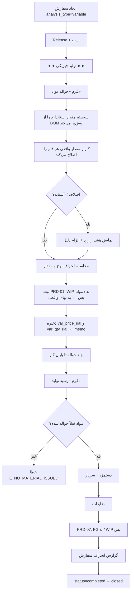

# 03-variable-analysis.md
## زیرگروه ۳ — تولید آنالیز متغیر (Variable / Actual-Consumption Production)

---

## ۱. هدف ماژول

تولید **تک‌مرحله‌ای** که در آن **کاربر مصرف واقعی هر ماده را وارد می‌کند** و سیستم **انحراف نسبت به فرمول** را محاسبه می‌کند.

**کاربرد در ترنم:**
- پارچه‌های طاقه‌ای با عرض متغیر (هر طاقه فرق دارد)
- مدل جدید که هنوز فرمولش تثبیت نشده
- سفارش‌هایی که برشکار گزارش دقیق مصرف می‌دهد
- هر جا که می‌خواهی بدانی «چقدر بیشتر از فرمول خرج شد؟»

**تفاوت با ماژول ۲:** فقط در **منبع مقدار مصرف**. تمام منطق بهایابی، سربار، ضایعات، اسناد و WIP یکسان است.

---

## ۲. ADR-011 — تصمیم کلیدی: انحرافات مواد سند نمی‌خورند

> **این مهم‌ترین تصمیم این ماژول است. با دقت بخوان.**

**تصمیم:** انحراف نرخ و انحراف مقدار مواد **محاسبه، ذخیره و گزارش** می‌شوند، ولی **سند حسابداری نمی‌خورند**. WIP به **بهای واقعی** بدهکار می‌شود.

**دلیل:**

۱. **سازگاری با ADR-003 (میانگین موزون دائمی).** در سیستم بهایابی استاندارد کامل، مواد به نرخ استاندارد از انبار خارج می‌شوند و انبار به نرخ استاندارد نگهداری می‌شود. این با میانگین موزون **ذاتاً ناسازگار** است. نمی‌شود هم‌زمان هر دو داشت.

۲. **سود دقیق ماهانه (خواسته صریح شما).** وقتی WIP و FG و COGS همه به بهای واقعی هستند، سود ناخالص **به‌صورت خودکار دقیق** است — بدون نیاز به تسهیم انحراف مواد. هر ثبت انحراف مواد یعنی موجودی به بهای مصنوعی می‌رود و بعد باید با تسهیم برگردانده شود — پیچیدگی بدون سود.

۳. **الزام مالیاتی ایران.** ماده ۱۴۸ ق.م.م و استاندارد حسابداری ۸ (موجودی مواد و کالا) بهای تمام‌شده واقعی را می‌پذیرند. بهایابی استاندارد کامل نیاز به تعدیل پایان دوره به واقعی دارد.

**نتیجه:**
| نوع انحراف | ثبت سند؟ | چرا |
|-----------|:--------:|-----|
| انحراف نرخ مواد (`5210`) | ❌ | WIP به واقعی — انحراف صرفاً اطلاعاتی |
| انحراف مقدار مواد (`5211`) | ❌ | همین |
| انحراف نرخ دستمزد (`5212`) | ✅ | مانده واقعی حساب کنترل `5201` |
| انحراف کارایی دستمزد (`5213`) | ✅ | همین |
| انحراف بودجه سربار (`5214`) | ✅ | مانده واقعی `5202` − `5203` |
| انحراف حجم سربار (`5215`) | ✅ | همین |
| ضایعات غیرعادی (`5221`) | ✅ | خروج واقعی ارزش از WIP |

> **حساب‌های `5210` و `5211` در chart_of_accounts ساخته می‌شوند ولی مانده‌شان همیشه صفر است** — برای آینده (اگر روزی به بهایابی استاندارد کامل مهاجرت کردی) و برای سازگاری با گزارش‌ها.
>
> **انحراف مواد در جداول `production_material_issues.var_price_rial`/`var_qty_rial` و `production_variances` با `status='memo'` ذخیره می‌شود** و در گزارش «تحلیل انحرافات» (R3-02) نمایش داده می‌شود.

---

## ۳. ساختار دیتابیس

همان جداول ماژول ۲. تفاوت‌ها:

| فیلد | ماژول ۲ (ثابت) | ماژول ۳ (متغیر) |
|------|----------------|------------------|
| `production_orders.analysis_type` | `'fixed'` | `'variable'` |
| `production_material_issues.issue_type` | `'backflush'` | `'issue'` |
| `qty_standard` | = `qty_actual` | از BOM |
| `qty_actual` | از BOM | **ورودی کاربر** |
| `qty_variance` | همیشه ۰ | `qty_actual − qty_standard` |
| `var_price_rial` | ممکن (نرخ) | ممکن |
| `var_qty_rial` | همیشه ۰ | محاسبه می‌شود |

**فیلد جدید لازم:**
```js
ensureColumn(db, 'production_material_issues', 'variance_status', "TEXT DEFAULT 'memo'");
// memo | posted   ← فعلاً همیشه memo (ADR-011)
```

---

## ۴. Workflow



**تفاوت جریان با ماژول ۲:**
| ماژول ۲ | ماژول ۳ |
|---------|---------|
| یک فرم: «رسید تولید» → همه‌چیز خودکار | دو فرم: «حواله مواد» سپس «رسید تولید» |
| حواله همراه رسید | حواله می‌تواند چند بار، قبل از رسید |
| برگشت مواد نادر | برگشت مواد رایج (`qty_actual` منفی) |

---

## ۵. فرمول‌های انحراف

### ۵.۱ تعاریف

```
SQ = مقدار استاندارد   = explodeBom(bom, qty_started).qty_final
AQ = مقدار واقعی       = ورودی کاربر
SP = نرخ استاندارد     = bom_lines.std_cost_rial  (یا products.std_cost_rial)
AP = نرخ واقعی         = products.average_cost_rial لحظه صدور
```

### ۵.۲ تفکیک دو انحرافی (روش استاندارد)

```
انحراف نرخ مواد   (MPV) = (AP − SP) × AQ
انحراف مقدار مواد (MQV) = (AQ − SQ) × SP
────────────────────────────────────────
انحراف کل         (MTV) = AQ×AP − SQ×SP
```

**اثبات تجزیه:**
```
(AP−SP)×AQ + (AQ−SQ)×SP
= AQ·AP − AQ·SP + AQ·SP − SQ·SP
= AQ·AP − SQ·SP  ✅
```

> **قرارداد علامت:** مقدار **مثبت = نامساعد (Unfavorable)**، **منفی = مساعد (Favorable)**.
> در UI: نامساعد قرمز 🔴، مساعد سبز 🟢.

### ۵.۳ چرا این تفکیک و نه تفکیک سه‌انحرافی؟

تفکیک سه‌انحرافی، «انحراف مشترک» `(AP−SP)×(AQ−SQ)` را جدا می‌کند. در عمل ایران رایج نیست و تفسیر مدیریتی سخت‌تری دارد. تفکیک دو‌انحرافی، اثر مشترک را به **انحراف نرخ** نسبت می‌دهد (چون `AQ` در فرمول MPV است) — این قرارداد استاندارد و پذیرفته‌شده است.

### ۵.۴ کنترل مسئولیت

| انحراف | مسئول در ترنم | اقدام |
|--------|---------------|-------|
| نرخ مواد نامساعد | خرید / بازار | مذاکره تأمین‌کننده، خرید عمده |
| مقدار مواد نامساعد | برشکار / کارگاه | آموزش، بازنگری الگو (T-Cuck) |
| مقدار مواد مساعد پایدار | **فرمول غلط است** | `versionUp` BOM → `qty_per_base` را کم کن |

> **قاعده هوشمند:** اگر انحراف مقدار یک قلم در **۳ سفارش متوالی** هم‌علامت و > ۵٪ بود → رویداد `production.bom.suggest_revision` + پیشنهاد خودکار نسخه جدید.

---

## ۶. مثال کامل عددی — سفارش `PO-1405-0004`

### ورودی
```
همان محصول و فرمول PO-1405-0001، ولی analysis_type='variable'
qty_started = 300  ·  qty_produced = 294  ·  waste_normal = 4  ·  waste_abnormal = 2
نرخ استاندارد در bom_lines.std_cost_rial:
   پارچه 900,000 · آستر 175,000 · نخ 85,000 · دکمه 12,500 · لیبل 6,000 · نایلون 9,000
نرخ واقعی (average_cost_rial لحظه صدور):
   پارچه 950,000 · آستر 180,000 · نخ 85,000 · دکمه 12,000 · لیبل 6,000 · نایلون 9,000
```

### مصرف واقعی گزارش‌شده توسط برشکار

| قلم | SQ (استاندارد) | AQ (واقعی) | SP | AP | AQ×AP (ریال) | انحراف نرخ | انحراف مقدار |
|-----|---------------:|-----------:|---:|---:|-------------:|-----------:|-------------:|
| پارچه کتان | ۵۱۵.۴۶۳۹ | **۵۳۰.۰۰** | ۹۰۰٬۰۰۰ | ۹۵۰٬۰۰۰ | ۵۰۳٬۵۰۰٬۰۰۰ | 🔴 +۲۶٬۵۰۰٬۰۰۰ | 🔴 +۱۳٬۰۸۲٬۴۷۴ |
| آستر | ۱۱۱.۵۹۵۳ | **۱۰۵.۰۰** | ۱۷۵٬۰۰۰ | ۱۸۰٬۰۰۰ | ۱۸٬۹۰۰٬۰۰۰ | 🔴 +۵۲۵٬۰۰۰ | 🟢 −۱٬۱۵۴٬۱۷۵ |
| نخ | ۲۴.۷۴۲۳ | **۲۶.۰۰** | ۸۵٬۰۰۰ | ۸۵٬۰۰۰ | ۲٬۲۱۰٬۰۰۰ | ۰ | 🔴 +۱۰۶٬۹۰۷ |
| دکمه | ۱٬۸۹۳.۵۴۰۹ | **۱٬۹۰۰** | ۱۲٬۵۰۰ | ۱۲٬۰۰۰ | ۲۲٬۸۰۰٬۰۰۰ | 🟢 −۹۵۰٬۰۰۰ | 🔴 +۸۰٬۷۳۹ |
| **جمع مواد** | | | | | **۵۴۷٬۴۱۰٬۰۰۰** | **+۲۶٬۰۷۵٬۰۰۰** | **+۱۲٬۱۱۵٬۹۴۵** |
| لیبل | ۳۰۹.۲۷۸۴ | **۳۰۰** | ۶٬۰۰۰ | ۶٬۰۰۰ | ۱٬۸۰۰٬۰۰۰ | ۰ | 🟢 −۵۵٬۶۷۰ |
| نایلون | ۳۰۹.۲۷۸۴ | **۳۰۰** | ۹٬۰۰۰ | ۹٬۰۰۰ | ۲٬۷۰۰٬۰۰۰ | ۰ | 🟢 −۸۳٬۵۰۵ |
| **جمع بسته‌بندی** | | | | | **۴٬۵۰۰٬۰۰۰** | **۰** | **−۱۳۹٬۱۷۵** |
| **جمع کل** | | | | | **۵۵۱٬۹۱۰٬۰۰۰** | **+۲۶٬۰۷۵٬۰۰۰** | **+۱۱٬۹۷۶٬۷۷۰** |

**راستی‌آزمایی:**
```
بهای استاندارد کل  = Σ SQ×SP = ۵۱۳٬۸۵۸٬۲۳۰
بهای واقعی کل      = Σ AQ×AP = ۵۵۱٬۹۱۰٬۰۰۰
انحراف کل          = ۵۵۱٬۹۱۰٬۰۰۰ − ۵۱۳٬۸۵۸٬۲۳۰ = ۳۸٬۰۵۱٬۷۷۰
انحراف نرخ + مقدار = ۲۶٬۰۷۵٬۰۰۰ + ۱۱٬۹۷۶٬۷۷۰ = ۳۸٬۰۵۱٬۷۷۰  ✅
```

### سند PRD-01 (به بهای **واقعی** — ADR-011)

| حساب | نام | بدهکار (ریال) | بستانکار (ریال) |
|------|-----|--------------:|----------------:|
| `1111` | کالای در جریان ساخت — PO-1405-0004 | ۵۵۱٬۹۱۰٬۰۰۰ | |
| `1110` | موجودی مواد اولیه | | ۵۴۷٬۴۱۰٬۰۰۰ |
| `1112` | موجودی مواد بسته‌بندی | | ۴٬۵۰۰٬۰۰۰ |

> **هیچ سطری برای `5210` یا `5211` نیست.** ✅ (ADR-011)

### بقیه گام‌ها (مانند ماژول ۲)

```
دستمزد (PRD-03/04):  ۸۷٬۰۰۰٬۰۰۰
سربار  (PRD-05):     ۴۵٬۰۰۰٬۰۰۰
──────────────────────────────────
WIP کل = ۵۵۱٬۹۱۰٬۰۰۰ + ۸۷٬۰۰۰٬۰۰۰ + ۴۵٬۰۰۰٬۰۰۰ = ۶۸۳٬۹۱۰٬۰۰۰

cost_per_started = ۶۸۳٬۹۱۰٬۰۰۰ / ۳۰۰ = ۲٬۲۷۹٬۷۰۰ ریال

ضایعات غیرعادی (۲) — PRD-09: ۲٬۲۷۹٬۷۰۰ × ۲ = ۴٬۵۵۹٬۴۰۰
ضایعات قابل فروش — PRD-10:   ۲۷ × ۱۲۰٬۰۰۰ = ۳٬۲۴۰٬۰۰۰

WIP_net = ۶۸۳٬۹۱۰٬۰۰۰ − ۴٬۵۵۹٬۴۰۰ − ۳٬۲۴۰٬۰۰۰ = ۶۷۶٬۱۱۰٬۶۰۰
unit_cost = round(۶۷۶٬۱۱۰٬۶۰۰ / ۲۹۴) = ۲٬۲۹۹٬۶۹۷ ریال
```

**سند PRD-07:** `1104` بدهکار ۶۷۶٬۱۱۰٬۶۰۰ / `1111` بستانکار ۶۷۶٬۱۱۰٬۶۰۰
**WIP = صفر ✅**

### گزارش انحراف سفارش (R3-02)

```
┌──────────────────────────────────────────────────────────────────┐
│ تحلیل انحراف — PO-1405-0004                                      │
├──────────────────────────────────────────────────────────────────┤
│ بهای استاندارد مواد (۳۰۰ عدد)        ۵۱۳٬۸۵۸٬۲۳۰ ریال            │
│ بهای واقعی مواد                       ۵۵۱٬۹۱۰٬۰۰۰ ریال            │
│ ═════════════════════════════════════════════════════            │
│ 🔴 انحراف کل مواد                      +۳۸٬۰۵۱٬۷۷۰  (+۷.۴٪)      │
│    ├─ 🔴 انحراف نرخ  (مسئول: خرید)     +۲۶٬۰۷۵٬۰۰۰  (۶۸.۵٪)      │
│    └─ 🔴 انحراف مقدار (مسئول: کارگاه)  +۱۱٬۹۷۶٬۷۷۰  (۳۱.۵٪)      │
│                                                                   │
│ بزرگ‌ترین مقصر: پارچه کتان — ۱۴.۵۴ متر بیش از فرمول (+۲.۸٪)      │
│                                                                   │
│ 💡 پیشنهاد: انحراف مقدار پارچه در ۳ سفارش اخیر مثبت بوده.        │
│    فرمول را بازنگری کنید: ۱.۶۰ → ۱.۶۴ متر  [ساخت نسخه ۲]        │
│                                                                   │
│ ℹ️ این انحرافات اطلاعاتی هستند و سند حسابداری ندارند             │
│    (بهای تمام‌شده به روش واقعی محاسبه می‌شود)                    │
└──────────────────────────────────────────────────────────────────┘
```

### مقایسه ماژول ۲ و ۳ روی همان سفارش

| | ماژول ۲ (ثابت) | ماژول ۳ (متغیر) | اختلاف |
|-|---------------:|----------------:|-------:|
| مواد + بسته‌بندی | ۵۳۹٬۲۴۲٬۶۳۲ | ۵۵۱٬۹۱۰٬۰۰۰ | +۱۲٬۶۶۷٬۳۶۸ |
| WIP کل | ۶۷۱٬۲۴۲٬۶۳۲ | ۶۸۳٬۹۱۰٬۰۰۰ | +۱۲٬۶۶۷٬۳۶۸ |
| بهای واحد | ۲٬۲۵۶٬۸۹۷ | ۲٬۲۹۹٬۶۹۷ | **+۴۲٬۸۰۰** (+۱.۹٪) |

> **درس:** آنالیز ثابت وقتی مصرف واقعی بیشتر از فرمول است، بهای تمام‌شده را **کمتر از واقع** نشان می‌دهد و اختلاف در انبار مواد باقی می‌ماند تا انبارگردانی آن را کشف کند (کسری انبار). آنالیز متغیر این را همان لحظه می‌گیرد.

---

## ۷. سناریوهای واقعی تولید

| # | سناریو | رفتار |
|---|--------|-------|
| V-01 | مصرف = استاندارد دقیقاً | `qty_variance=0` · انحراف مقدار صفر |
| V-02 | مصرف بیشتر | انحراف مقدار نامساعد 🔴 + الزام دلیل اگر > ۵٪ |
| V-03 | مصرف کمتر | انحراف مقدار مساعد 🟢 + هشدار «فرمول را بازنگری کن» |
| V-04 | برگشت مواد به انبار | حواله با `qty_actual` منفی · `issue_type='return'` · PRD-02 |
| V-05 | چند حواله برای یک سفارش | همه جمع می‌شوند · انحراف روی مجموع |
| V-06 | حواله ماده‌ای که در BOM نیست | مجاز · `SQ=0` · کل مصرف = انحراف مقدار نامساعد + هشدار |
| V-07 | ماده جایگزین | `substitute_of_product_id` + `issue_type='substitute'` · SQ از قلم اصلی |
| V-08 | نرخ استاندارد صفر | Fallback به `AP` → انحراف نرخ = ۰ + هشدار |
| V-09 | حواله بعد از رسید | مجاز تا `status != 'closed'` · بهای واحد بازمحاسبه + **الزام Reversal رسید** |
| V-10 | تبدیل ثابت → متغیر | فقط در `draft` · بعد از تراکنش `E_ANALYSIS_LOCKED` |
| V-11 | مصرف پارچه از دو طاقه با نرخ متفاوت | دو سطر حواله جدا با نرخ میانگین یکسان (میانگین موزون نرخ واحد دارد) |
| V-12 | برشکار عدد نمی‌دهد | استفاده از دکمه «پر کردن از فرمول» → عملاً می‌شود ماژول ۲ |
| V-13 | انحراف مقدار مثبت پایدار ۳ سفارش | `production.bom.suggest_revision` |
| V-14 | حواله بدون رسید (سفارش نیمه‌کاره پایان ماه) | WIP باز · در `wip_close_rial` می‌آید ✅ |

---

## ۸. سناریوهای حسابداری

| رویداد | سند | بدهکار | بستانکار | مبلغ |
|--------|-----|--------|----------|------|
| حواله مواد | PRD-01 | `1111` | `1110`+`1112` | **AQ × AP** (واقعی) |
| برگشت مواد | PRD-02 | `1110` | `1111` | qty × نرخ سند اصلی |
| بقیه | — | مانند ماژول ۲ | | |

> **⛔ هیچ سندی برای `5210`/`5211` — ADR-011**

### برگشت مواد و میانگین موزون

```
برگشت باید به **نرخ سند حواله اصلی** باشد، نه میانگین جاری:

  amount = qty_return × unit_cost_rial(حواله اصلی)

  prev_qty = products.stock;  prev_avg = products.average_cost_rial
  new_qty  = prev_qty + qty_return
  new_val  = prev_qty × prev_avg + amount
  new_avg  = round(new_val / new_qty)
```

**چرا نرخ اصلی؟** اگر بین حواله و برگشت خرید جدیدی شده و میانگین بالا رفته، برگشت به میانگین جدید یعنی WIP کمتر از آنچه بدهکار شده بستانکار می‌شود → مانده کاذب در WIP. برگشت به نرخ اصلی، اثر حواله را دقیقاً خنثی می‌کند.

---

## ۹. قوانین اعتبارسنجی

همه V2-01 تا V2-18 از ماژول ۲، به‌علاوه:

| کد | قانون | خطا |
|----|-------|-----|
| V3-01 | `analysis_type` باید `'variable'` باشد | `E_WRONG_ANALYSIS` |
| V3-02 | حواله باید حداقل یک قلم داشته باشد | `E_ISSUE_EMPTY` |
| V3-03 | `qty_actual ≠ 0` | `E_QTY_ZERO` |
| V3-04 | برگشت (`qty_actual < 0`) نمی‌تواند بیش از مجموع حواله‌های قبلی باشد | `E_RETURN_EXCEEDS_ISSUE` |
| V3-05 | اگر `|qty_variance / qty_standard| > threshold` → `reason` اجباری | `E_VARIANCE_NEEDS_REASON` |
| V3-06 | رسید بدون حواله قبلی ممنوع | `E_NO_MATERIAL_ISSUED` |
| V3-07 | تغییر `analysis_type` بعد از تراکنش ممنوع | `E_ANALYSIS_LOCKED` |
| V3-08 | حواله بعد از `status='completed'` → الزام Reversal رسید | `E_RECEIPT_EXISTS` |
| V3-09 | `substitute_of_product_id` باید در BOM باشد | `E_SUBSTITUTE_INVALID` |
| V3-10 | ماده خارج از BOM → هشدار (نه خطا) | `W_ITEM_NOT_IN_BOM` |

**آستانه پیش‌فرض:** `settings.production_variance_reason_threshold_pct = 5`

---

## ۱۰. Edge Case ها

| # | حالت | راه‌حل |
|---|------|--------|
| E3-01 | `SQ = 0` (ماده خارج از فرمول) | `MQV = AQ × SP` کل نامساعد · `MPV = (AP−SP)×AQ` |
| E3-02 | `SP = 0` (نرخ استاندارد تعریف نشده) | `SP := AP` → `MPV=0`, `MQV=(AQ−SQ)×AP` + هشدار |
| E3-03 | `AQ` منفی (برگشت) بیشتر از حواله کل | V3-04 |
| E3-04 | مجموع حواله‌ها بعد از برگشت = ۰ | مجاز · WIP مواد = ۰ |
| E3-05 | حواله در ماه ۱، رسید در ماه ۲ | WIP بین دو ماه · هر دو در دوره خودشان |
| E3-06 | برگشت در ماه بعد از حواله | مجاز اگر ماه باز · نرخ سند اصلی |
| E3-07 | تغییر `qty_started` بعد از حواله | `SQ` بازمحاسبه → انحراف مقدار عوض می‌شود ✅ خودکار |
| E3-08 | همان ماده در دو سطر حواله | مجاز · جمع می‌شوند برای انحراف |
| E3-09 | انحراف مقدار مساعد ۵۰٪ (فرمول کاملاً غلط) | هشدار قرمز + پیشنهاد بازنگری فرمول |
| E3-10 | `AP` صفر (کالای بدون خرید) | `E_ZERO_AVG_COST` |
| E3-11 | برگشت ماده‌ای که حواله نشده | `E_RETURN_WITHOUT_ISSUE` |
| E3-12 | حواله با تاریخ قبل از `actual_start` | مجاز با هشدار |

---

## ۱۱. خطاهای احتمالی

| کد | HTTP | پیام |
|----|------|------|
| `E_WRONG_ANALYSIS` | 409 | نوع آنالیز این سفارش «{type}» است |
| `E_ISSUE_EMPTY` | 422 | حواله باید حداقل یک قلم داشته باشد |
| `E_QTY_ZERO` | 422 | مقدار مصرف نمی‌تواند صفر باشد |
| `E_RETURN_EXCEEDS_ISSUE` | 422 | برگشت ({r}) بیش از مصرف ثبت‌شده ({i}) است |
| `E_VARIANCE_NEEDS_REASON` | 422 | انحراف «{name}» {pct}٪ است — دلیل الزامی است |
| `E_NO_MATERIAL_ISSUED` | 422 | ابتدا حواله مواد را ثبت کنید |
| `E_ANALYSIS_LOCKED` | 409 | نوع آنالیز پس از اولین تراکنش قابل تغییر نیست |
| `E_RECEIPT_EXISTS` | 409 | رسید ثبت شده — ابتدا آن را ابطال کنید |
| `E_SUBSTITUTE_INVALID` | 422 | کالای جایگزین‌شده در فرمول نیست |
| `E_RETURN_WITHOUT_ISSUE` | 422 | برای «{name}» حواله‌ای ثبت نشده |
| `W_ITEM_NOT_IN_BOM` | 200⚠ | «{name}» در فرمول نیست — کل مصرف انحراف محسوب می‌شود |

---

## ۱۲. Undo و اصلاح

| عملیات | روش |
|--------|-----|
| اصلاح مقدار حواله | Reversal حواله → حواله جدید (**ویرایش ممنوع**) |
| برگشت واقعی مواد | حواله جدید با `qty_actual` منفی، `issue_type='return'` (این Reversal نیست — رویداد جدید) |
| ابطال کل سفارش | ترتیب معکوس ماژول ۲ (§۱۴) |

> **تفکیک مهم:** «Reversal» = اشتباه ثبت را خنثی کن. «Return» = مواد واقعاً به انبار برگشت.
> Reversal تاریخ امروز می‌خورد، Return تاریخ برگشت واقعی.

---

## ۱۳. گزارش‌ها

| گزارش | endpoint |
|-------|----------|
| R3-01 حواله‌های سفارش | `GET /production/orders/:id/issues` |
| R3-02 تحلیل انحراف سفارش | `GET /production/orders/:id/variance-analysis` |
| R3-03 انحراف دوره به تفکیک ماده | `GET /production/reports/material-variance?period=` |
| R3-04 انحراف دوره به تفکیک محصول | `GET /production/reports/product-variance?period=` |
| R3-05 روند انحراف یک ماده | `GET /production/reports/variance-trend?product_id=` |
| R3-06 پیشنهاد بازنگری فرمول | `GET /production/reports/bom-revision-suggestions` |
| R3-07 مقایسه ثابت/متغیر | `GET /production/reports/analysis-compare?product_id=` |
| R3-08 دلایل انحراف (Pareto) | `GET /production/reports/variance-reasons?period=` |

---

## ۱۴. دسترسی کاربران

همان ماژول ۲. اضافه:

| نقش | ثبت حواله | مشاهده انحراف | مشاهده نرخ استاندارد |
|-----|:---------:|:-------------:|:--------------------:|
| admin | ✅ | ✅ | ✅ |
| accounting | ✅ | ✅ | ✅ |
| production_manager | ✅ | ✅ | ✅ |
| production_operator | ✅ | ❌ | ❌ |

> اپراتور فقط **مقدار** وارد می‌کند؛ ستون‌های نرخ و مبلغ برایش مخفی است (`hide_cost=1`).

---

## ۱۵. APIهای موردنیاز

```
POST   /api/production/orders/:id/issue           ★ ثبت حواله مواد
       body: { date, warehouse_id,
               lines: [ { product_id, qty_actual, reason?, substitute_of_product_id? } ] }
GET    /api/production/orders/:id/issue-template   پیش‌پر از BOM
GET    /api/production/orders/:id/issues           فهرست حواله‌ها
POST   /api/production/orders/:id/return           برگشت مواد
GET    /api/production/orders/:id/variance-analysis
GET    /api/production/reports/material-variance
GET    /api/production/reports/bom-revision-suggestions
POST   /api/production/orders/:id/receipt          همان endpoint ماژول ۲ (بدون Backflush)
```

### `GET /orders/:id/issue-template?qty_started=300`

```json
{
  "order_no": "PO-1405-0004", "qty_started": 300, "analysis_type": "variable",
  "warehouse_id": 1,
  "lines": [
    { "product_id":201, "name":"پارچه کتان ۱۴۰ سانت — سبز", "unit":"متر",
      "qty_standard":515.4639, "qty_actual":515.4639,
      "std_cost_rial":900000, "avg_cost_rial":950000,
      "on_hand":620, "in_bom":true },
    { "product_id":202, "name":"آستر ساده", "unit":"متر",
      "qty_standard":111.5953, "qty_actual":111.5953,
      "std_cost_rial":175000, "avg_cost_rial":180000,
      "on_hand":150, "in_bom":true }
  ]
}
```

### `POST /orders/:id/issue`

**درخواست:**
```json
{
  "date": "1405/04/11", "warehouse_id": 1,
  "lines": [
    { "product_id":201, "qty_actual":530,  "reason":"عرض طاقه ۱۳۵ به‌جای ۱۴۰" },
    { "product_id":202, "qty_actual":105 },
    { "product_id":203, "qty_actual":26 },
    { "product_id":204, "qty_actual":1900 },
    { "product_id":205, "qty_actual":300 },
    { "product_id":206, "qty_actual":300 }
  ]
}
```

**پاسخ:**
```json
{
  "ok": true, "issue_no": "MI-1405-0032",
  "lines": [
    { "product_id":201, "name":"پارچه کتان",
      "qty_standard":515.4639, "qty_actual":530, "qty_variance":14.5361,
      "std_cost_rial":900000, "unit_cost_rial":950000,
      "std_amount_rial":463917526, "amount_rial":503500000,
      "var_price_rial":26500000, "var_qty_rial":13082474,
      "var_total_rial":39582474, "var_pct":8.53, "favorable":false,
      "reason":"عرض طاقه ۱۳۵ به‌جای ۱۴۰" }
  ],
  "totals": {
    "material_rial":547410000, "packaging_rial":4500000, "total_rial":551910000,
    "std_total_rial":513858230,
    "var_price_rial":26075000, "var_qty_rial":11976770, "var_total_rial":38051770,
    "var_pct":7.41
  },
  "journal_entry": { "event":"PRD-01", "je_id":4601, "voucher_no":"JV-1405-0498",
                     "amount_rial":551910000 },
  "note": "انحرافات اطلاعاتی هستند و سند حسابداری ندارند (ADR-011)",
  "warnings": [
    "انحراف مقدار «پارچه کتان» ۲.۸٪ نامساعد",
    "این سومین سفارش متوالی با انحراف مثبت پارچه — بازنگری فرمول پیشنهاد می‌شود"
  ]
}
```

---

## ۱۶. رویدادها

| رویداد | Payload |
|--------|---------|
| `production.material.issued` | `{orderId, issueNo, lines[], totalRial, varTotalRial}` |
| `production.material.returned` | `{orderId, lines[], totalRial}` |
| `production.variance.detected` | `{orderId, productId, type, amountRial, pct, favorable}` |
| `production.bom.suggest_revision` | `{productId, bomId, lineId, currentQty, suggestedQty, sampleSize, avgVariancePct}` |

**منطق `bom.suggest_revision`:**
```sql
SELECT mi.product_id, AVG(mi.qty_variance / NULLIF(mi.qty_standard,0)) AS avg_pct, COUNT(*) n
FROM production_material_issues mi
JOIN production_orders po ON po.id = mi.order_id
WHERE po.product_id = :fgId AND po.status IN ('completed','closed')
  AND mi.issue_type = 'issue' AND mi.status = 'posted'
  AND po.actual_end >= :last3OrdersDate
GROUP BY mi.product_id
HAVING n >= 3 AND ABS(avg_pct) > 0.05
       AND MIN(SIGN(mi.qty_variance)) = MAX(SIGN(mi.qty_variance));   -- هم‌علامت
```
پیشنهاد: `suggested_qty_per_base = qty_per_base × (1 + avg_pct)`

---

## ۱۷. پیشنهاد UI

### فرم حواله مواد

```
┌────────────────────────────────────────────────────────────────────────────┐
│ حواله مواد به تولید — PO-1405-0004 · مانتو ترمه سبز · ۳۰۰ عدد             │
├────────────────────────────────────────────────────────────────────────────┤
│ 📅 [۱۴۰۵/۰۴/۱۱]   🏬 انبار: [مواد اولیه — نبوت ▾]                          │
│ [🔄 پر کردن از فرمول]  [📋 کپی حواله قبلی]  [🗑 پاک کردن]                   │
├──────────────┬──────────┬──────────┬────────┬───────┬──────────────┬───────┤
│ کالا         │استاندارد │  واقعی   │ اختلاف │  ٪    │ مبلغ (ریال)  │ دلیل  │
├──────────────┼──────────┼──────────┼────────┼───────┼──────────────┼───────┤
│پارچه کتان سبز│ ۵۱۵.۴۶  │[ 530.00 ]│ +۱۴.۵۴ │🔴+۲.۸│ ۵۰۳٬۵۰۰٬۰۰۰ │[عرض..]│
│آستر ساده     │ ۱۱۱.۶۰  │[ 105.00 ]│ −۶.۶۰  │🟢−۵.۹│  ۱۸٬۹۰۰٬۰۰۰ │[     ]│
│نخ پلی‌استر   │  ۲۴.۷۴  │[  26.00 ]│ +۱.۲۶  │🔴+۵.۱│   ۲٬۲۱۰٬۰۰۰ │[     ]│
│دکمه چوبی     │۱۸۹۳.۵۴  │[ 1900   ]│ +۶.۴۶  │  +۰.۳│  ۲۲٬۸۰۰٬۰۰۰ │[     ]│
│لیبل ترنم     │ ۳۰۹.۲۸  │[  300   ]│ −۹.۲۸  │🟢−۳.۰│   ۱٬۸۰۰٬۰۰۰ │[     ]│
│نایلون        │ ۳۰۹.۲۸  │[  300   ]│ −۹.۲۸  │🟢−۳.۰│   ۲٬۷۰۰٬۰۰۰ │[     ]│
├──────────────┴──────────┴──────────┴────────┴───────┴──────────────┴───────┤
│                                          [+ افزودن قلم خارج از فرمول]      │
├────────────────────────────────────────────────────────────────────────────┤
│ ┌─ 📊 خلاصه انحراف ───────────────────────────────────────────────┐        │
│ │ بهای استاندارد   ۵۱۳٬۸۵۸٬۲۳۰                                    │        │
│ │ بهای واقعی       ۵۵۱٬۹۱۰٬۰۰۰                                    │        │
│ │ 🔴 انحراف کل      +۳۸٬۰۵۱٬۷۷۰  (+۷.۴٪)                          │        │
│ │    ├ نرخ  (خرید)  +۲۶٬۰۷۵٬۰۰۰  ████████████████░░░ ۶۸.۵٪       │        │
│ │    └ مقدار(کارگاه)+۱۱٬۹۷۶٬۷۷۰  ████████░░░░░░░░░░░ ۳۱.۵٪       │        │
│ └─────────────────────────────────────────────────────────────────┘        │
│                                                                             │
│ ⚠️ انحراف مقدار «نخ» ۵.۱٪ است — دلیل الزامی                                │
│ 💡 سومین سفارش متوالی با انحراف مثبت پارچه [بازنگری فرمول]                 │
│                                                                             │
│ 📄 ۱ سند: WIP بدهکار ۵۵۱٬۹۱۰٬۰۰۰ / مواد بستانکار                          │
│                                    [انصراف]  [✅ ثبت حواله]                │
└────────────────────────────────────────────────────────────────────────────┘
```

**تعاملات:**
- تایپ در «واقعی» → محاسبه زنده اختلاف/٪/مبلغ (بدون درخواست سرور — فرمول سمت کلاینت)
- `|٪| > 5` → سلول دلیل قرمز + دکمه ثبت غیرفعال تا پر شود
- 🟢 مساعد سبز `#2D7A5F` · 🔴 نامساعد قرمز `#C0392B` · خنثی خاکستری
- برای `production_operator`: ستون‌های «مبلغ»، «٪» و کارت خلاصه **مخفی**
- Mobile: هر قلم یک کارت با استپر عددی بزرگ

---

## ۱۸. تست‌کیس‌ها

| # | عنوان | ورودی | انتظار |
|---|-------|-------|--------|
| T3-01 | قالب حواله | `GET issue-template?qty_started=300` | ۶ سطر با `qty_standard` صحیح |
| T3-02 | حواله = استاندارد | AQ=SQ | همه `qty_variance=0`, `var_qty_rial=0` |
| T3-03 | انحراف نرخ پارچه | AQ=530, SP=900k, AP=950k | `var_price_rial = 26,500,000` |
| T3-04 | انحراف مقدار پارچه | — | `var_qty_rial = 13,082,474` |
| T3-05 | **تجزیه انحراف** | — | `Σvar_price + Σvar_qty = ΣAQ×AP − ΣSQ×SP` |
| T3-06 | مبلغ سند = واقعی | — | `1111` بدهکار = ۵۵۱٬۹۱۰٬۰۰۰ |
| T3-07 | **بدون سند انحراف** | — | هیچ `journal_lines` با `5210` یا `5211` |
| T3-08 | بهای واحد | — | `unit_cost_rial = 2,299,697` |
| T3-09 | WIP صفر | close | مانده `1111` سفارش = ۰ |
| T3-10 | دلیل الزامی | انحراف ۶٪ بدون دلیل | `422 E_VARIANCE_NEEDS_REASON` |
| T3-11 | ماده خارج از BOM | product_id=999 | `W_ITEM_NOT_IN_BOM` · `SQ=0` · کل = انحراف مقدار |
| T3-12 | برگشت مواد | qty=-30 | `1110` بدهکار ۲۸٬۵۰۰٬۰۰۰ (۳۰×۹۵۰k نرخ اصلی) |
| T3-13 | برگشت > حواله | qty=-600 | `422 E_RETURN_EXCEEDS_ISSUE` |
| T3-14 | برگشت با میانگین تغییریافته | خرید بین حواله و برگشت | برگشت به نرخ **سند اصلی** |
| T3-15 | رسید بدون حواله | receipt | `422 E_NO_MATERIAL_ISSUED` |
| T3-16 | تغییر آنالیز بعد از حواله | PUT analysis_type | `409 E_ANALYSIS_LOCKED` |
| T3-17 | چند حواله | ۳ حواله | انحراف روی مجموع محاسبه شود |
| T3-18 | SP=0 | حذف `std_cost_rial` | `SP:=AP` · `var_price=0` · هشدار |
| T3-19 | پیشنهاد بازنگری | ۳ سفارش با +۳٪ | رویداد `bom.suggest_revision` + `suggested_qty=1.648` |
| T3-20 | مقایسه با ماژول ۲ | همان داده | اختلاف بهای واحد = ۴۲٬۸۰۰ ریال |
| T3-21 | جایگزین | `substitute_of_product_id=201` | `SQ` از قلم ۲۰۱ · `issue_type='substitute'` |
| T3-22 | ابطال حواله | reverse | موجودی + میانگین + دفتر کل بازگردد |
| T3-23 | حواله بعد از رسید | issue پس از receipt | `409 E_RECEIPT_EXISTS` |
| T3-24 | اپراتور | حواله با نقش operator | ثبت موفق · پاسخ بدون فیلدهای مبلغ |

---

## ۱۹. شبه‌کد

```js
// server/lib/production/engine.js — استراتژی variable

function postMaterialIssue(db, { orderId, body, userId }) {
  return db.transaction(() => {
    const po = db.prepare('SELECT * FROM production_orders WHERE id=?').get(orderId);
    if (!po)                            throw err('E_NOT_FOUND', 404);
    if (po.analysis_type !== 'variable' && po.analysis_type !== 'variable_adv')
                                        throw err('E_WRONG_ANALYSIS', 409, { type: po.analysis_type });
    if (po.status === 'closed')         throw err('E_ORDER_CLOSED', 409);
    if (po.status === 'completed')      throw err('E_RECEIPT_EXISTS', 409);
    if (!body.lines?.length)            throw err('E_ISSUE_EMPTY', 422);

    const date   = body.date || todayJalali();
    const period = jalaliPeriod(date);
    assertFiscalYearWritable(db, date);
    assertPeriodOpen(db, period);

    const whId       = body.warehouse_id || po.warehouse_raw_id;
    const qtyStarted = body.qty_started || po.qty_planned;
    const threshold  = parseFloat(setting(db,'production_variance_reason_threshold_pct')) || 5;

    // مقادیر استاندارد از BOM
    const std = {};
    if (po.bom_id) {
      const ex = explodeBom(db, { bomId: po.bom_id, qty: qtyStarted,
                                  sizeBreakdown: safeJson(po.size_breakdown), priceBasis: 'std' });
      for (const L of ex.lines) std[L.product_id] = { qty: L.qty_final, price: L.unit_cost_rial, kind: L.line_kind };
    }

    const issueNo = allocateNumber(db,'material_issue','MI');
    let matRial = 0, pkgRial = 0, varP = 0, varQ = 0;
    const out = [], warnings = [];

    for (const L of body.lines) {
      const AQ = num(L.qty_actual);
      if (AQ === 0) throw err('E_QTY_ZERO', 422);

      const prod = db.prepare('SELECT * FROM products WHERE id=?').get(L.product_id);
      if (!prod) throw err('E_NOT_FOUND', 404, { product_id: L.product_id });

      const s  = std[L.product_id] || std[L.substitute_of_product_id];
      const SQ = s?.qty ?? 0;
      let   SP = s?.price ?? 0;
      const AP = prod.average_cost_rial;

      if (AQ > 0 && !AP) throw err('E_ZERO_AVG_COST', 422, { name: prod.name });
      if (!SP) { SP = AP; warnings.push(`نرخ استاندارد «${prod.name}» تعریف نشده — از نرخ واقعی استفاده شد`); }
      if (!s)  warnings.push(`«${prod.name}» در فرمول نیست — کل مصرف انحراف محسوب می‌شود`);

      // برگشت: نرخ سند اصلی، نه میانگین جاری
      let unitCost = AP;
      if (AQ < 0) {
        const orig = db.prepare(`SELECT unit_cost_rial, SUM(qty_actual) tot
                                 FROM production_material_issues
                                 WHERE order_id=? AND product_id=? AND status='posted'
                                 GROUP BY product_id`).get(orderId, L.product_id);
        if (!orig || orig.tot <= 0) throw err('E_RETURN_WITHOUT_ISSUE', 422, { name: prod.name });
        if (Math.abs(AQ) > orig.tot) throw err('E_RETURN_EXCEEDS_ISSUE', 422, { r: Math.abs(AQ), i: orig.tot });
        unitCost = orig.unit_cost_rial;
      }

      // انحراف
      const varQty   = round6(AQ - SQ);
      const varPRial = Math.round((unitCost - SP) * AQ);   // MPV = (AP−SP)×AQ
      const varQRial = Math.round(varQty * SP);            // MQV = (AQ−SQ)×SP
      const pct      = SQ ? (varQty / SQ) * 100 : (AQ > 0 ? 100 : 0);

      if (Math.abs(pct) > threshold && !L.reason && AQ > 0)
        throw err('E_VARIANCE_NEEDS_REASON', 422, { name: prod.name, pct: pct.toFixed(1) });

      const amount = Math.round(AQ * unitCost);

      // انبار
      if (AQ > 0) issueFromStock(db, { productId: L.product_id, warehouseId: whId, qty: AQ, userId, note: `حواله ${issueNo}` });
      else        restoreStock(db,   { productId: L.product_id, warehouseId: whId, qty: -AQ, userId, note: `برگشت ${issueNo}`,
                                       unitCostRial: unitCost });

      db.prepare(`INSERT INTO production_material_issues
        (doc_no,order_id,cost_center_id,product_id,issue_type,
         qty_standard,qty_actual,qty_variance,unit_cost_rial,std_cost_rial,
         amount_rial,std_amount_rial,var_price_rial,var_qty_rial,
         warehouse_id,substitute_of_product_id,date,period_label,
         status,variance_status,note,created_by)
        VALUES (?,?,?,?,?,?,?,?,?,?,?,?,?,?,?,?,?,?,'posted','memo',?,?)`)
        .run(issueNo, orderId, po.cost_center_id, L.product_id,
             AQ < 0 ? 'return' : (L.substitute_of_product_id ? 'substitute' : 'issue'),
             SQ, AQ, varQty, unitCost, SP, amount, Math.round(SQ * SP),
             varPRial, varQRial, whId, L.substitute_of_product_id || null,
             date, period, L.reason || '', userId);

      const kind = s?.kind || (prod.item_type === 'packaging' ? 'packaging' : 'material');
      if (kind === 'packaging') pkgRial += amount; else matRial += amount;
      varP += varPRial; varQ += varQRial;

      // انحراف memo برای گزارش دوره
      if (varPRial || varQRial) {
        insertVarianceMemo(db, { period, orderId, productId: L.product_id,
                                 type: 'material_price', rial: varPRial });
        insertVarianceMemo(db, { period, orderId, productId: L.product_id,
                                 type: 'material_qty',   rial: varQRial });
        emit(db, 'production.variance.detected',
             { orderId, productId: L.product_id, type: 'material', amountRial: varPRial + varQRial, pct, favorable: varQRial < 0 });
      }

      if (AQ > 0) checkReorderPoint(db, L.product_id);
      out.push({ product_id: L.product_id, name: prod.name, qty_standard: SQ, qty_actual: AQ,
                 qty_variance: varQty, std_cost_rial: SP, unit_cost_rial: unitCost,
                 std_amount_rial: Math.round(SQ*SP), amount_rial: amount,
                 var_price_rial: varPRial, var_qty_rial: varQRial,
                 var_total_rial: varPRial + varQRial, var_pct: round2(pct),
                 favorable: (varPRial + varQRial) < 0, reason: L.reason || '' });
    }

    // ═══ سند PRD-01/PRD-02 — به بهای واقعی (ADR-011) ═══
    const totalRial = matRial + pkgRial;
    const lines = totalRial >= 0
      ? plug([ dr(db,'coa_wip', totalRial, po.coa_wip_tafsili),
               cr(db,'coa_raw_materials', matRial),
               cr(db,'coa_packaging_materials', pkgRial) ])
      : plug([ dr(db,'coa_raw_materials', -matRial),
               dr(db,'coa_packaging_materials', -pkgRial),
               cr(db,'coa_wip', -totalRial, po.coa_wip_tafsili) ]);

    const je = postToLedger(db, {
      sourceType: totalRial >= 0 ? 'production_material_issue' : 'production_material_return',
      sourceId: orderId, date, createdBy: userId,
      description: `${totalRial >= 0 ? 'مصرف' : 'برگشت'} مواد ${issueNo} — ${po.order_no}`,
      lines,
    });
    db.prepare('UPDATE production_material_issues SET je_id=? WHERE doc_no=?').run(je, issueNo);

    db.prepare(`UPDATE production_orders SET
        material_cost_rial  = material_cost_rial + ?,
        packaging_cost_rial = packaging_cost_rial + ?,
        status = CASE WHEN status='released' THEN 'in_progress' ELSE status END,
        actual_start = CASE WHEN actual_start='' THEN ? ELSE actual_start END
      WHERE id=?`).run(matRial, pkgRial, date, orderId);

    checkBomRevisionSuggestion(db, po.product_id);
    audit(userId,'create','production_material_issue', orderId, `${issueNo} — ${totalRial} ریال`);
    emit(db,'production.material.issued',{ orderId, issueNo, lines: out, totalRial, varTotalRial: varP + varQ });

    return {
      ok: true, issue_no: issueNo, lines: out,
      totals: { material_rial: matRial, packaging_rial: pkgRial, total_rial: totalRial,
                std_total_rial: out.reduce((s,l)=>s+l.std_amount_rial,0),
                var_price_rial: varP, var_qty_rial: varQ, var_total_rial: varP + varQ },
      journal_entry: { event: totalRial >= 0 ? 'PRD-01' : 'PRD-02', je_id: je, amount_rial: Math.abs(totalRial) },
      note: 'انحرافات اطلاعاتی هستند و سند حسابداری ندارند (ADR-011)',
      warnings,
    };
  })();
}
```

---

## ۲۰. پرامپت اجرایی مخصوص Cursor

````
# TASK: پیاده‌سازی ماژول ۳ — تولید آنالیز متغیر

## پیش‌نیاز
ماژول ۱ (BOM) و ماژول ۲ (آنالیز ثابت) کامل و تست‌شده.

## اسناد مرجع
- docs/Production/03-variable-analysis.md   ← این سند. §2 (ADR-011) را ۲ بار بخوان.
- docs/Production/02-fixed-analysis.md      ← منطق مشترک
- docs/Production/accounting-scenarios.md   ← A-19..A-26

## ⚠️ مهم‌ترین قاعده (ADR-011)
انحراف نرخ و مقدار مواد **سند حسابداری نمی‌خورند**.
WIP به **بهای واقعی** بدهکار می‌شود.
انحرافات فقط در `production_material_issues.var_price_rial`/`var_qty_rial`
و `production_variances` با `status='memo'` ذخیره می‌شوند.
اگر در کدت `postToLedger` با حساب 5210 یا 5211 دیدی → **غلط است، پاک کن**.

## گام‌ها

### گام ۱ — Schema
ensureColumn(db, 'production_material_issues', 'variance_status', "TEXT DEFAULT 'memo'");
settings: production_variance_reason_threshold_pct = '5'

### گام ۲ — موتور
server/lib/production/engine.js:
  + postMaterialIssue(db, {orderId, body, userId})      ← §19 دقیقاً
  + previewMaterialIssue(db, {orderId, body})           ← dry-run
  + getIssueTemplate(db, {orderId, qtyStarted})         ← پیش‌پر از BOM
  + postMaterialReturn(...)                             ← wrapper با qty منفی
  + computeVariance({AQ, SQ, AP, SP}) → {varPrice, varQty, varTotal, pct, favorable}
  + postReceiptVariable(db, ...)  ← مثل postReceiptFixed **ولی بدون Backflush**
        - اگر حواله‌ای نیست → E_NO_MATERIAL_ISSUED
        - matRial/pkgRial از SUM(production_material_issues) خوانده می‌شود

server/lib/production/variance.js:
  + insertVarianceMemo(db, {period, orderId, productId, type, rial})
  + checkBomRevisionSuggestion(db, fgProductId)   ← §16
  + varianceAnalysis(db, orderId)

### گام ۳ — Route
server/routes/production-orders.js:
  POST /:id/issue · GET /:id/issue-template · GET /:id/issues
  POST /:id/return · GET /:id/variance-analysis
server/routes/production-reports.js:
  GET /material-variance · GET /bom-revision-suggestions · GET /variance-trend

### گام ۴ — UI
فرم حواله مواد (§17):
- محاسبه انحراف **سمت کلاینت** (بدون درخواست سرور) — فرمول‌ها ساده‌اند
- دکمه ثبت غیرفعال تا دلیل انحرافات > ۵٪ پر شود
- برای نقش production_operator ستون‌های مبلغ/٪/خلاصه را با CSS مخفی کن
- سبز #2D7A5F مساعد / قرمز #C0392B نامساعد

### گام ۵ — تست
server/scripts/test-production-variable.js — ۲۴ تست از §18
حیاتی‌ترین‌ها:
  T3-05  Σvar_price + Σvar_qty = ΣAQ×AP − ΣSQ×SP   (تجزیه انحراف)
  T3-07  هیچ سطر سندی با حساب 5210/5211 وجود ندارد
  T3-08  unit_cost = 2,299,697
  T3-14  برگشت به نرخ سند اصلی، نه میانگین جاری

## معیار پذیرش
- [ ] مثال §6 عیناً بازتولید شود
- [ ] `SELECT COUNT(*) FROM journal_lines WHERE account_code IN ('5210','5211')` = 0
- [ ] تجزیه انحراف در همه سفارش‌ها برقرار باشد (تست T3-05)
- [ ] WIP هر سفارش closed = 0

## ممنوعیت‌ها
- ❌ سند برای انحراف مواد
- ❌ خروج انبار به نرخ استاندارد
- ❌ برگشت مواد به میانگین جاری
- ❌ کد جدا برای متغیر — همان engine.js با شاخه analysis_type
````

---

## ۲۱. خروجی‌های این ماژول

| خروجی | مسیر |
|-------|------|
| موتور | `server/lib/production/engine.js` (توسعه) |
| انحراف | `server/lib/production/variance.js` |
| Route | `server/routes/production-orders.js` (توسعه) |
| گزارش | `server/routes/production-reports.js` |
| UI | `server/public/index.html` — فرم حواله |
| تست | `server/scripts/test-production-variable.js` |
