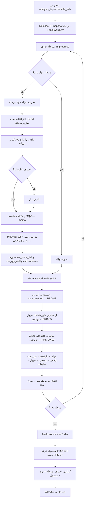

# 08-variable-analysis-advanced.md
## زیرگروه ۸ — تولید آنالیز متغیر پیشرفته (Multi-Stage Variable / Actual-Consumption)

---

## ۱. هدف ماژول

**حالت مرجع نهایی سیستم.** ترکیب:

```
ماژول ۷ (چندمرحله‌ای + پیمانکاری + Co/By)
       +
ماژول ۳ (مصرف واقعی + انحراف نرخ و مقدار)
       =
      ماژول ۸
```

| ویژگی | ۲ | ۳ | ۷ | **۸** |
|-------|:-:|:-:|:-:|:-----:|
| Backflush از BOM | ✅ | ❌ | ✅ | ❌ |
| مصرف واقعی ورودی کاربر | ❌ | ✅ | ❌ | **✅** |
| مراحل مجزا | ❌ | ❌ | ✅ | **✅** |
| انحراف مقدار | ❌ | ✅ | ❌ | **✅ به تفکیک مرحله** |
| انحراف نرخ | ✅ | ✅ | ✅ | **✅ به تفکیک مرحله** |
| پیمانکاری | ❌ | ❌ | ✅ | **✅** |
| Co/By-Product | ❌ | ❌ | ✅ | **✅** |
| مسئولیت‌پذیری | ❌ | نسبی | مرحله‌ای | **✅ مرحله × نوع انحراف** |

**چرا این حالت نهایی است؟** فقط اینجا می‌توانی بگویی:
> «۱۵ میلیون ریال انحراف مقدار پارچه، **در مرحله برش**، **مسئول: برشکار** —
> و ۲۷ میلیون ریال انحراف نرخ همان پارچه، **مسئول: خرید**.»

**کاربرد در ترنم:** وقتی خط ۶ مرحله‌ای راه افتاد و برشکار گزارش دقیق مصرف می‌دهد → این حالت را فعال کن.

---

## ۲. قواعد ارثی (بدون تغییر)

| قاعده | منبع |
|-------|------|
| **ADR-011** — انحراف مواد **سند نمی‌خورد**، WIP به بهای واقعی | `03-variable-analysis.md §2` |
| **ADR-012** — WIP یک حساب، انتقال مرحله‌ای بدون سند | `07-fixed-analysis-advanced.md §2` |
| ضایعات عادی مرحله‌ای بدون سند | `07 §6.2` |
| پیمانکاری PRD-13/14 سند دارد | `07 §6.5` |
| `receipt.amount_rial = WIP_net` دقیق | `02 §6.3` |
| هر مرحله با نرخ سربار **دوره خودش** | `07 §6.2` |
| کسری نزد پیمانکار همیشه غیرعادی | `07 §6.5` |

> **این ماژول هیچ ADR جدیدی معرفی نمی‌کند** — فقط ۷ و ۳ را ترکیب می‌کند.

---

## ۳. تفاوت‌های عملیاتی با ماژول ۷

| موضوع | ماژول ۷ | ماژول ۸ |
|-------|---------|---------|
| `analysis_type` | `'fixed_adv'` | `'variable_adv'` |
| فرم‌های هر مرحله | ۱ (ثبت خروجی) | **۲** (حواله مواد + ثبت خروجی) |
| `production_material_issues.issue_type` | `'backflush'` | `'issue'` / `'return'` / `'substitute'` |
| `qty_actual` | = `qty_standard` | **ورودی کاربر** |
| `qty_variance` | همیشه ۰ | محاسبه می‌شود |
| `var_qty_rial` | همیشه ۰ | محاسبه می‌شود (`memo`) |
| محرک سربار `material_rial` | مواد **استاندارد** | مواد **واقعی** ⚠️ |
| ترتیب اجرا | خروجی → Backflush خودکار | حواله → خروجی |
| `E_NO_MATERIAL_ISSUED` | — | ✅ اگر مرحله مواد دارد ولی حواله نشده |

> **⚠️ نکته ظریف:** در ماژول ۸، محرک `material_rial` **مواد واقعی** را می‌گیرد، نه استاندارد.
> پس اگر برشکار ۵٪ بیشتر پارچه ببرد، سربار برش هم ۵٪ بیشتر جذب می‌شود.
> این **درست** است — سربار برش واقعاً تابع مقدار پارچه پردازش‌شده است.

---

## ۴. Workflow



---

## ۵. الگوریتم‌ها

### ۵.۱ حواله مواد مرحله‌ای

```
postStageMaterialIssue(orderId, stageId, lines[]):
  ۰) اعتبارسنجی:
     po.analysis_type === 'variable_adv'
     stage.status === 'in_progress'
     دوره باز + سال مالی باز

  ۱) مقادیر استاندارد این مرحله:
     ex = explodeBom(bom, stage.qty_in, priceBasis='std')
     std = ex.lines WHERE stage_cost_center_id === stage.cost_center_id
           → { product_id: { SQ: qty_final, SP: unit_cost_rial } }

  ۲) برای هر قلم L در ورودی کاربر:
        AQ = L.qty_actual
        AP = products[L.product_id].average_cost_rial      ← میانگین لحظه صدور
        SQ = std[L.product_id]?.SQ ?? 0                    ← ماده خارج از فرمول → SQ=0
        SP = std[L.product_id]?.SP ?? AP                   ← بدون نرخ استاندارد → SP:=AP

        MPV = round((AP − SP) × AQ)      ← انحراف نرخ   (مسئول: خرید)
        MQV = round((AQ − SQ) × SP)      ← انحراف مقدار (مسئول: مرکز هزینه مرحله)

        pct = SQ ? (AQ−SQ)/SQ × 100 : 100
        if |pct| > threshold and !L.reason → E_VARIANCE_NEEDS_REASON

        issueFromStock(...)  ← موجودی منفی چک می‌شود
        INSERT production_material_issues (
           stage_id, cost_center_id = stage.cost_center_id,   ← 🔑 کلید مسئولیت‌پذیری
           issue_type = AQ<0 ? 'return' : (L.substitute_of_product_id ? 'substitute' : 'issue'),
           qty_standard=SQ, qty_actual=AQ, qty_variance=AQ−SQ,
           std_cost_rial=SP, unit_cost_rial=AP,
           std_amount_rial=round(SQ×SP), amount_rial=round(AQ×AP),
           var_price_rial=MPV, var_qty_rial=MQV,
           variance_status='memo'                            ← ADR-011
        )
        insertVarianceMemo(period, orderId, stageId, ccId, productId, 'material_price', MPV)
        insertVarianceMemo(period, orderId, stageId, ccId, productId, 'material_qty',   MQV)

  ۳) سند PRD-01 — به بهای **واقعی** (ADR-011):
        1111 WIP  بد   Σ(AQ × AP)
        1110 مواد بس   Σ مواد
        1112 بسته‌بندی بس

  ۴) stage.material_added_rial += Σ(AQ × AP)
```

### ۵.۲ تفاوت محرک سربار

```
ماژول ۷ (ثابت):
   driver='material_rial' → ctx.material = مواد استاندارد Backflush شده

ماژول ۸ (متغیر):
   driver='material_rial' → ctx.material = Σ production_material_issues.amount_rial
                                            WHERE stage_id = stage.id AND status='posted'
                            ← مواد واقعاً حواله‌شده

بقیه محرک‌ها یکسان:
   output_qty         → stage.qty_in
   direct_labor_rial  → labor / 1,000,000
   direct_labor_hours → (setup + run × qty_in)/60 × crew
   machine_hours      → machine_minutes × qty_in / 60
```

### ۵.۳ ماتریس مسئولیت‌پذیری (خروجی منحصربه‌فرد ماژول ۸)

```
برای هر (مرحله، نوع انحراف):

   انحراف نرخ مواد   → مسئول: واحد خرید            (مستقل از مرحله)
   انحراف مقدار مواد → مسئول: مرکز هزینه آن مرحله  (برشکار / دوزنده / ...)
   انحراف نرخ دستمزد → مسئول: مدیریت (نرخ کارمزد)
   انحراف کارایی     → مسئول: مرکز هزینه
   انحراف سربار      → مسئول: مدیریت کارگاه

گزارش R8-01:
   SELECT s.seq, cc.name, v.variance_type, SUM(v.amount_rial)
   FROM production_variances v
   JOIN production_order_stages s ON s.id = v.stage_id
   JOIN cost_centers cc ON cc.id = v.cost_center_id
   WHERE v.period_label = :period AND v.status = 'memo'
   GROUP BY s.seq, v.variance_type
```

---

## ۶. مثال کامل — سفارش `PO-1405-0012`

### ورودی
```
همان محصول و فرمول PO-1405-0010 (BOM-000101 v2)
analysis_type = 'variable_adv'
هدف ۳۰۰ عدد  →  qty_start = 314
تاریخ ۱۴۰۵/۰۴/۱۸  ·  دوره 1405/04
```

### ۶.۱ حواله مواد — مصرف واقعی گزارش‌شده

| قلم | مرحله | SQ (استاندارد) | AQ (واقعی) | SP | AP | AQ×AP (ریال) | انحراف نرخ | انحراف مقدار |
|-----|-------|---------------:|-----------:|---:|---:|-------------:|-----------:|-------------:|
| پارچه کتان | CC-10 برش | ۵۲۳.۳۳۳۳ | **۵۴۰.۰۰** | ۹۰۰٬۰۰۰ | ۹۵۰٬۰۰۰ | ۵۱۳٬۰۰۰٬۰۰۰ | 🔴 +۲۷٬۰۰۰٬۰۰۰ | 🔴 +۱۵٬۰۰۰٬۰۰۰ |
| آستر | CC-10 برش | ۱۱۳.۲۹۹۰ | **۱۰۸.۰۰** | ۱۷۵٬۰۰۰ | ۱۸۰٬۰۰۰ | ۱۹٬۴۴۰٬۰۰۰ | 🔴 +۵۴۰٬۰۰۰ | 🟢 −۹۲۷٬۳۲۰ |
| نخ | CC-30 دوخت | ۲۵.۱۲۰۰ | **۲۶.۰۰** | ۸۵٬۰۰۰ | ۸۵٬۰۰۰ | ۲٬۲۱۰٬۰۰۰ | ۰ | 🔴 +۷۴٬۸۰۰ |
| دکمه | CC-40 یراق | ۱٬۹۲۲.۴۴۹۰ | **۱٬۹۳۰.۰۰** | ۱۲٬۵۰۰ | ۱۲٬۰۰۰ | ۲۳٬۱۶۰٬۰۰۰ | 🟢 −۹۶۵٬۰۰۰ | 🔴 +۹۴٬۳۸۸ |
| لیبل | CC-60 اتو | ۳۱۴.۰۰ | **۳۱۴.۰۰** | ۶٬۰۰۰ | ۶٬۰۰۰ | ۱٬۸۸۴٬۰۰۰ | ۰ | ۰ |
| نایلون | CC-60 اتو | ۳۱۴.۰۰ | **۳۱۴.۰۰** | ۹٬۰۰۰ | ۹٬۰۰۰ | ۲٬۸۲۶٬۰۰۰ | ۰ | ۰ |
| | | | | | **جمع** | **۵۶۲٬۵۲۰٬۰۰۰** | **+۲۶٬۵۷۵٬۰۰۰** | **+۱۴٬۲۴۱٬۸۶۸** |

**راستی‌آزمایی تجزیه انحراف:** ✅
```
بهای واقعی      = ۵۶۲٬۵۲۰٬۰۰۰
بهای استاندارد  = ۵۲۱٬۷۰۳٬۱۳۲
انحراف کل       = ۴۰٬۸۱۶٬۸۶۸
انحراف نرخ + مقدار = ۲۶٬۵۷۵٬۰۰۰ + ۱۴٬۲۴۱٬۸۶۸ = ۴۰٬۸۱۶٬۸۶۸  ✅
```

### ۶.۲ انحراف به تفکیک مرحله و مسئول ⭐

| مرحله | مرکز هزینه | انحراف نرخ (خرید) | انحراف مقدار (کارگاه) | جمع |
|-------|-----------|------------------:|----------------------:|----:|
| **۱۰** | برش | 🔴 +۲۷٬۵۴۰٬۰۰۰ | 🔴 **+۱۴٬۰۷۲٬۶۸۰** | +۴۱٬۶۱۲٬۶۸۰ |
| **۳۰** | دوخت | ۰ | 🔴 +۷۴٬۸۰۰ | +۷۴٬۸۰۰ |
| **۴۰** | یراق | 🟢 −۹۶۵٬۰۰۰ | 🔴 +۹۴٬۳۸۸ | −۸۷۰٬۶۱۲ |
| **۶۰** | اتو | ۰ | ۰ | ۰ |
| **جمع** | | **+۲۶٬۵۷۵٬۰۰۰** | **+۱۴٬۲۴۱٬۸۶۸** | **+۴۰٬۸۱۶٬۸۶۸** |

> **این جدول قلب ماژول ۸ است.**
> **۹۸.۸٪ از کل انحراف مقدار در مرحله برش است** → گفت‌وگوی مدیریتی مشخص:
> «برشکار ۱۶.۷ متر پارچه بیشتر از فرمول مصرف کرده = ۱۴ میلیون ریال»
> نه یک عدد کلی مبهم برای کل کارگاه.

### ۶.۳ جدول اجرای مراحل ✅ *(راستی‌آزمایی‌شده)*

| مرحله | ورودی | خروجی | بهای ورودی | مواد **واقعی** | دستمزد | پیمان | سربار | بهای خروجی | واحد |
|-------|------:|------:|-----------:|---------------:|-------:|------:|------:|-----------:|-----:|
| **۱۰ برش** | ۳۱۴.۰۰ | ۳۰۷.۷۲ | ۰ | ۵۳۲٬۴۴۰٬۰۰۰ | ۷٬۸۵۰٬۰۰۰ | ۰ | ۴٬۷۹۱٬۹۶۰ | ۵۴۵٬۰۸۱٬۹۶۰ | ۱٬۷۷۱٬۳۵۷ |
| **۲۰ گلدوزی** | ۳۰۷.۷۲ | ۳۰۷.۷۲ | ۵۴۵٬۰۸۱٬۹۶۰ | ۰ | ۱۳٬۸۴۷٬۴۰۰ | ۰ | ۱۸٬۴۶۳٬۲۰۰ | ۵۷۷٬۳۹۲٬۵۶۰ | ۱٬۸۷۶٬۳۵۷ |
| **۳۰ دوخت** | ۳۰۷.۷۲ | ۳۰۴.۶۴ | ۵۷۷٬۳۹۲٬۵۶۰ | ۲٬۲۱۰٬۰۰۰ | ۵۵٬۳۸۹٬۶۰۰ | ۰ | ۱۹٬۳۸۶٬۳۶۰ | ۶۵۴٬۳۷۸٬۵۲۰ | ۲٬۱۴۸٬۰۱۹ |
| **۴۰ یراق** | ۳۰۴.۶۴ | ۳۰۴.۶۴ | ۶۵۴٬۳۷۸٬۵۲۰ | ۲۳٬۱۶۰٬۰۰۰ | ۷٬۶۱۶٬۰۷۰ | ۰ | ۲٬۴۳۷٬۱۴۲ | ۶۸۷٬۵۹۱٬۷۳۲ | ۲٬۲۵۷٬۰۴۲ |
| **۵۰ شستشو** 🏭 | ۳۰۴.۶۴ | ۳۰۰.۰۷ | ۶۸۷٬۵۹۱٬۷۳۲ | ۰ | ۰ | ۱۱٬۵۷۶٬۴۲۶ | ۱٬۵۲۳٬۲۱۴ | ۷۰۰٬۶۹۱٬۳۷۲ | ۲٬۳۳۵٬۰۶۸ |
| **۶۰ اتو** ✅ | ۳۰۰.۰۷ | ۳۰۰.۰۷ | ۷۰۰٬۶۹۱٬۳۷۲ | ۴٬۷۱۰٬۰۰۰ | ۴٬۵۰۱٬۰۹۷ | ۰ | ۳٬۶۰۰٬۸۷۸ | **۷۱۳٬۵۰۳٬۳۴۷** | ۲٬۳۷۷٬۷۶۵ |

> **⚠️ توجه به سربار مرحله ۱۰:** ۴٬۷۹۱٬۹۶۰ (نه ۴٬۶۵۸٬۰۴۴ ماژول ۷)
> چون محرک `material_rial` است و مواد واقعی (۵۳۲٬۴۴۰٬۰۰۰) بیشتر از استاندارد (۵۱۷٬۵۶۰٬۴۸۱) است.
> ۹٬۰۰۰ × ۵۳۲.۴۴ م.ریال = ۴٬۷۹۱٬۹۶۰ ✅

### ۶.۴ تسهیم نهایی

```
WIP_final     = ۷۱۳٬۵۰۳٬۳۴۷
by (خرده پارچه ۲۸.۲۶ کیلو × ۱۲۰٬۰۰۰) = ۳٬۳۹۱٬۲۰۰   → PRD-16
WIP_after_by  = ۷۱۰٬۱۱۲٬۱۴۷
main ۱۰۰٪ برای ۳۰۰.۰۷ عدد           = ۷۱۰٬۱۱۲٬۱۴۷   → PRD-07
unit_cost     = ۲٬۳۶۶٬۴۶۳ ریال ≈ ۲۳۶٬۶۴۶ تومان
```

### ۶.۵ مقایسه با ماژول ۷ (استاندارد)

| | ماژول ۷ (استاندارد) | ماژول ۸ (واقعی) | اختلاف |
|-|--------------------:|----------------:|-------:|
| مواد + بسته‌بندی | ۵۴۷٬۴۷۵٬۰۶۹ | ۵۶۲٬۵۲۰٬۰۰۰ | +۱۵٬۰۴۴٬۹۳۱ |
| دستمزد | ۸۹٬۲۰۴٬۱۶۷ | ۸۹٬۲۰۴٬۱۶۷ | ۰ |
| پیمانکاری | ۱۱٬۵۷۶٬۴۲۶ | ۱۱٬۵۷۶٬۴۲۶ | ۰ |
| سربار | ۵۰٬۰۶۸٬۸۳۸ | ۵۰٬۲۰۲٬۷۵۴ | +۱۳۳٬۹۱۶ |
| **WIP ناخالص** | **۶۹۸٬۳۲۴٬۵۰۰** | **۷۱۳٬۵۰۳٬۳۴۷** | **+۱۵٬۱۷۸٬۸۴۷** |
| **بهای واحد** | **۲٬۳۱۵٬۸۸۰** | **۲٬۳۶۶٬۴۶۳** | **+۵۰٬۵۸۳ (+۲.۱۸٪)** |

> **درس مدیریتی:** ماژول ۷ بهای تمام‌شده را **۲.۱۸٪ کمتر از واقع** نشان می‌داد.
> روی ۳۰۰ عدد = **۱۵.۲ میلیون ریال** اختلاف که در انبار مواد پنهان می‌ماند تا انبارگردانی.
> اگر روی این عدد قیمت می‌دادی، حاشیه واقعی‌ات ۲.۲ واحد درصد کمتر بود.

### ۶.۶ اسناد صادرشده

| # | مرحله | رویداد | بدهکار | بستانکار | مبلغ (ریال) |
|--:|-------|--------|--------|----------|------------:|
| ۱ | ۱۰ | PRD-01 | `1111`/PO-1405-0012 | `1110` | ۵۳۲٬۴۴۰٬۰۰۰ |
| ۲ | ۱۰ | PRD-03 | `1111` | `5201`/CC-10 | ۷٬۸۵۰٬۰۰۰ |
| ۳ | ۱۰ | PRD-05 | `1111` | `5203`/CC-10 | ۴٬۷۹۱٬۹۶۰ |
| ۴ | ۲۰ | PRD-03 | `1111` | `5201`/CC-20 | ۱۳٬۸۴۷٬۴۰۰ |
| ۵ | ۲۰ | PRD-05 | `1111` | `5203`/CC-20 | ۱۸٬۴۶۳٬۲۰۰ |
| ۶ | ۳۰ | PRD-01 | `1111` | `1110` | ۲٬۲۱۰٬۰۰۰ |
| ۷ | ۳۰ | PRD-03 | `1111` | `5201`/CC-30 | ۵۵٬۳۸۹٬۶۰۰ |
| ۸ | ۳۰ | PRD-05 | `1111` | `5203`/CC-30 | ۱۹٬۳۸۶٬۳۶۰ |
| ۹ | ۴۰ | PRD-01 | `1111` | `1110` | ۲۳٬۱۶۰٬۰۰۰ |
| ۱۰ | ۴۰ | PRD-03 | `1111` | `5201`/CC-40 | ۷٬۶۱۶٬۰۷۰ |
| ۱۱ | ۴۰ | PRD-05 | `1111` | `5203`/CC-40 | ۲٬۴۳۷٬۱۴۲ |
| ۱۲ | ۵۰ | **PRD-13** | `1114`/رضوان | `1111` | ۶۸۷٬۵۹۱٬۷۳۲ |
| ۱۳ | ۵۰ | **PRD-14** | `1111` + `1108` | `1114` + `2101` | — |
| ۱۴ | ۵۰ | PRD-05 | `1111` | `5203`/CC-50 | ۱٬۵۲۳٬۲۱۴ |
| ۱۵ | ۶۰ | PRD-01 | `1111` | `1112` | ۴٬۷۱۰٬۰۰۰ |
| ۱۶ | ۶۰ | PRD-03 | `1111` | `5201`/CC-60 | ۴٬۵۰۱٬۰۹۷ |
| ۱۷ | ۶۰ | PRD-05 | `1111` | `5203`/CC-60 | ۳٬۶۰۰٬۸۷۸ |
| ۱۸ | — | **PRD-16** | `1113` | `1111` | ۳٬۳۹۱٬۲۰۰ |
| ۱۹ | — | **PRD-07** | `1104` | `1111` | **۷۱۰٬۱۱۲٬۱۴۷** |

> **⛔ هیچ سندی با `5210` یا `5211` — ADR-011** ✅
> **⛔ هیچ سند انتقال بین مراحل — ADR-012** ✅

### جزئیات سند ۱۳ — دریافت از پیمانکار (PRD-14)

```
ارسال ۳۰۴.۶۴ عدد به بهای ۶۸۷٬۵۹۱٬۷۳۲
دریافت ۳۰۰.۰۷ · ضایعات پیمانکار ۴.۵۷ (عادی، قرارداد ۱.۵٪) · کسری ۰
کارمزد: ۳۸٬۰۰۰ × ۳۰۴.۶۴ = ۱۱٬۵۷۶٬۴۲۶  ·  مالیات ۱۰٪ = ۱٬۱۵۷٬۶۴۳
```

| حساب | نام | تفصیلی | بدهکار | بستانکار |
|------|-----|--------|-------:|---------:|
| `1111` | کالای در جریان ساخت | PO-1405-0012 | ۶۹۹٬۱۶۸٬۱۵۸ | |
| `1108` | مالیات ارزش افزوده دریافتنی | | ۱٬۱۵۷٬۶۴۳ | |
| `1114` | موجودی نزد پیمانکار | خشکشویی رضوان | | ۶۸۷٬۵۹۱٬۷۳۲ |
| `2101` | حساب‌های پرداختنی | خشکشویی رضوان | | ۱۲٬۷۳۴٬۰۶۹ |

> تراز: ۶۹۹٬۱۶۸٬۱۵۸ + ۱٬۱۵۷٬۶۴۳ = ۶۸۷٬۵۹۱٬۷۳۲ + ۱۲٬۷۳۴٬۰۶۹ = ۷۰۰٬۳۲۵٬۸۰۱ ✅

### ۶.۷ راستی‌آزمایی WIP ✅

```
بدهکار 1111:
  532,440,000 +  7,850,000 +  4,791,960     (مرحله ۱۰)
+  13,847,400 + 18,463,200                  (مرحله ۲۰)
+   2,210,000 + 55,389,600 + 19,386,360     (مرحله ۳۰)
+  23,160,000 +  7,616,070 +  2,437,142     (مرحله ۴۰)
+ 699,168,158 +  1,523,214                  (مرحله ۵۰ — PRD-14 + سربار)
+   4,710,000 +  4,501,097 +  3,600,878     (مرحله ۶۰)
= 1,401,095,079

بستانکار 1111:
  687,591,732 (PRD-13) + 3,391,200 (PRD-16) + 710,112,147 (PRD-07)
= 1,401,095,079

مانده WIP = ۰  ✅
```

### ۶.۸ ارزش افزوده مراحل

| مرحله | ارزش افزوده (ریال) | ٪ | بهای واحد تجمعی |
|-------|-------------------:|--:|----------------:|
| ۱۰ برش | ۵۴۵٬۰۸۱٬۹۶۰ | ۷۶.۴ | ۱٬۷۷۱٬۳۵۷ |
| ۲۰ گلدوزی | ۳۲٬۳۱۰٬۶۰۰ | ۴.۵ | ۱٬۸۷۶٬۳۵۷ |
| ۳۰ دوخت | ۷۶٬۹۸۵٬۹۶۰ | ۱۰.۸ | ۲٬۱۴۸٬۰۱۹ |
| ۴۰ یراق | ۳۳٬۲۱۳٬۲۱۲ | ۴.۷ | ۲٬۲۵۷٬۰۴۲ |
| ۵۰ شستشو | ۱۳٬۰۹۹٬۶۴۰ | ۱.۸ | ۲٬۳۳۵٬۰۶۸ |
| ۶۰ اتو | ۱۲٬۸۱۱٬۹۷۵ | ۱.۸ | ۲٬۳۷۷٬۷۶۵ |

---

## ۷. سناریوهای واقعی

| # | سناریو | رفتار |
|---|--------|-------|
| Y-01 | تولید کامل با انحراف | مثال §۶ |
| Y-02 | مصرف = استاندارد در همه مراحل | نتیجه = ماژول ۷ دقیقاً |
| Y-03 | برشکار پارچه اضافه برد | انحراف مقدار CC-10 🔴 + الزام دلیل |
| Y-04 | برگشت پارچه اضافی به انبار | حواله با `qty_actual` منفی · PRD-02 · نرخ سند اصلی |
| Y-05 | چند حواله در یک مرحله | جمع می‌شوند · انحراف روی مجموع |
| Y-06 | ماده خارج از فرمول (چسب پارچه) | `SQ=0` · کل مصرف = انحراف مقدار + `W_ITEM_NOT_IN_BOM` |
| Y-07 | ماده جایگزین (پارچه یشمی) | `substitute_of_product_id` · `SQ` از قلم اصلی |
| Y-08 | انحراف مقدار پارچه ۳ سفارش متوالی | `production.bom.suggest_revision` |
| Y-09 | مرحله بدون مواد (گلدوزی) | حواله ندارد · مستقیم ثبت خروجی |
| Y-10 | ثبت خروجی قبل از حواله (مرحله ماده‌دار) | `E_NO_MATERIAL_ISSUED` |
| Y-11 | حواله بعد از `done` شدن مرحله | `E_STAGE_CLOSED` — ابتدا Reversal |
| Y-12 | مصرف واقعی بیشتر → سربار برش بیشتر | ✅ خودکار (محرک `material_rial`) |
| Y-13 | پیمانکار کارمزد را بالا برد | `fee_unit_rial` در فرم دریافت قابل تغییر |
| Y-14 | ضایعات غیرعادی در دوخت | PRD-09 با بهای مرحله دوخت (شامل پارچه) |
| Y-15 | تبدیل `fixed_adv` → `variable_adv` | فقط `draft` · بعدش `E_ANALYSIS_LOCKED` |
| Y-16 | سفارش دو ماهه | انحرافات هر ماه در دوره خودش گزارش شود |
| Y-17 | مقایسه ۷ و ۸ روی یک محصول | `GET /reports/analysis-compare` |
| Y-18 | اپراتور فقط مقدار وارد می‌کند | ستون‌های نرخ/مبلغ/انحراف حذف از JSON |
| Y-19 | انحراف مقدار مساعد پایدار | «فرمول سخت‌گیرانه است» → پیشنهاد کاهش `qty_per_base` |
| Y-20 | همه مواد یک مرحله برگشت خورد | `material_added_rial = 0` · مجاز |

---

## ۸. سناریوهای حسابداری

| رویداد | سند | بدهکار | بستانکار | مبلغ |
|--------|-----|--------|----------|------|
| حواله مواد مرحله | PRD-01 | `1111`/سفارش | `1110`+`1112` | **Σ(AQ × AP)** |
| برگشت مواد | PRD-02 | `1110` | `1111` | qty × نرخ سند اصلی |
| دستمزد | PRD-03 | `1111` | `5201`/مرکز | طبق `labor_method` |
| سربار | PRD-05 | `1111` | `5203`/مرکز | نرخ × محرک **واقعی** |
| ضایعات غیرعادی | PRD-09 | `5221` | `1111` | بهای مرحله × تعداد |
| ضایعات فروشی | PRD-10 | `1113` | `1111` | qty × NRV |
| ارسال پیمانکار | PRD-13 | `1114`/تأمین‌کننده | `1111` | بهای ارسالی |
| دریافت پیمانکار | PRD-14 | `1111`+`1108` | `1114`+`2101` | برگشتی+کارمزد |
| محصول فرعی | PRD-16 | `1113`/`1104` | `1111` | qty × NRV |
| رسید FG | PRD-07 | `1104` | `1111` | **WIP_net دقیق** |
| **انحراف مواد** | **—** | **—** | **—** | **memo — ADR-011** |

---

## ۹. اعتبارسنجی

همه V7-01..V7-20 و V3-01..V3-10، به‌علاوه:

| کد | قانون | خطا |
|----|-------|-----|
| V8-01 | `analysis_type='variable_adv'` → `bom.has_routing=1` | `E_NO_ROUTING` |
| V8-02 | حواله فقط برای مرحله `in_progress` | `E_STAGE_CLOSED` |
| V8-03 | ثبت خروجی مرحله‌ای که مواد دارد، بدون حواله | `E_NO_MATERIAL_ISSUED` |
| V8-04 | مواد حواله‌شده باید به همان مرحله تعلق داشته باشند یا هشدار | `W_ITEM_NOT_IN_STAGE` |
| V8-05 | `qty_actual ≠ 0` | `E_QTY_ZERO` |
| V8-06 | برگشت ≤ مجموع حواله همان مرحله | `E_RETURN_EXCEEDS_ISSUE` |
| V8-07 | `|انحراف مقدار٪| > threshold` → `reason` اجباری | `E_VARIANCE_NEEDS_REASON` |
| V8-08 | محرک `material_rial` باید مواد **واقعی** بگیرد | `E_DRIVER_SOURCE` (internal) |
| V8-09 | تغییر `analysis_type` بعد از اولین حواله | `E_ANALYSIS_LOCKED` |
| V8-10 | تجزیه انحراف: `Σ(MPV+MQV) = Σ(AQ×AP) − Σ(SQ×SP)` (±۳ ریال) | `E_VARIANCE_DECOMPOSITION` |
| V8-11 | هر انحراف باید `stage_id` و `cost_center_id` داشته باشد | `E_VARIANCE_NO_STAGE` |
| V8-12 | Backflush در این حالت ممنوع | `E_VARIABLE_NO_BACKFLUSH` |

---

## ۱۰. Edge Case ها

| # | حالت | راه‌حل |
|---|------|--------|
| E8-01 | مصرف دقیقاً استاندارد | همه انحرافات ۰ · نتیجه = ماژول ۷ |
| E8-02 | مرحله بدون مواد در BOM ولی کاربر حواله زد | `W_ITEM_NOT_IN_STAGE` · `SQ=0` · کل انحراف مقدار |
| E8-03 | `SP=0` (نرخ استاندارد تعریف نشده) | `SP:=AP` → `MPV=0` + هشدار |
| E8-04 | همه مواد یک مرحله برگشت | `material_added_rial=0` · سربار `material_rial` = ۰ |
| E8-05 | حواله در ماه ۱، خروجی در ماه ۲ | هر کدام در دوره خودش · نرخ سربار ماه خروجی |
| E8-06 | مصرف واقعی صفر برای ماده اجباری | مجاز · انحراف مقدار = `−SQ×SP` مساعد + هشدار قوی |
| E8-07 | ۵۰٪ انحراف مقدار | هشدار قرمز + تأیید مضاعف + الزام دلیل |
| E8-08 | انحراف مقدار مساعد ولی ضایعات بالا | تناقض → هشدار «مصرف کمتر ولی ضایعات بیشتر؟» |
| E8-09 | تغییر `qty_in` مرحله بعد از حواله (ابطال مرحله قبل) | `SQ` بازمحاسبه → انحراف عوض شود ✅ |
| E8-10 | گرد کردن انباشتی ۶ مرحله × ۶ قلم | `receipt = WIP_net` دقیق |
| E8-11 | ماده مشترک بین دو مرحله | هر مرحله `SQ` خودش را از `stage_cost_center_id` می‌گیرد |
| E8-12 | حواله بدون `stage_id` | `E_VARIANCE_NO_STAGE` |

---

## ۱۱. خطاهای احتمالی

| کد | HTTP | پیام |
|----|------|------|
| `E_NO_MATERIAL_ISSUED` | 422 | مرحله «{name}» مواد دارد — ابتدا حواله را ثبت کنید |
| `E_VARIABLE_NO_BACKFLUSH` | 409 | در آنالیز متغیر مصرف خودکار مجاز نیست |
| `E_VARIANCE_DECOMPOSITION` | 500 | تجزیه انحراف برقرار نیست — عملیات لغو شد |
| `E_VARIANCE_NO_STAGE` | 500 | انحراف بدون مرحله ثبت شد |
| `W_ITEM_NOT_IN_STAGE` | 200⚠ | «{name}» در فرمول مرحله «{stage}» نیست — کل مصرف انحراف محسوب می‌شود |
| بقیه | | همان ماژول ۳ و ۷ |

---

## ۱۲. Undo و اصلاح

### ترتیب Reversal یک مرحله

```
۱) PRD-10 ضایعات فروشی
۲) PRD-09 ضایعات غیرعادی
۳) PRD-05 سربار
۴) PRD-03 دستمزد
۵) PRD-01 حواله مواد  ← موجودی و میانگین برمی‌گردد
۶) حذف رکوردهای انحراف memo همان مرحله
۷) stage.status = 'in_progress' · مرحله بعد → 'pending' با qty_in=0
```

| عملیات | روش |
|--------|-----|
| اصلاح مقدار حواله | Reversal حواله → حواله جدید (ویرایش ممنوع) |
| برگشت واقعی مواد | حواله جدید با `qty_actual` منفی (این Reversal **نیست**) |
| ابطال کل سفارش | ترتیب معکوس ماژول ۷ §۱۲ |

> **تفکیک مهم:** «Reversal» = خنثی کردن اشتباه ثبت (تاریخ امروز).
> «Return» = مواد واقعاً برگشت به انبار (تاریخ واقعی برگشت).

---

## ۱۳. گزارش‌ها

| گزارش | endpoint |
|-------|----------|
| **R8-01 ماتریس انحراف: مرحله × نوع × مسئول** ⭐ | `GET /production/reports/variance-matrix?period=` |
| R8-02 تحلیل انحراف سفارش | `GET /production/orders/:id/variance-analysis` |
| R8-03 انحراف مقدار به تفکیک مرکز هزینه | `GET /production/reports/qty-variance-by-cc?period=` |
| R8-04 انحراف نرخ به تفکیک تأمین‌کننده | `GET /production/reports/price-variance-by-supplier?period=` |
| R8-05 روند انحراف یک ماده در یک مرحله | `GET /production/reports/variance-trend?product_id=&cc_id=` |
| R8-06 پیشنهاد بازنگری فرمول (مرحله‌ای) | `GET /production/reports/bom-revision-suggestions?stage=` |
| R8-07 مقایسه ۷ و ۸ | `GET /production/reports/analysis-compare?product_id=` |
| R8-08 پارتو دلایل انحراف | `GET /production/reports/variance-reasons?period=` |
| R8-09 کارت امتیاز مرکز هزینه | `GET /production/reports/cc-scorecard?period=` |
| R8-10 حواله‌های مرحله | `GET /production/orders/:id/stages/:stageId/issues` |
| + همه R7-01..R7-12 | |

### `GET /reports/variance-matrix?period=1405/04`

```json
{
  "period": "1405/04",
  "matrix": [
    { "seq":10, "cost_center":"CC-10 برش", "cost_center_id":1,
      "material_price_rial":27540000, "material_qty_rial":14072680,
      "labor_rate_rial":0, "labor_eff_rial":0,
      "total_rial":41612680, "favorable":false,
      "responsible_qty":"برش — سرکارگر برش", "responsible_price":"واحد خرید" },
    { "seq":30, "cost_center":"CC-30 دوخت", "cost_center_id":3,
      "material_price_rial":0, "material_qty_rial":74800,
      "total_rial":74800, "favorable":false },
    { "seq":40, "cost_center":"CC-40 یراق", "cost_center_id":4,
      "material_price_rial":-965000, "material_qty_rial":94388,
      "total_rial":-870612, "favorable":true },
    { "seq":60, "cost_center":"CC-60 اتو", "cost_center_id":6,
      "material_price_rial":0, "material_qty_rial":0, "total_rial":0 }
  ],
  "totals": {
    "material_price_rial":26575000, "material_qty_rial":14241868,
    "grand_total_rial":40816868
  },
  "insights": [
    "🔴 ۹۸.۸٪ از انحراف مقدار در مرحله «برش» است — ۱۴٬۰۷۲٬۶۸۰ ریال",
    "🔴 انحراف نرخ ۲۶٬۵۷۵٬۰۰۰ ریال — مسئول: واحد خرید (تورم پارچه)",
    "🟢 انحراف نرخ دکمه مساعد است — تأمین‌کننده جدید ارزان‌تر"
  ],
  "note": "انحرافات اطلاعاتی هستند و سند حسابداری ندارند (ADR-011)"
}
```

---

## ۱۴. دسترسی کاربران

همان ماژول ۷، به‌علاوه:

| نقش | ثبت حواله | مشاهده انحراف | مشاهده ماتریس مسئولیت |
|-----|:---------:|:-------------:|:---------------------:|
| admin | ✅ | ✅ | ✅ |
| accounting | ✅ | ✅ | ✅ |
| production_manager | ✅ | ✅ | ✅ |
| production_operator | ✅¹ | ❌ | ❌ |

¹ فقط مراکز هزینه تخصیص‌یافته در `user_cost_centers` · فقط ستون «مقدار واقعی»

---

## ۱۵. APIهای موردنیاز

```
POST   /api/production/orders/:id/stages/:stageId/issue          ★ حواله مواد مرحله
       body: { date, warehouse_id,
               lines: [ { product_id, qty_actual, reason?, substitute_of_product_id? } ] }
GET    /api/production/orders/:id/stages/:stageId/issue-template  پیش‌پر از BOM
GET    /api/production/orders/:id/stages/:stageId/issues
POST   /api/production/orders/:id/stages/:stageId/return          برگشت مواد
POST   /api/production/orders/:id/stages/:stageId/output          ★ ثبت خروجی (بدون Backflush)
GET    /api/production/orders/:id/variance-analysis
GET    /api/production/reports/variance-matrix                    ⭐
GET    /api/production/reports/qty-variance-by-cc
GET    /api/production/reports/price-variance-by-supplier
GET    /api/production/reports/cc-scorecard
GET    /api/production/reports/analysis-compare
+ همه endpoint های ماژول ۷ §15
```

### `GET /orders/:id/stages/:stageId/issue-template`

```json
{
  "order_no": "PO-1405-0012", "analysis_type": "variable_adv",
  "stage": { "id":52, "seq":10, "cost_center":"CC-10 برش", "qty_in":314 },
  "warehouse_id": 1,
  "lines": [
    { "product_id":201, "name":"پارچه کتان ۱۴۰ سانت — سبز", "unit":"متر",
      "qty_standard":523.3333, "qty_actual":523.3333,
      "std_cost_rial":900000, "avg_cost_rial":950000,
      "on_hand":620, "in_bom":true, "scrap_percent":4 },
    { "product_id":202, "name":"آستر ساده", "unit":"متر",
      "qty_standard":113.2990, "qty_actual":113.2990,
      "std_cost_rial":175000, "avg_cost_rial":180000,
      "on_hand":150, "in_bom":true, "scrap_percent":3 }
  ]
}
```

### `POST /orders/:id/stages/:stageId/issue`

**درخواست:**
```json
{
  "date": "1405/04/18", "warehouse_id": 1,
  "lines": [
    { "product_id":201, "qty_actual":540, "reason":"عرض طاقه ۱۳۵ به‌جای ۱۴۰" },
    { "product_id":202, "qty_actual":108 }
  ]
}
```

**پاسخ:**
```json
{
  "ok": true, "issue_no": "MI-1405-0088",
  "stage": { "id":52, "seq":10, "cost_center":"CC-10 برش" },
  "lines": [
    { "product_id":201, "name":"پارچه کتان",
      "qty_standard":523.3333, "qty_actual":540, "qty_variance":16.6667,
      "std_cost_rial":900000, "unit_cost_rial":950000,
      "std_amount_rial":471000000, "amount_rial":513000000,
      "var_price_rial":27000000, "var_qty_rial":15000000,
      "var_total_rial":42000000, "var_pct":3.18, "favorable":false,
      "responsible_qty":"CC-10 برش", "responsible_price":"واحد خرید",
      "reason":"عرض طاقه ۱۳۵ به‌جای ۱۴۰" },
    { "product_id":202, "name":"آستر ساده",
      "qty_standard":113.2990, "qty_actual":108, "qty_variance":-5.2990,
      "std_cost_rial":175000, "unit_cost_rial":180000,
      "std_amount_rial":19827320, "amount_rial":19440000,
      "var_price_rial":540000, "var_qty_rial":-927320,
      "var_total_rial":-387320, "var_pct":-4.68, "favorable":true }
  ],
  "totals": {
    "material_rial":532440000, "packaging_rial":0, "total_rial":532440000,
    "std_total_rial":490827320,
    "var_price_rial":27540000, "var_qty_rial":14072680, "var_total_rial":41612680
  },
  "journal_entry": { "event":"PRD-01", "je_id":5301, "voucher_no":"JV-1405-0701",
                     "amount_rial":532440000 },
  "note": "انحرافات اطلاعاتی هستند و سند حسابداری ندارند (ADR-011)",
  "warnings": [ "انحراف مقدار «پارچه کتان» ۳.۱۸٪ نامساعد — مسئول: مرکز برش" ]
}
```

---

## ۱۶. رویدادها

| رویداد | Payload |
|--------|---------|
| `production.stage.material.issued` | `{orderId, stageId, ccId, issueNo, lines[], totalRial, varTotalRial}` |
| `production.stage.variance.detected` | `{orderId, stageId, ccId, productId, type, amountRial, pct, favorable, responsible}` |
| `production.variance.matrix.updated` | `{period, grandTotalRial}` |
| `production.bom.suggest_revision` | `{productId, bomId, lineId, stageCcId, currentQty, suggestedQty, sampleSize, avgVariancePct}` |
| + همه رویدادهای ماژول ۷ §16 | |

---

## ۱۷. پیشنهاد UI

### فرم حواله مواد مرحله‌ای

```
┌────────────────────────────────────────────────────────────────────────────┐
│ حواله مواد — PO-1405-0012 · مرحله ۱۰ برش · ورودی ۳۱۴ عدد                  │
├────────────────────────────────────────────────────────────────────────────┤
│ 📅 [۱۴۰۵/۰۴/۱۸]  🏬 انبار: [مواد اولیه — نبوت ▾]                          │
│ [🔄 پر کردن از فرمول]  [📋 کپی حواله قبلی]                                 │
├──────────────┬──────────┬──────────┬────────┬───────┬──────────────┬───────┤
│ کالا         │استاندارد │  واقعی   │ اختلاف │  ٪    │ مبلغ (ریال)  │ دلیل  │
├──────────────┼──────────┼──────────┼────────┼───────┼──────────────┼───────┤
│پارچه کتان سبز│ ۵۲۳.۳۳  │[ 540.00 ]│ +۱۶.۶۷│🔴+۳.۲│ ۵۱۳٬۰۰۰٬۰۰۰ │[عرض..]│
│آستر ساده     │ ۱۱۳.۳۰  │[ 108.00 ]│  −۵.۳۰│🟢−۴.۷│  ۱۹٬۴۴۰٬۰۰۰ │[     ]│
├──────────────┴──────────┴──────────┴────────┴───────┴──────────────┴───────┤
│                                          [+ افزودن قلم خارج از فرمول]      │
├────────────────────────────────────────────────────────────────────────────┤
│ ┌─ 📊 انحراف این مرحله ───────────────────────────────────────────┐        │
│ │ بهای استاندارد   ۴۹۰٬۸۲۷٬۳۲۰                                    │        │
│ │ بهای واقعی       ۵۳۲٬۴۴۰٬۰۰۰                                    │        │
│ │ 🔴 انحراف کل      +۴۱٬۶۱۲٬۶۸۰  (+۸.۵٪)                          │        │
│ │    ├ نرخ   +۲۷٬۵۴۰٬۰۰۰  ███████████████░░░  ۶۶٪  ← واحد خرید   │        │
│ │    └ مقدار +۱۴٬۰۷۲٬۶۸۰  ████████░░░░░░░░░░  ۳۴٪  ← مرکز برش    │        │
│ └─────────────────────────────────────────────────────────────────┘        │
│                                                                             │
│ ⚠️ سومین سفارش متوالی با انحراف مثبت پارچه در برش  [بازنگری فرمول]        │
│ 📄 ۱ سند: WIP بدهکار ۵۳۲٬۴۴۰٬۰۰۰ / مواد بستانکار                          │
│ ℹ️ انحرافات سند حسابداری ندارند — WIP به بهای واقعی ثبت می‌شود             │
│                                    [انصراف]  [✅ ثبت حواله]                │
└────────────────────────────────────────────────────────────────────────────┘
```

### ماتریس انحراف — صفحه مدیریتی ⭐

```
┌──────────────────────────────────────────────────────────────────────────┐
│ 🎯 ماتریس انحراف — دوره [۱۴۰۵/۰۴ ▾]                        [📥 Excel]    │
├──────────────────────────────────────────────────────────────────────────┤
│                                                                           │
│  مرحله      │ انحراف نرخ    │ انحراف مقدار  │ جمع          │ مسئول       │
│             │ (واحد خرید)   │ (مرکز هزینه)  │              │             │
│ ────────────┼───────────────┼───────────────┼──────────────┼──────────── │
│ ۱۰ برش      │🔴+۲۷٬۵۴۰٬۰۰۰ │🔴+۱۴٬۰۷۲٬۶۸۰ │+۴۱٬۶۱۲٬۶۸۰ │ سرکارگر برش│
│             │ ███████████   │ ████████      │              │ 🔍 بررسی    │
│ ۲۰ گلدوزی   │      ۰       │      ۰       │      ۰       │      —      │
│ ۳۰ دوخت     │      ۰       │🔴   +۷۴٬۸۰۰  │   +۷۴٬۸۰۰   │ سرکارگر دوخت│
│ ۴۰ یراق     │🟢  −۹۶۵٬۰۰۰ │🔴   +۹۴٬۳۸۸  │  −۸۷۰٬۶۱۲   │      ✅     │
│ ۵۰ شستشو    │      —       │      —       │      —       │  پیمانکاری  │
│ ۶۰ اتو      │      ۰       │      ۰       │      ۰       │      ✅     │
│ ════════════┼═══════════════┼═══════════════┼══════════════┼════════════ │
│ **جمع**     │**+۲۶٬۵۷۵٬۰۰۰**│**+۱۴٬۲۴۱٬۸۶۸**│**+۴۰٬۸۱۶٬۸۶۸**│            │
│                                                                           │
│ ┌─ 💡 تحلیل هوشمند ──────────────────────────────────────────────┐        │
│ │ 🔴 ۹۸.۸٪ از انحراف مقدار در «برش» است — ۱۴٬۰۷۲٬۶۸۰ ریال       │        │
│ │    اقدام: بازنگری الگو در T-Cuck · آموزش برشکار                │        │
│ │ 🔴 انحراف نرخ ۲۶٬۵۷۵٬۰۰۰ — تورم پارچه کتان                     │        │
│ │    اقدام: مذاکره با نساجی یزد · خرید عمده                      │        │
│ │ 🟢 دکمه ارزان‌تر شد — تأمین‌کننده جدید خوب عمل کرده             │        │
│ └────────────────────────────────────────────────────────────────┘        │
│                                                                           │
│ ℹ️ این انحرافات اطلاعاتی هستند (ADR-011) — بهای تمام‌شده به روش          │
│    واقعی محاسبه شده و سود دوره دقیق است.                                 │
└──────────────────────────────────────────────────────────────────────────┘
```

---

## ۱۸. تست‌کیس‌ها

| # | عنوان | انتظار |
|---|-------|--------|
| T8-01 | Release | ۶ مرحله · `qty_in[10]=314` |
| T8-02 | قالب حواله مرحله ۱۰ | ۲ سطر (پارچه، آستر) با `SQ` صحیح |
| T8-03 | قالب حواله مرحله ۲۰ | ۰ سطر (گلدوزی مواد ندارد) |
| T8-04 | حواله = استاندارد | همه انحرافات ۰ · نتیجه = ماژول ۷ |
| T8-05 | انحراف نرخ پارچه | `var_price_rial = 27,000,000` |
| T8-06 | انحراف مقدار پارچه | `var_qty_rial = 15,000,000` |
| T8-07 | انحراف مقدار آستر (مساعد) | `var_qty_rial = -927,320` |
| T8-08 | **تجزیه انحراف** | `Σ(MPV+MQV) = ΣAQ×AP − ΣSQ×SP = 40,816,868` |
| T8-09 | **بدون سند انحراف** | هیچ `journal_lines` با `5210`/`5211` |
| T8-10 | سند PRD-01 مرحله ۱۰ | `1111` بد = ۵۳۲٬۴۴۰٬۰۰۰ |
| T8-11 | **سربار مرحله ۱۰ (محرک واقعی)** | `9,000 × 532.44 = 4,791,960` ≠ ماژول ۷ |
| T8-12 | **مرحله ۱۰** | `cost_out_rial = 545,081,960` |
| T8-13 | **مرحله ۲۰** | `cost_out_rial = 577,392,560` |
| T8-14 | **مرحله ۳۰** | `cost_out_rial = 654,378,520` |
| T8-15 | **مرحله ۴۰** | `cost_out_rial = 687,591,732` |
| T8-16 | **مرحله ۵۰** | `cost_out_rial = 700,691,372` |
| T8-17 | **مرحله ۶۰** | `cost_out_rial = 713,503,347` |
| T8-18 | محصول فرعی | `1113` بد ۳٬۳۹۱٬۲۰۰ |
| T8-19 | **رسید نهایی** | `1104` بد ۷۱۰٬۱۱۲٬۱۴۷ |
| T8-20 | **بهای واحد** | `unit_cost_rial = 2,366,463` |
| T8-21 | **WIP صفر** | مانده `1111`/PO-1405-0012 = ۰ |
| T8-22 | **تراز کل** | Σ بد `1111` = Σ بس `1111` = ۱٬۴۰۱٬۰۹۵٬۰۷۹ |
| T8-23 | **مقایسه با ماژول ۷** | `2,366,463 − 2,315,880 = +50,583 (+2.18%)` |
| T8-24 | **ماتریس انحراف** | CC-10 → `total_rial = 41,612,680` |
| T8-25 | خروجی بدون حواله | مرحله ۱۰ → `422 E_NO_MATERIAL_ISSUED` |
| T8-26 | خروجی مرحله بدون مواد | مرحله ۲۰ → مجاز بدون حواله ✅ |
| T8-27 | Backflush در متغیر | body با `auto_backflush` → `409 E_VARIABLE_NO_BACKFLUSH` |
| T8-28 | برگشت مواد | `qty_actual=-20` → `1110` بد به نرخ سند اصلی |
| T8-29 | برگشت > حواله | `422 E_RETURN_EXCEEDS_ISSUE` |
| T8-30 | دلیل الزامی | انحراف ۶٪ بدون دلیل → `422 E_VARIANCE_NEEDS_REASON` |
| T8-31 | ماده خارج از مرحله | `W_ITEM_NOT_IN_STAGE` · `SQ=0` |
| T8-32 | جایگزین | `substitute_of_product_id` → `SQ` از قلم اصلی |
| T8-33 | تغییر آنالیز بعد از حواله | `409 E_ANALYSIS_LOCKED` |
| T8-34 | انحراف بدون `stage_id` | `500 E_VARIANCE_NO_STAGE` |
| T8-35 | پیشنهاد بازنگری مرحله‌ای | ۳ سفارش +۳٪ پارچه در CC-10 → رویداد با `stageCcId` |
| T8-36 | پیمانکاری | PRD-13/14 مانند ماژول ۷ |
| T8-37 | ابطال حواله مرحله | موجودی + میانگین + انحرافات memo حذف |
| T8-38 | ابطال کامل سفارش | ۱۹ سند Reversal → حالت اول |
| T8-39 | اپراتور | حواله موفق · پاسخ بدون `var_*` و `*_rial` |
| T8-40 | همزمانی | ۲ حواله موازی یک مرحله → `409 E_CONCURRENT` |

---

## ۱۹. شبه‌کد

```js
// server/lib/production/engine-advanced.js — استراتژی variable_adv

/** حواله مواد یک مرحله */
function postStageMaterialIssue(db, { orderId, stageId, body, userId }) {
  return db.transaction(() => {
    const po = db.prepare('SELECT * FROM production_orders WHERE id=?').get(orderId);
    const st = db.prepare('SELECT * FROM production_order_stages WHERE id=? AND order_id=?')
                 .get(stageId, orderId);
    if (!po || !st)                          throw err('E_NOT_FOUND', 404);
    if (po.analysis_type !== 'variable_adv') throw err('E_WRONG_ANALYSIS', 409, { type: po.analysis_type });
    if (st.status !== 'in_progress')         throw err('E_STAGE_CLOSED', 409, { name: st.operation_name });
    if (!body.lines?.length)                 throw err('E_ISSUE_EMPTY', 422);

    const date   = body.date || todayJalali();
    const period = jalaliPeriod(date);
    assertFiscalYearWritable(db, date);
    assertPeriodOpen(db, period);
    assertUserCostCenter(db, userId, st.cost_center_id);

    const whId      = body.warehouse_id || po.warehouse_raw_id;
    const threshold = parseFloat(setting(db,'production_variance_reason_threshold_pct')) || 5;
    const cc        = db.prepare('SELECT * FROM cost_centers WHERE id=?').get(st.cost_center_id);

    // ═══ مقادیر استاندارد این مرحله ═══
    const ex  = explodeBom(db, { bomId: po.bom_id, qty: st.qty_in,
                                 sizeBreakdown: safeJson(po.size_breakdown), priceBasis: 'std' });
    const std = {};
    for (const L of ex.lines)
      if (L.stage_cost_center_id === st.cost_center_id)
        std[L.product_id] = { SQ: L.qty_final, SP: L.unit_cost_rial, kind: L.line_kind };

    const issueNo = allocateNumber(db, 'material_issue', 'MI');
    let matRial = 0, pkgRial = 0, varP = 0, varQ = 0;
    const out = [], warnings = [];

    for (const L of body.lines) {
      const AQ = num(L.qty_actual);
      if (AQ === 0) throw err('E_QTY_ZERO', 422);

      const prod = db.prepare('SELECT * FROM products WHERE id=?').get(L.product_id);
      if (!prod) throw err('E_NOT_FOUND', 404, { product_id: L.product_id });

      const s  = std[L.product_id] || std[L.substitute_of_product_id];
      const SQ = s?.SQ ?? 0;
      let   SP = s?.SP ?? 0;
      const AP = prod.average_cost_rial;

      if (AQ > 0 && !AP) throw err('E_ZERO_AVG_COST', 422, { name: prod.name });
      if (!SP) { SP = AP; warnings.push(`نرخ استاندارد «${prod.name}» تعریف نشده — از نرخ واقعی استفاده شد`); }
      if (!s)  warnings.push(`«${prod.name}» در فرمول مرحله «${cc.name}» نیست — کل مصرف انحراف محسوب می‌شود`);

      // برگشت: نرخ سند اصلی همان مرحله
      let unitCost = AP;
      if (AQ < 0) {
        const orig = db.prepare(`SELECT unit_cost_rial, SUM(qty_actual) tot
                                 FROM production_material_issues
                                 WHERE stage_id=? AND product_id=? AND status='posted'
                                 GROUP BY product_id`).get(stageId, L.product_id);
        if (!orig || orig.tot <= 0)   throw err('E_RETURN_WITHOUT_ISSUE', 422, { name: prod.name });
        if (Math.abs(AQ) > orig.tot)  throw err('E_RETURN_EXCEEDS_ISSUE', 422, { r: Math.abs(AQ), i: orig.tot });
        unitCost = orig.unit_cost_rial;
      }

      // ═══ انحراف (memo — ADR-011) ═══
      const varQty   = round6(AQ - SQ);
      const varPRial = Math.round((unitCost - SP) * AQ);   // MPV = (AP−SP)×AQ
      const varQRial = Math.round(varQty * SP);            // MQV = (AQ−SQ)×SP
      const pct      = SQ ? (varQty / SQ) * 100 : (AQ > 0 ? 100 : 0);

      if (Math.abs(pct) > threshold && !L.reason && AQ > 0)
        throw err('E_VARIANCE_NEEDS_REASON', 422, { name: prod.name, pct: pct.toFixed(1) });

      const amount = Math.round(AQ * unitCost);

      // انبار
      if (AQ > 0) issueFromStock(db, { productId: L.product_id, warehouseId: whId, qty: AQ,
                                       userId, note: `${po.order_no}/${st.seq} — ${issueNo}` });
      else        restoreStock(db,   { productId: L.product_id, warehouseId: whId, qty: -AQ,
                                       userId, note: `برگشت ${issueNo}`, unitCostRial: unitCost });

      db.prepare(`INSERT INTO production_material_issues
        (doc_no,order_id,stage_id,cost_center_id,product_id,issue_type,
         qty_standard,qty_actual,qty_variance,unit_cost_rial,std_cost_rial,
         amount_rial,std_amount_rial,var_price_rial,var_qty_rial,
         warehouse_id,substitute_of_product_id,date,period_label,
         status,variance_status,note,created_by)
        VALUES (?,?,?,?,?,?,?,?,?,?,?,?,?,?,?,?,?,?,?,'posted','memo',?,?)`)
        .run(issueNo, orderId, stageId, st.cost_center_id, L.product_id,
             AQ < 0 ? 'return' : (L.substitute_of_product_id ? 'substitute' : 'issue'),
             SQ, AQ, varQty, unitCost, SP, amount, Math.round(SQ * SP),
             varPRial, varQRial, whId, L.substitute_of_product_id || null,
             date, period, L.reason || '', userId);

      const kind = s?.kind || (prod.item_type === 'packaging' ? 'packaging' : 'material');
      if (kind === 'packaging') pkgRial += amount; else matRial += amount;
      varP += varPRial; varQ += varQRial;

      // ═══ انحراف memo با stage و cost_center (کلید مسئولیت‌پذیری) ═══
      if (varPRial) insertVarianceMemo(db, { period, orderId, stageId, ccId: st.cost_center_id,
                                             productId: L.product_id, type: 'material_price', rial: varPRial });
      if (varQRial) insertVarianceMemo(db, { period, orderId, stageId, ccId: st.cost_center_id,
                                             productId: L.product_id, type: 'material_qty',   rial: varQRial });
      if (varPRial || varQRial)
        emit(db, 'production.stage.variance.detected',
             { orderId, stageId, ccId: st.cost_center_id, productId: L.product_id,
               type: 'material', amountRial: varPRial + varQRial, pct, favorable: (varPRial+varQRial) < 0,
               responsible: { qty: cc.name, price: 'واحد خرید' } });

      if (AQ > 0) checkReorderPoint(db, L.product_id);
      out.push({ product_id: L.product_id, name: prod.name,
                 qty_standard: SQ, qty_actual: AQ, qty_variance: varQty,
                 std_cost_rial: SP, unit_cost_rial: unitCost,
                 std_amount_rial: Math.round(SQ*SP), amount_rial: amount,
                 var_price_rial: varPRial, var_qty_rial: varQRial,
                 var_total_rial: varPRial + varQRial, var_pct: round2(pct),
                 favorable: (varPRial + varQRial) < 0,
                 responsible_qty: cc.name, responsible_price: 'واحد خرید',
                 reason: L.reason || '' });
    }

    // ═══ کنترل تجزیه انحراف (V8-10) ═══
    const actual = out.reduce((s,l)=>s+l.amount_rial, 0);
    const stdTot = out.reduce((s,l)=>s+l.std_amount_rial, 0);
    if (Math.abs((actual - stdTot) - (varP + varQ)) > 3)
      throw err('E_VARIANCE_DECOMPOSITION', 500);

    // ═══ سند PRD-01/02 — به بهای واقعی (ADR-011) ═══
    const totalRial = matRial + pkgRial;
    const lines = totalRial >= 0
      ? plug([ dr(db,'coa_wip', totalRial, po.coa_wip_tafsili),
               cr(db,'coa_raw_materials', matRial),
               cr(db,'coa_packaging_materials', pkgRial) ])
      : plug([ dr(db,'coa_raw_materials', -matRial),
               dr(db,'coa_packaging_materials', -pkgRial),
               cr(db,'coa_wip', -totalRial, po.coa_wip_tafsili) ]);

    const je = postToLedger(db, {
      sourceType: totalRial >= 0 ? 'production_material_issue' : 'production_material_return',
      sourceId: stageId, date, createdBy: userId,
      description: `${totalRial >= 0 ? 'مصرف' : 'برگشت'} مواد ${issueNo} — ${po.order_no} / مرحله ${st.seq} ${cc.name}`,
      lines,
    });
    db.prepare('UPDATE production_material_issues SET je_id=? WHERE doc_no=?').run(je, issueNo);

    db.prepare('UPDATE production_order_stages SET material_added_rial = material_added_rial + ? WHERE id=?')
      .run(totalRial, stageId);
    db.prepare(`UPDATE production_orders SET
        material_cost_rial = material_cost_rial + ?, packaging_cost_rial = packaging_cost_rial + ?,
        actual_start = CASE WHEN actual_start='' THEN ? ELSE actual_start END
      WHERE id=?`).run(matRial, pkgRial, date, orderId);

    checkBomRevisionSuggestion(db, po.product_id, st.cost_center_id);
    audit(userId,'create','production_stage_issue', stageId, `${issueNo} — ${totalRial} ریال`);
    emit(db,'production.stage.material.issued',
         { orderId, stageId, ccId: st.cost_center_id, issueNo, lines: out,
           totalRial, varTotalRial: varP + varQ });

    return {
      ok: true, issue_no: issueNo,
      stage: { id: stageId, seq: st.seq, cost_center: `${cc.code} ${cc.name}` },
      lines: out,
      totals: { material_rial: matRial, packaging_rial: pkgRial, total_rial: totalRial,
                std_total_rial: stdTot, var_price_rial: varP, var_qty_rial: varQ,
                var_total_rial: varP + varQ },
      journal_entry: { event: totalRial >= 0 ? 'PRD-01' : 'PRD-02', je_id: je,
                       amount_rial: Math.abs(totalRial) },
      note: 'انحرافات اطلاعاتی هستند و سند حسابداری ندارند (ADR-011)',
      warnings,
    };
  })();
}

/** ثبت خروجی مرحله در حالت متغیر — مثل ماژول ۷ ولی بدون Backflush */
function postStageOutputVariable(db, { orderId, stageId, body, userId }) {
  return db.transaction(() => {
    const po = db.prepare('SELECT * FROM production_orders WHERE id=?').get(orderId);
    const st = db.prepare('SELECT * FROM production_order_stages WHERE id=?').get(stageId);
    if (po.analysis_type !== 'variable_adv') throw err('E_WRONG_ANALYSIS', 409);
    if (body.auto_backflush)                 throw err('E_VARIABLE_NO_BACKFLUSH', 409);

    // ═══ چک: مرحله مواد دارد ولی حواله نشده؟ ═══
    const bomHasMaterial = db.prepare(`SELECT COUNT(*) c FROM bom_lines
                                       WHERE bom_id=? AND stage_cost_center_id=?`)
                             .get(po.bom_id, st.cost_center_id).c;
    const issued = db.prepare(`SELECT COUNT(*) c FROM production_material_issues
                               WHERE stage_id=? AND status='posted'`).get(stageId).c;
    if (bomHasMaterial > 0 && issued === 0)
      throw err('E_NO_MATERIAL_ISSUED', 422, { name: st.operation_name });

    // ═══ مواد واقعی این مرحله (از حواله‌ها) ═══
    const mat = db.prepare(`SELECT COALESCE(SUM(amount_rial),0) s FROM production_material_issues
                            WHERE stage_id=? AND status='posted'`).get(stageId).s;

    // بقیه دقیقاً مانند postStageOutput ماژول ۷، با دو تفاوت:
    //   ۱) بلوک Backflush حذف می‌شود (مواد قبلاً حواله شده)
    //   ۲) ctx.material برای محرک سربار = mat (واقعی)، نه استاندارد
    return runStageCommon(db, { po, st, body, userId, materialRial: mat, skipBackflush: true });
  })();
}

/** ماتریس انحراف — خروجی امضای ماژول ۸ */
function varianceMatrix(db, { period }) {
  const rows = db.prepare(`
    SELECT s.seq, s.cost_center_id, cc.code, cc.name,
           SUM(CASE WHEN v.variance_type='material_price' THEN v.amount_rial ELSE 0 END) mp,
           SUM(CASE WHEN v.variance_type='material_qty'   THEN v.amount_rial ELSE 0 END) mq,
           SUM(CASE WHEN v.variance_type='labor_rate'     THEN v.amount_rial ELSE 0 END) lr,
           SUM(CASE WHEN v.variance_type='labor_eff'      THEN v.amount_rial ELSE 0 END) le
    FROM production_variances v
    JOIN production_order_stages s ON s.id = v.stage_id
    JOIN cost_centers cc           ON cc.id = v.cost_center_id
    WHERE v.period_label=? AND v.status='memo'
    GROUP BY s.seq, s.cost_center_id
    ORDER BY s.seq
  `).all(period);

  const matrix = rows.map(r => ({
    seq: r.seq, cost_center_id: r.cost_center_id, cost_center: `${r.code} ${r.name}`,
    material_price_rial: r.mp, material_qty_rial: r.mq,
    labor_rate_rial: r.lr, labor_eff_rial: r.le,
    total_rial: r.mp + r.mq + r.lr + r.le,
    favorable: (r.mp + r.mq + r.lr + r.le) < 0,
    responsible_qty: `${r.name} — سرکارگر`, responsible_price: 'واحد خرید',
  }));

  const totals = {
    material_price_rial: sum(matrix,'material_price_rial'),
    material_qty_rial:   sum(matrix,'material_qty_rial'),
    grand_total_rial:    sum(matrix,'total_rial'),
  };

  // ═══ تحلیل هوشمند ═══
  const insights = [];
  const worstQty = [...matrix].sort((a,b) => b.material_qty_rial - a.material_qty_rial)[0];
  if (worstQty && worstQty.material_qty_rial > 0 && totals.material_qty_rial > 0) {
    const share = worstQty.material_qty_rial / totals.material_qty_rial * 100;
    insights.push(`🔴 ${share.toFixed(1)}٪ از انحراف مقدار در مرحله «${worstQty.cost_center}» است — ${fmt(worstQty.material_qty_rial)} ریال`);
  }
  if (totals.material_price_rial > 0)
    insights.push(`🔴 انحراف نرخ ${fmt(totals.material_price_rial)} ریال — مسئول: واحد خرید`);
  for (const m of matrix)
    if (m.material_price_rial < 0)
      insights.push(`🟢 انحراف نرخ مساعد در «${m.cost_center}» — ${fmt(-m.material_price_rial)} ریال صرفه‌جویی`);

  return { period, matrix, totals, insights,
           note: 'انحرافات اطلاعاتی هستند و سند حسابداری ندارند (ADR-011)' };
}
```

---

## ۲۰. پرامپت اجرایی مخصوص Cursor

````
# TASK: پیاده‌سازی ماژول ۸ — تولید آنالیز متغیر پیشرفته

## پیش‌نیاز
ماژول ۱، ۳، ۴، ۷ کامل و تست‌شده. **این آخرین ماژول اجرایی است.**

## اسناد مرجع (همه را بخوان)
- docs/Production/08-variable-analysis-advanced.md  ← این سند
- docs/Production/07-fixed-analysis-advanced.md     ← ساختار مرحله‌ای (ADR-012)
- docs/Production/03-variable-analysis.md           ← فرمول انحراف (ADR-011)
- docs/Production/accounting-scenarios.md           ← A-41..A-48

## ⚠️ قواعد قطعی (ارثی — بدون استثنا)
1. **ADR-011:** انحراف مواد **سند نمی‌خورد**. WIP به بهای واقعی.
   `SELECT COUNT(*) FROM journal_lines WHERE account_code IN ('5210','5211')` باید ۰ باشد.
2. **ADR-012:** WIP یک حساب. انتقال بین مراحل بدون سند.
3. **محرک `material_rial` باید مواد واقعی بگیرد**، نه استاندارد.
   منبع: `SUM(production_material_issues.amount_rial) WHERE stage_id=?`
   این تنها تفاوت محاسباتی با ماژول ۷ است — از قلم نیندازش (T8-11).
4. هر انحراف باید `stage_id` **و** `cost_center_id` داشته باشد — کلید مسئولیت‌پذیری.
5. `E_NO_MATERIAL_ISSUED` فقط اگر مرحله در BOM ماده دارد ولی حواله نشده.
   مرحله بدون ماده (گلدوزی) نباید خطا بدهد.
6. کنترل تجزیه انحراف در هر حواله: `Σ(MPV+MQV) = Σ(AQ×AP) − Σ(SQ×SP)` ±۳ ریال.
7. برگشت مواد به **نرخ سند اصلی همان مرحله**، نه میانگین جاری.
8. `receipt.amount_rial = WIP_net` دقیق → WIP باید صفر شود.

## گام‌ها

### گام ۱ — Schema
هیچ جدول جدیدی لازم نیست. فقط:
- ensureColumn(db, 'production_variances', 'stage_id', 'INTEGER');
- ensureColumn(db, 'production_variances', 'product_id', 'INTEGER');
- CREATE INDEX ix_var_stage ON production_variances(stage_id, variance_type);

### گام ۲ — موتور
server/lib/production/engine-advanced.js (توسعه):
  postStageMaterialIssue(db, {orderId, stageId, body, userId})   ← §19 دقیقاً
  previewStageMaterialIssue  ← dry-run
  getStageIssueTemplate(db, {orderId, stageId})
  postStageMaterialReturn    ← wrapper با qty منفی
  postStageOutputVariable(db, {...})  ← §19
  runStageCommon(db, {po, st, body, userId, materialRial, skipBackflush})
     ← بازآرایی postStageOutput ماژول ۷ به تابع مشترک
       تا ۷ و ۸ کد مشترک داشته باشند، نه دو نسخه کپی

server/lib/production/variance.js (توسعه):
  insertVarianceMemo(db, {period, orderId, stageId, ccId, productId, type, rial})
  varianceMatrix(db, {period})              ← §19
  qtyVarianceByCostCenter, priceVarianceBySupplier, ccScorecard
  checkBomRevisionSuggestion(db, productId, ccId)   ← حالا مرحله‌آگاه
  analysisCompare(db, {productId})

### گام ۳ — بازآرایی ماژول ۷
⚠️ postStageOutput ماژول ۷ را به runStageCommon تبدیل کن با پارامتر:
   - skipBackflush = false (ماژول ۷) / true (ماژول ۸)
   - materialRial = محاسبه‌شده (۷) / از حواله‌ها (۸)
هدف: **یک** موتور، دو استراتژی. نه دو کد موازی.

### گام ۴ — Route
server/routes/production-execution.js (توسعه):
  POST /:id/stages/:stageId/issue
  GET  /:id/stages/:stageId/issue-template
  GET  /:id/stages/:stageId/issues
  POST /:id/stages/:stageId/return
server/routes/production-reports.js (توسعه):
  GET /variance-matrix · /qty-variance-by-cc · /price-variance-by-supplier
  GET /cc-scorecard · /analysis-compare

### گام ۵ — UI
1. **فرم حواله مواد مرحله‌ای** (§17) — محاسبه انحراف سمت کلاینت
2. **ماتریس انحراف** (§17) ⭐ — مهم‌ترین صفحه مدیریتی این ماژول
   - جدول مرحله × نوع انحراف با نوار نسبت
   - کارت «تحلیل هوشمند» با اقدام پیشنهادی
   - یادداشت ADR-011 در پایین
3. اپراتور: ستون‌های نرخ/مبلغ/انحراف از **JSON حذف** شوند (نه CSS)
4. RTL, Vazirmatn, #1B5C4A/#2D7A5F/#C9A84C

### گام ۶ — تست
server/scripts/test-production-variable-advanced.js — ۴۰ تست از §18
حیاتی‌ترین‌ها:
  T8-08  تجزیه انحراف = 40,816,868
  T8-09  هیچ سند 5210/5211
  T8-11  سربار مرحله ۱۰ = 4,791,960 (محرک واقعی — ≠ ماژول ۷)
  T8-12..T8-17  cost_out هر ۶ مرحله
  T8-20  unit_cost = 2,366,463
  T8-21  WIP = 0
  T8-22  تراز کل = 1,401,095,079
  T8-23  مقایسه با ماژول ۷ = +50,583 (+2.18%)
  T8-24  ماتریس: CC-10 = 41,612,680
  T8-25  E_NO_MATERIAL_ISSUED
  T8-26  مرحله بدون ماده بدون خطا

## معیار پذیرش
- [ ] جدول §6.3 عیناً بازتولید شود (۶ مرحله)
- [ ] §6.2 (ماتریس انحراف) دقیقاً مطابقت داشته باشد
- [ ] `SELECT COUNT(*) FROM journal_lines WHERE account_code IN ('5210','5211')` = 0
- [ ] WIP سفارش closed = 0
- [ ] هیچ کد کپی‌شده بین engine ماژول ۷ و ۸ — runStageCommon مشترک
- [ ] health-check H1..H5 خالی

## ممنوعیت‌ها
- ❌ سند برای انحراف مواد
- ❌ Backflush در این حالت
- ❌ محرک material_rial با مواد استاندارد
- ❌ انحراف بدون stage_id
- ❌ کپی کردن postStageOutput به‌جای بازآرایی مشترک
````

---

## ۲۱. خروجی‌های این ماژول

| خروجی | مسیر |
|-------|------|
| Migration | `server/db.js` (فقط ۲ ستون + ۱ ایندکس) |
| موتور | `server/lib/production/engine-advanced.js` (بازآرایی + توسعه) |
| انحراف | `server/lib/production/variance.js` (توسعه) |
| Route اجرا | `server/routes/production-execution.js` |
| Route گزارش | `server/routes/production-reports.js` |
| UI حواله مرحله | `server/public/index.html` |
| UI ماتریس انحراف | `server/public/index.html` |
| تست | `server/scripts/test-production-variable-advanced.js` |
