# workflows.md
## نمودارهای گردش کار — ماژول عملیات تولید

---

## ۱. نقشه کلان سیستم

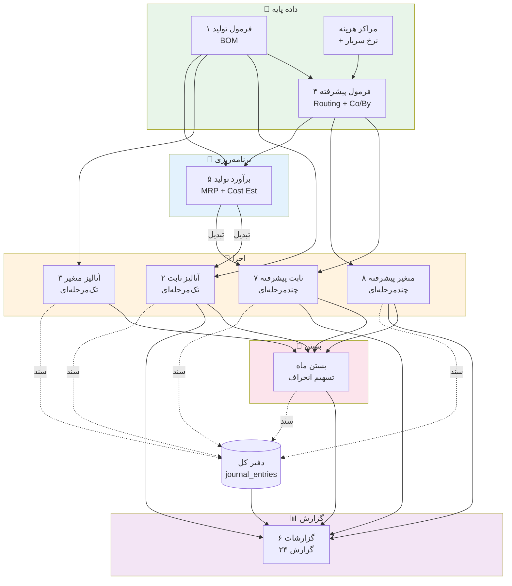
```mermaid
flowchart TB
    subgraph MD["📘 داده پایه"]
        M1["۱ فرمول تولید<br/>BOM"]
        M4["۴ فرمول پیشرفته<br/>Routing + Co/By"]
        CC["مراکز هزینه<br/>+ نرخ سربار"]
        M1 --> M4
        CC --> M4
    end

    subgraph PL["📗 برنامه‌ریزی"]
        M5["۵ برآورد تولید<br/>MRP + Cost Est"]
    end

    subgraph EX["📙 اجرا"]
        M2["۲ آنالیز ثابت<br/>تک‌مرحله‌ای"]
        M3["۳ آنالیز متغیر<br/>تک‌مرحله‌ای"]
        M7["۷ ثابت پیشرفته<br/>چندمرحله‌ای"]
        M8["۸ متغیر پیشرفته<br/>چندمرحله‌ای"]
    end

    subgraph CL["📕 بستن"]
        PC["بستن ماه<br/>تسهیم انحراف"]
    end

    subgraph RP["📊 گزارش"]
        M6["۶ گزارشات<br/>۲۴ گزارش"]
    end

    M1 --> M2
    M1 --> M3
    M4 --> M7
    M4 --> M8
    M1 --> M5
    M4 --> M5
    M5 -->|تبدیل| M2
    M5 -->|تبدیل| M7
    M2 --> PC
    M3 --> PC
    M7 --> PC
    M8 --> PC
    PC --> M6
    M2 --> M6
    M7 --> M6
    M8 --> M6

    GL[("دفتر کل<br/>journal_entries")]
    M2 -.سند.-> GL
    M3 -.سند.-> GL
    M7 -.سند.-> GL
    M8 -.سند.-> GL
    PC -.سند.-> GL
    GL --> M6

    style MD fill:#e8f5e9
    style PL fill:#e3f2fd
    style EX fill:#fff3e0
    style CL fill:#fce4ec
    style RP fill:#f3e5f5
```

---

## ۲. چرخه کامل — از استعلام تا سود

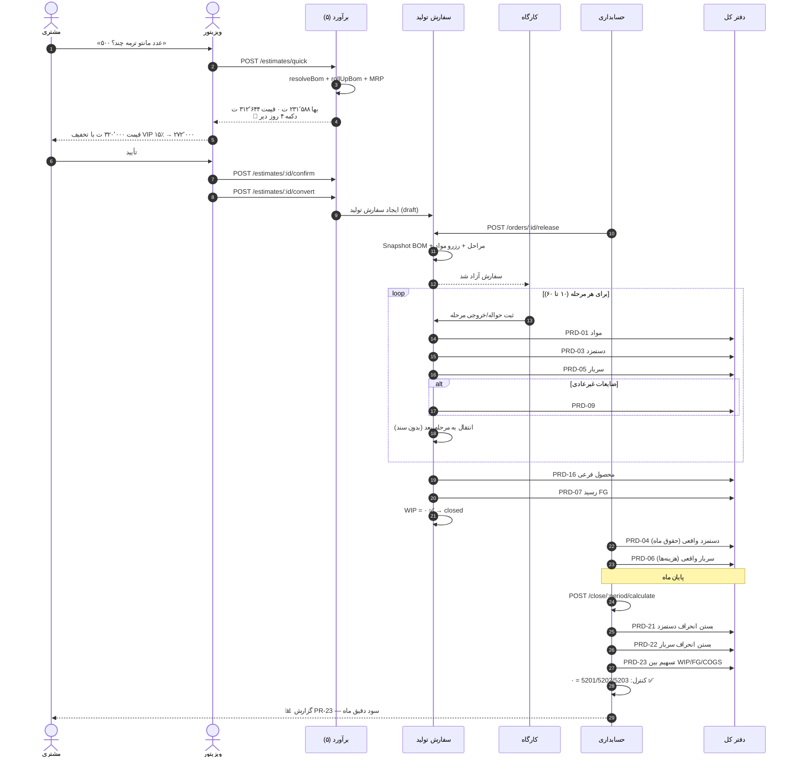
```mermaid
sequenceDiagram
    autonumber
    actor C as مشتری
    actor S as ویزیتور
    participant E as برآورد (۵)
    participant P as سفارش تولید
    participant W as کارگاه
    participant A as حسابداری
    participant G as دفتر کل

    C->>S: «۵۰۰ عدد مانتو ترمه چند؟»
    S->>E: POST /estimates/quick
    E->>E: resolveBom + rollUpBom + MRP
    E-->>S: بها ۲۳۱٬۵۸۸ ت · قیمت ۳۱۲٬۶۴۴ ت<br/>🔴 دکمه ۴ روز دیر
    S-->>C: قیمت ۳۲۰٬۰۰۰ ت با تخفیف VIP ۱۵٪ → ۲۷۲٬۰۰۰
    C->>S: تأیید
    S->>E: POST /estimates/:id/confirm
    S->>E: POST /estimates/:id/convert
    E->>P: ایجاد سفارش تولید (draft)

    A->>P: POST /orders/:id/release
    P->>P: Snapshot BOM + مراحل + رزرو مواد
    P-->>W: سفارش آزاد شد

    loop برای هر مرحله (۱۰ تا ۶۰)
        W->>P: ثبت حواله/خروجی مرحله
        P->>G: PRD-01 مواد
        P->>G: PRD-03 دستمزد
        P->>G: PRD-05 سربار
        alt ضایعات غیرعادی
            P->>G: PRD-09
        end
        P->>P: انتقال به مرحله بعد (بدون سند)
    end

    P->>G: PRD-16 محصول فرعی
    P->>G: PRD-07 رسید FG
    P->>P: WIP = ۰ ✅ → closed

    A->>G: PRD-04 دستمزد واقعی (حقوق ماه)
    A->>G: PRD-06 سربار واقعی (هزینه‌ها)

    Note over A,G: پایان ماه
    A->>A: POST /close/:period/calculate
    A->>G: PRD-21 بستن انحراف دستمزد
    A->>G: PRD-22 بستن انحراف سربار
    A->>G: PRD-23 تسهیم بین WIP/FG/COGS
    A->>A: کنترل: 5201/5202/5203 = ۰ ✅
    A-->>C: 📊 گزارش PR-23 — سود دقیق ماه
```

---

## ۳. چرخه حیات سفارش تولید

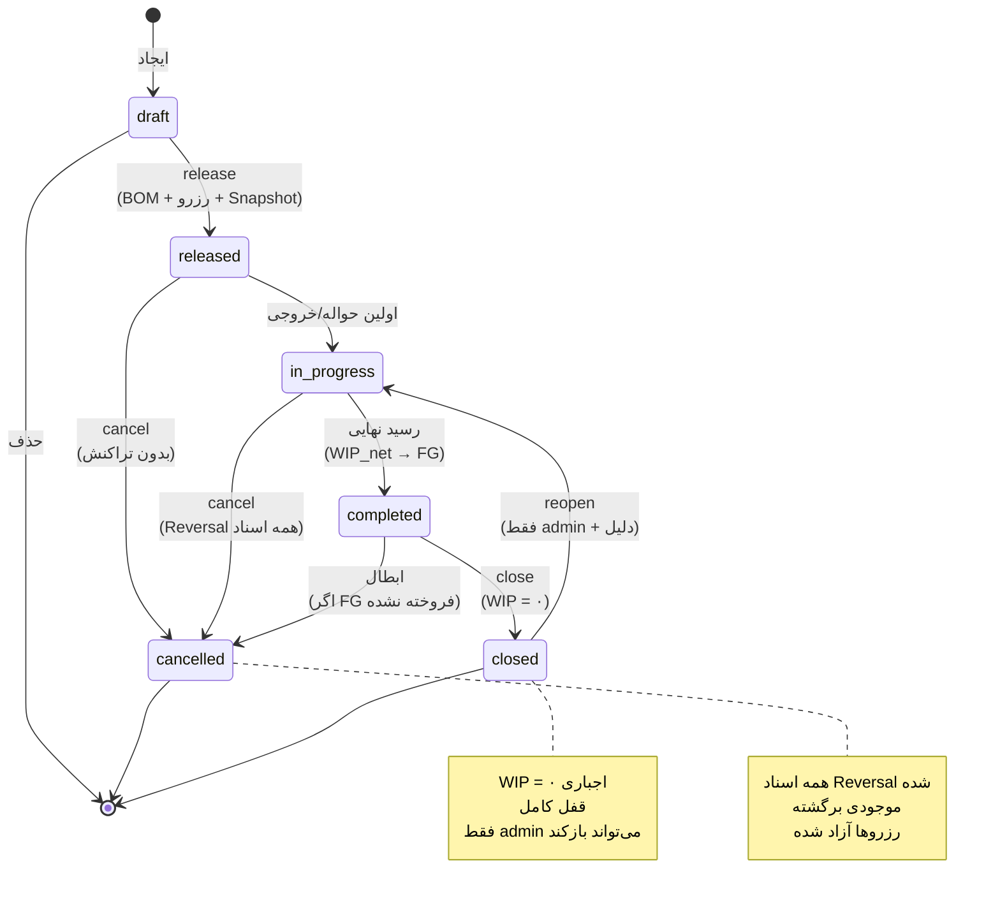
```mermaid
stateDiagram-v2
    [*] --> draft: ایجاد
    draft --> released: release<br/>(BOM + رزرو + Snapshot)
    draft --> [*]: حذف

    released --> in_progress: اولین حواله/خروجی
    released --> cancelled: cancel<br/>(بدون تراکنش)

    in_progress --> completed: رسید نهایی<br/>(WIP_net → FG)
    in_progress --> cancelled: cancel<br/>(Reversal همه اسناد)

    completed --> closed: close<br/>(WIP = ۰)
    completed --> cancelled: ابطال<br/>(اگر FG فروخته نشده)

    closed --> in_progress: reopen<br/>(فقط admin + دلیل)

    cancelled --> [*]
    closed --> [*]

    note right of closed
        WIP = ۰ اجباری
        قفل کامل
        فقط admin می‌تواند بازکند
    end note

    note right of cancelled
        همه اسناد Reversal شده
        موجودی برگشته
        رزروها آزاد شده
    end note
```

---

## ۴. چرخه حیات مرحله (ماژول ۷ و ۸)

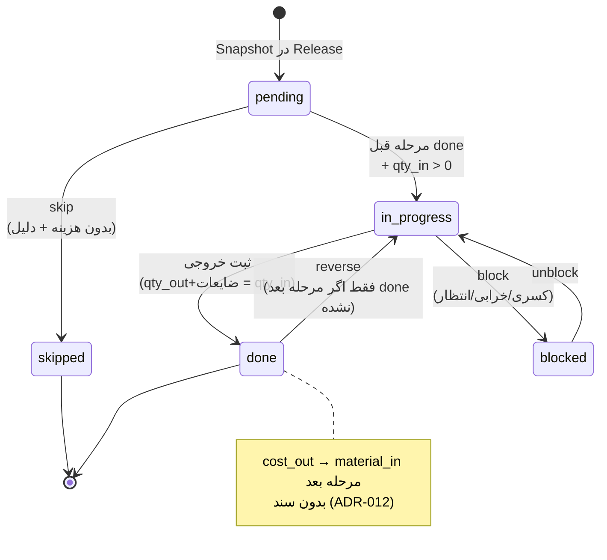
```mermaid
stateDiagram-v2
    [*] --> pending: Snapshot در Release
    pending --> in_progress: مرحله قبل done<br/>+ qty_in > 0
    pending --> skipped: skip<br/>(بدون هزینه + دلیل)

    in_progress --> done: ثبت خروجی<br/>(qty_out+ضایعات = qty_in)
    in_progress --> blocked: block<br/>(کسری/خرابی/انتظار)

    blocked --> in_progress: unblock

    done --> in_progress: reverse<br/>(فقط اگر مرحله بعد done نشده)

    skipped --> [*]
    done --> [*]

    note right of done
        cost_out → material_in مرحله بعد
        بدون سند (ADR-012)
    end note
```

---

## ۵. چرخه حیات فرمول (BOM)

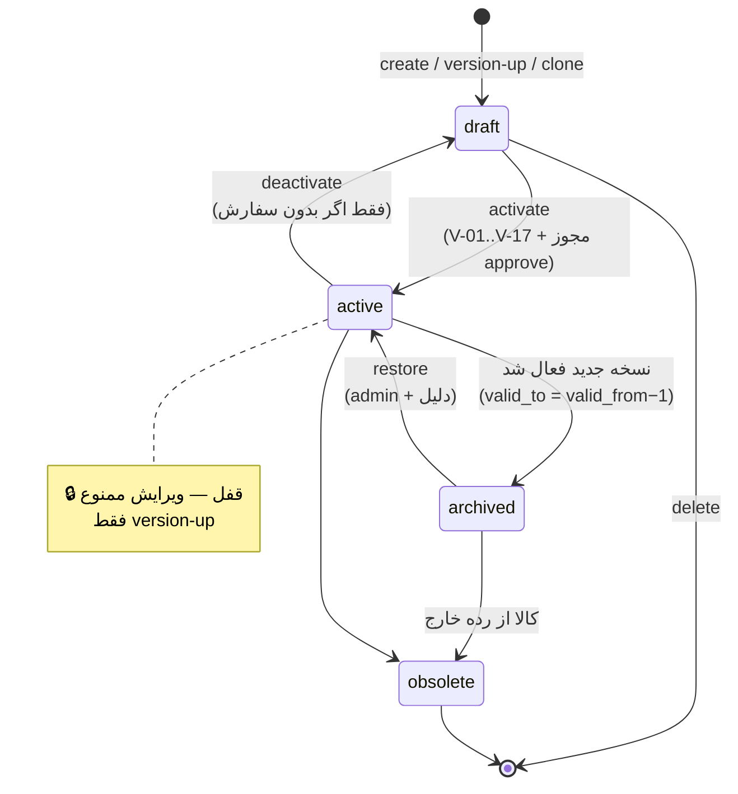
```mermaid
stateDiagram-v2
    [*] --> draft: create / version-up / clone
    draft --> active: activate<br/>(V-01..V-17 + مجوز approve)
    draft --> [*]: delete

    active --> archived: نسخه جدید فعال شد<br/>(valid_to = valid_from−1)
    active --> draft: deactivate<br/>(فقط اگر بدون سفارش)

    archived --> active: restore<br/>(admin + دلیل)
    archived --> obsolete: کالا از رده خارج
    active --> obsolete

    obsolete --> [*]

    note right of active
        🔒 قفل — ویرایش ممنوع
        فقط version-up
    end note
```

---

## ۶. Workflow ماژول ۲ — آنالیز ثابت (ساده‌ترین)

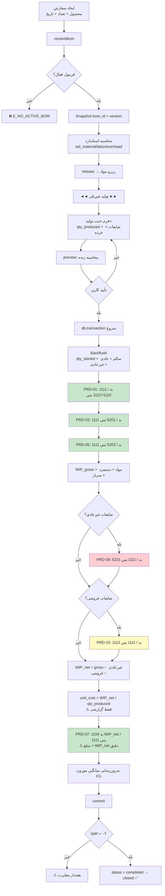
```mermaid
flowchart TD
    A[ایجاد سفارش<br/>محصول + تعداد + تاریخ] --> B[resolveBom]
    B --> C{فرمول فعال؟}
    C -->|خیر| D[❌ E_NO_ACTIVE_BOM]
    C -->|بله| E[Snapshot bom_id + version]
    E --> F[محاسبه استاندارد<br/>std_material/labor/overhead]
    F --> G[release → رزرو مواد]
    G --> H[◄◄ تولید فیزیکی ►►]
    H --> I["فرم «ثبت تولید»<br/>qty_produced + ضایعات + خرده"]
    I --> J[preview: محاسبه زنده]
    J --> K{تأیید کاربر}
    K -->|خیر| I
    K -->|بله| L[db.transaction شروع]

    L --> M["Backflush<br/>qty_started = سالم + عادی + غیرعادی"]
    M --> N[PRD-01: 1111 بد / 1110+1112 بس]
    N --> O[PRD-03: 1111 بد / 5201 بس]
    O --> P[PRD-05: 1111 بد / 5203 بس]
    P --> Q["WIP_gross = مواد + دستمزد + سربار"]
    Q --> R{ضایعات غیرعادی؟}
    R -->|بله| S[PRD-09: 5221 بد / 1111 بس]
    R -->|خیر| T
    S --> T{ضایعات فروشی؟}
    T -->|بله| U[PRD-10: 1113 بد / 1111 بس]
    T -->|خیر| V
    U --> V["WIP_net = gross − غیرعادی − فروشی"]
    V --> W["unit_cost = WIP_net / qty_produced<br/>⚠️ فقط گزارشی"]
    W --> X["PRD-07: 1104 بد WIP_net / 1111 بس<br/>⚠️ مبلغ = WIP_net دقیق"]
    X --> Y[به‌روزرسانی میانگین موزون FG]
    Y --> Z[commit]
    Z --> AA{WIP = ۰؟}
    AA -->|خیر| AB[⚠️ هشدار مغایرت]
    AA -->|بله| AC[status = completed → closed ✅]

    style N fill:#c8e6c9
    style O fill:#c8e6c9
    style P fill:#c8e6c9
    style S fill:#ffcdd2
    style U fill:#fff9c4
    style X fill:#c8e6c9
```

---

## ۷. Workflow ماژول ۳ — آنالیز متغیر

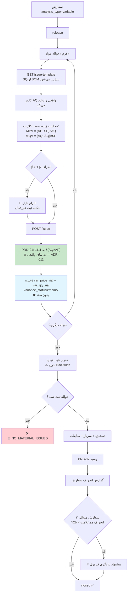
```mermaid
flowchart TD
    A[سفارش analysis_type=variable] --> B[release]
    B --> C["فرم «حواله مواد»"]
    C --> D[GET issue-template<br/>SQ از BOM پیش‌پر می‌شود]
    D --> E[کاربر AQ واقعی را وارد می‌کند]
    E --> F["محاسبه زنده سمت کلاینت:<br/>MPV = (AP−SP)×AQ<br/>MQV = (AQ−SQ)×SP"]
    F --> G{"|انحراف٪| > ۵؟"}
    G -->|بله| H[🔴 الزام دلیل<br/>دکمه ثبت غیرفعال]
    H --> I
    G -->|خیر| I[POST /issue]
    I --> J["PRD-01: 1111 بد Σ(AQ×AP)<br/>⚠️ به بهای واقعی — ADR-011"]
    J --> K["ذخیره var_price_rial + var_qty_rial<br/>variance_status='memo'<br/>⛔ بدون سند"]
    K --> L{حواله دیگری؟}
    L -->|بله| C
    L -->|خیر| M["فرم «ثبت تولید»<br/>⚠️ بدون Backflush"]
    M --> N{حواله ثبت شده؟}
    N -->|خیر| O[❌ E_NO_MATERIAL_ISSUED]
    N -->|بله| P[دستمزد + سربار + ضایعات]
    P --> Q[PRD-07 رسید]
    Q --> R[گزارش انحراف سفارش]
    R --> S{"۳ سفارش متوالی<br/>انحراف هم‌علامت > ۵٪؟"}
    S -->|بله| T[💡 پیشنهاد بازنگری فرمول]
    S -->|خیر| U[closed ✅]
    T --> U

    style J fill:#c8e6c9
    style K fill:#e1f5fe
    style O fill:#ffcdd2
```

---

## ۸. Workflow ماژول ۷ — چندمرحله‌ای

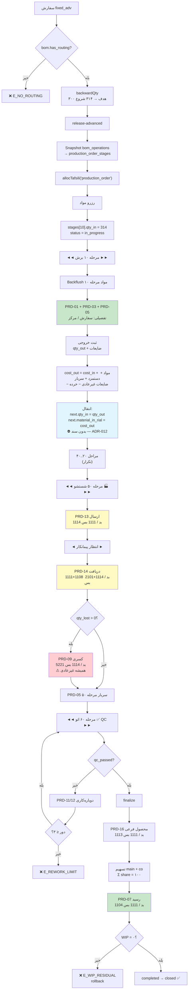
```mermaid
flowchart TD
    A[سفارش fixed_adv] --> B{bom.has_routing?}
    B -->|خیر| C[❌ E_NO_ROUTING]
    B -->|بله| D["backwardQty<br/>۳۰۰ هدف → ۳۱۴ شروع"]
    D --> E[release-advanced]
    E --> F["Snapshot bom_operations<br/>→ production_order_stages"]
    F --> G["allocTafsili('production_order')"]
    G --> H[رزرو مواد]
    H --> I["stages[10].qty_in = 314<br/>status = in_progress"]

    I --> J["◄◄ مرحله ۱۰ برش ►►"]
    J --> K[Backflush مواد مرحله ۱۰]
    K --> L["PRD-01 + PRD-03 + PRD-05<br/>تفصیلی: سفارش / مرکز"]
    L --> M["ثبت خروجی<br/>qty_out + ضایعات"]
    M --> N["cost_out = cost_in + مواد + دستمزد + سربار<br/>− ضایعات غیرعادی − خرده"]
    N --> O["انتقال:<br/>next.qty_in = qty_out<br/>next.material_in_rial = cost_out<br/>⛔ بدون سند — ADR-012"]

    O --> P["مراحل ۲۰..۴۰<br/>(تکرار)"]

    P --> Q["◄◄ مرحله ۵۰ شستشو 🏭 ►►"]
    Q --> R["PRD-13 ارسال<br/>1114 بد / 1111 بس"]
    R --> S["◄ انتظار پیمانکار ►"]
    S --> T["PRD-14 دریافت<br/>1111+1108 بد / 1114+2101 بس"]
    T --> U{qty_lost > 0؟}
    U -->|بله| V["PRD-09 کسری<br/>5221 بد / 1114 بس<br/>⚠️ همیشه غیرعادی"]
    U -->|خیر| W
    V --> W["PRD-05 سربار مرحله ۵۰"]

    W --> X["◄◄ مرحله ۶۰ اتو ✅ QC ►►"]
    X --> Y{qc_passed?}
    Y -->|خیر| Z["PRD-11/12 دوباره‌کاری"]
    Z --> AA{"دور ≤ ۳؟"}
    AA -->|بله| X
    AA -->|خیر| AB[❌ E_REWORK_LIMIT]
    Y -->|بله| AC[finalize]

    AC --> AD["PRD-16 محصول فرعی<br/>1113 بد / 1111 بس"]
    AD --> AE["تسهیم main + co<br/>Σ share = ۱۰۰"]
    AE --> AF["PRD-07 رسید<br/>1104 بد / 1111 بس"]
    AF --> AG{"WIP = ۰؟"}
    AG -->|خیر| AH[❌ E_WIP_RESIDUAL<br/>rollback]
    AG -->|بله| AI[completed → closed ✅]

    style L fill:#c8e6c9
    style O fill:#e1f5fe
    style R fill:#fff9c4
    style T fill:#fff9c4
    style V fill:#ffcdd2
    style AF fill:#c8e6c9
```

---

## ۹. Workflow ماژول ۸ — چندمرحله‌ای با انحراف

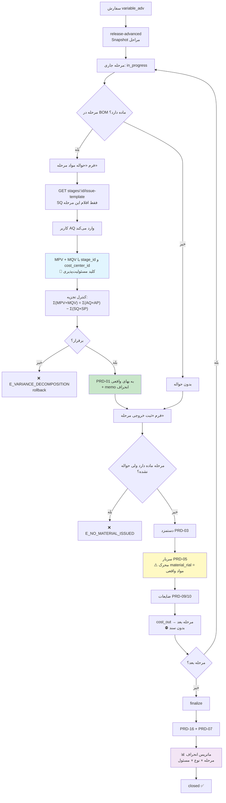
```mermaid
flowchart TD
    A[سفارش variable_adv] --> B[release-advanced<br/>Snapshot مراحل]
    B --> C[مرحله جاری: in_progress]
    C --> D{مرحله در BOM ماده دارد؟}

    D -->|بله| E["فرم «حواله مواد مرحله»"]
    E --> F["GET stages/:id/issue-template<br/>SQ فقط اقلام این مرحله"]
    F --> G[کاربر AQ وارد می‌کند]
    G --> H["MPV + MQV با stage_id و cost_center_id<br/>🔑 کلید مسئولیت‌پذیری"]
    H --> I["کنترل تجزیه:<br/>Σ(MPV+MQV) = Σ(AQ×AP) − Σ(SQ×SP)"]
    I --> J{برقرار؟}
    J -->|خیر| K[❌ E_VARIANCE_DECOMPOSITION<br/>rollback]
    J -->|بله| L["PRD-01 به بهای واقعی<br/>+ memo انحراف"]

    D -->|خیر| M[بدون حواله]
    L --> N["فرم «ثبت خروجی مرحله»"]
    M --> N

    N --> O{مرحله ماده دارد ولی حواله نشده؟}
    O -->|بله| P[❌ E_NO_MATERIAL_ISSUED]
    O -->|خیر| Q["دستمزد PRD-03"]
    Q --> R["سربار PRD-05<br/>⚠️ محرک material_rial = مواد واقعی"]
    R --> S["ضایعات PRD-09/10"]
    S --> T["cost_out → مرحله بعد<br/>⛔ بدون سند"]
    T --> U{مرحله بعد؟}
    U -->|بله| C
    U -->|خیر| V[finalize]
    V --> W[PRD-16 + PRD-07]
    W --> X["📊 ماتریس انحراف<br/>مرحله × نوع × مسئول"]
    X --> Y[closed ✅]

    style H fill:#e1f5fe
    style L fill:#c8e6c9
    style R fill:#fff9c4
    style X fill:#f3e5f5
```

---

## ۱۰. Workflow بستن ماه ⭐

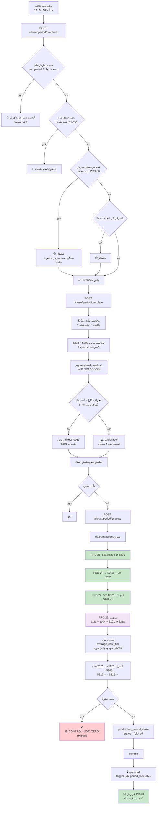
```mermaid
flowchart TD
    A["پایان ماه جلالی<br/>مثلاً ۱۴۰۵/۰۴/۳۱"] --> B[POST /close/:period/precheck]

    B --> C{"همه سفارش‌های<br/>completed بسته شده‌اند؟"}
    C -->|خیر| D[🔴 لیست سفارش‌های باز<br/>«ابتدا ببندید»]
    C -->|بله| E{"همه حقوق ماه<br/>ثبت شده؟ PRD-04"}
    E -->|خیر| F[🔴 «حقوق ثبت نشده»]
    E -->|بله| G{"همه هزینه‌های سربار<br/>ثبت شده؟ PRD-06"}
    G -->|خیر| H[🟡 هشدار<br/>«ممکن است سربار ناقص باشد»]
    G -->|بله| I{"انبارگردانی انجام شده؟"}
    I -->|خیر| J[🟡 هشدار]
    I -->|بله| K[✅ Precheck پاس]
    H --> K
    J --> K

    K --> L[POST /close/:period/calculate]
    L --> M["محاسبه مانده 5201<br/>= واقعی − جذب‌شده"]
    M --> N["محاسبه مانده 5202 − 5203<br/>= کسر/اضافه جذب"]
    N --> O["محاسبه پایه‌های تسهیم:<br/>WIP / FG / COGS"]
    O --> P{"|انحراف کل| < آستانه؟<br/>(۰.۵٪ بهای تولید)"}
    P -->|بله| Q["روش: direct_cogs<br/>همه به 5101"]
    P -->|خیر| R["روش: proration<br/>تسهیم بین ۳ سطل"]

    Q --> S[نمایش پیش‌نمایش اسناد]
    R --> S
    S --> T{تأیید مدیر؟}
    T -->|خیر| U[لغو]
    T -->|بله| V[POST /close/:period/execute]

    V --> W[db.transaction شروع]
    W --> X["PRD-21: 5212/5213 ⇄ 5201"]
    X --> Y["PRD-22 گام ۱: 5203 → 5202"]
    Y --> Z["PRD-22 گام ۲: 5214/5215 ⇄ 5202"]
    Z --> AA["PRD-23: تسهیم<br/>1111 + 1104 + 5101 ⇄ 521x"]
    AA --> AB["به‌روزرسانی average_cost_rial<br/>کالاهای موجود پایان دوره"]
    AB --> AC["کنترل: 5201=۰ · 5202=۰ · 5203=۰<br/>5212=۰ · 5215=۰"]
    AC --> AD{همه صفر؟}
    AD -->|خیر| AE[❌ E_CONTROL_NOT_ZERO<br/>rollback]
    AD -->|بله| AF["production_period_close<br/>status = 'closed'"]
    AF --> AG[commit]
    AG --> AH["🔒 قفل دوره<br/>trigger های period_lock فعال"]
    AH --> AI["📊 گزارش PR-23<br/>سود دقیق ماه ✅"]

    style X fill:#c8e6c9
    style Y fill:#c8e6c9
    style Z fill:#c8e6c9
    style AA fill:#f3e5f5
    style AE fill:#ffcdd2
    style AI fill:#c8e6c9
```

---

## ۱۱. Workflow ابطال (Reversal)

```mermaid
flowchart TD
    A[درخواست ابطال سفارش] --> B{status?}
    B -->|draft| C[حذف مستقیم ✅]
    B -->|released بدون تراکنش| D[cancel + آزادسازی رزرو ✅]
    B -->|closed| E{admin?}
    E -->|خیر| F[❌ E_ORDER_CLOSED]
    E -->|بله| G[reopen + دلیل + audit]
    B -->|in_progress / completed| H

    G --> H{دوره باز؟}
    H -->|خیر| I[❌ E_PERIOD_CLOSED<br/>ابتدا reopen-period]
    H -->|بله| J{FG فروخته شده؟}
    J -->|بله| K[❌ E_FG_SOLD<br/>ابتدا برگشت فروش]
    J -->|خیر| L{کالا نزد پیمانکار؟}
    L -->|بله| M[❌ E_SUBCON_IN_TRANSIT<br/>ابتدا دریافت]
    L -->|خیر| N[db.transaction شروع]

    N --> O["ترتیب معکوس ثبت:"]
    O --> P["۱) PRD-07 رسید FG<br/>موجودی + میانگین از snapshot"]
    P --> Q["۲) PRD-16 محصول فرعی"]
    Q --> R["۳) PRD-10 ضایعات فروشی"]
    R --> S["۴) PRD-09 ضایعات غیرعادی"]
    S --> T["۵) PRD-05 سربار"]
    T --> U["۶) PRD-03 دستمزد"]
    U --> V["۷) PRD-14 دریافت پیمانکار"]
    V --> W["۸) PRD-13 ارسال پیمانکار"]
    W --> X["۹) PRD-01 حواله مواد<br/>موجودی برگردد"]
    X --> Y[۱۰) آزادسازی رزروها]
    Y --> Z["status = 'cancelled'<br/>cancelled_reason"]
    Z --> AA[commit]
    AA --> AB{"WIP = ۰؟<br/>موجودی = حالت اول؟"}
    AB -->|خیر| AC[❌ rollback + هشدار]
    AB -->|بله| AD[✅ ابطال کامل]

    style P fill:#ffcdd2
    style X fill:#ffcdd2
    style AD fill:#c8e6c9
```

**در حالت چندمرحله‌ای:** ترتیب از **آخرین مرحله به اولین** — هر مرحله کامل Reversal شود، بعد مرحله قبلی.

---

## ۱۲. Workflow جذب سربار

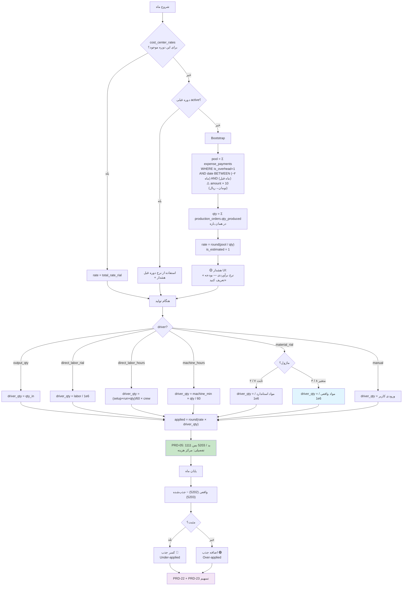
```mermaid
flowchart TD
    A["شروع ماه"] --> B{"cost_center_rates<br/>برای این دوره موجود؟"}
    B -->|بله| C["rate = total_rate_rial"]
    B -->|خیر| D{"دوره قبلی active؟"}
    D -->|بله| E["استفاده از نرخ دوره قبل<br/>+ هشدار"]
    D -->|خیر| F["Bootstrap"]

    F --> G["pool = Σ expense_payments<br/>WHERE is_overhead=1<br/>AND date BETWEEN (−۳ ماه) AND (ماه قبل)<br/>⚠️ amount × 10 (تومان→ریال)"]
    G --> H["qty = Σ production_orders.qty_produced<br/>در همان بازه"]
    H --> I["rate = round(pool / qty)<br/>is_estimated = 1"]
    I --> J["🟡 هشدار UI:<br/>«نرخ برآوردی — بودجه تعریف کنید»"]

    C --> K
    E --> K
    J --> K["هنگام تولید"]

    K --> L{"driver?"}
    L -->|output_qty| M["driver_qty = qty_in"]
    L -->|direct_labor_rial| N["driver_qty = labor / 1e6"]
    L -->|direct_labor_hours| O["driver_qty = (setup+run×qty)/60 × crew"]
    L -->|machine_hours| P["driver_qty = machine_min × qty / 60"]
    L -->|material_rial| Q{"ماژول؟"}
    Q -->|۲ / ۷ ثابت| R["driver_qty = مواد استاندارد / 1e6"]
    Q -->|۳ / ۸ متغیر| S["driver_qty = مواد واقعی / 1e6"]
    L -->|manual| T["driver_qty = ورودی کاربر"]

    M --> U
    N --> U
    O --> U
    P --> U
    R --> U
    S --> U
    T --> U["applied = round(rate × driver_qty)"]
    U --> V["PRD-05: 1111 بد / 5203 بس<br/>تفصیلی: مرکز هزینه"]

    V --> W["پایان ماه"]
    W --> X["واقعی (5202) − جذب‌شده (5203)"]
    X --> Y{"مثبت؟"}
    Y -->|بله| Z["کسر جذب 🔴<br/>Under-applied"]
    Y -->|خیر| AA["اضافه جذب 🟢<br/>Over-applied"]
    Z --> AB["PRD-22 + PRD-23 تسهیم"]
    AA --> AB

    style S fill:#e1f5fe
    style V fill:#c8e6c9
    style AB fill:#f3e5f5
```

---

## ۱۳. Workflow دستمزد (۴ روش)

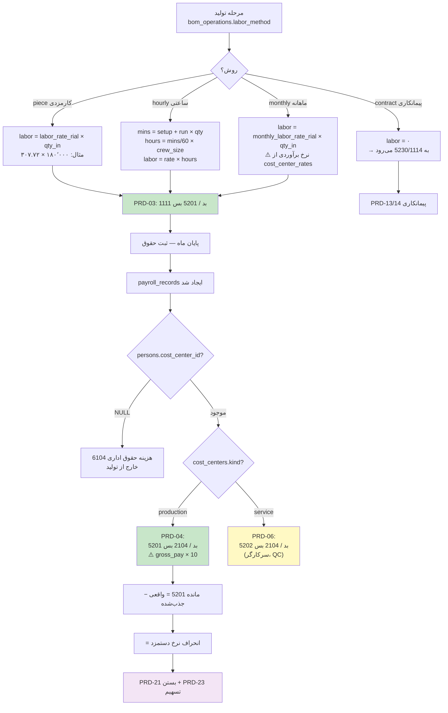
```mermaid
flowchart TD
    A["مرحله تولید<br/>bom_operations.labor_method"] --> B{روش؟}

    B -->|piece کارمزدی| C["labor = labor_rate_rial × qty_in<br/>مثال: ۱۸۰٬۰۰۰ × ۳۰۷.۷۲"]
    B -->|hourly ساعتی| D["mins = setup + run × qty<br/>hours = mins/60 × crew_size<br/>labor = rate × hours"]
    B -->|monthly ماهانه| E["labor = monthly_labor_rate_rial × qty_in<br/>⚠️ نرخ برآوردی از cost_center_rates"]
    B -->|contract پیمانکاری| F["labor = ۰<br/>→ به 5230/1114 می‌رود"]

    C --> G["PRD-03: 1111 بد / 5201 بس"]
    D --> G
    E --> G
    F --> H["PRD-13/14 پیمانکاری"]

    G --> I["پایان ماه — ثبت حقوق"]
    I --> J["payroll_records ایجاد شد"]
    J --> K{"persons.cost_center_id?"}
    K -->|NULL| L["6104 هزینه حقوق اداری<br/>خارج از تولید"]
    K -->|موجود| M{"cost_centers.kind?"}
    M -->|production| N["PRD-04:<br/>5201 بد / 2104 بس<br/>⚠️ gross_pay × 10"]
    M -->|service| O["PRD-06:<br/>5202 بد / 2104 بس<br/>(سرکارگر، QC)"]

    N --> P["مانده 5201 = واقعی − جذب‌شده"]
    P --> Q["= انحراف نرخ دستمزد"]
    Q --> R["PRD-21 بستن + PRD-23 تسهیم"]

    style G fill:#c8e6c9
    style N fill:#c8e6c9
    style O fill:#fff9c4
    style R fill:#f3e5f5
```

---

## ۱۴. Workflow ضایعات (۴ نوع)

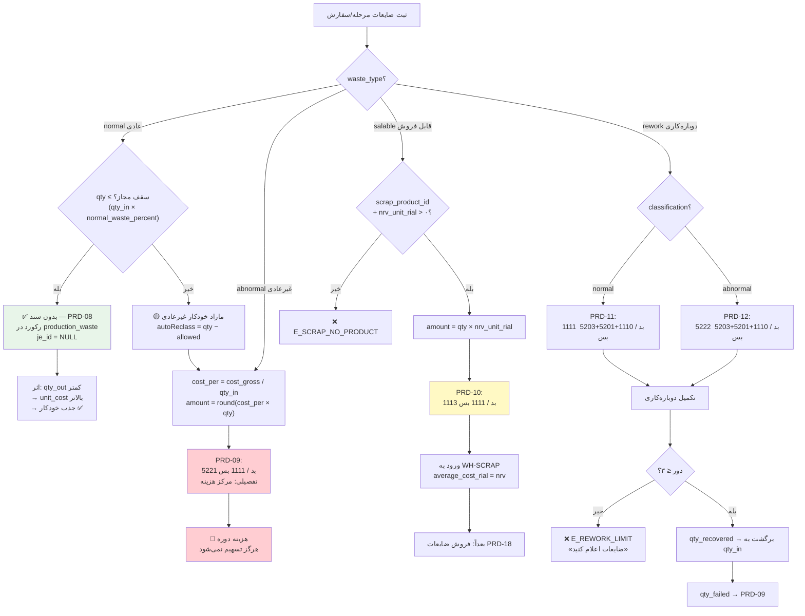
```mermaid
flowchart TD
    A["ثبت ضایعات مرحله/سفارش"] --> B{"waste_type؟"}

    B -->|normal عادی| C{"qty ≤ سقف مجاز؟<br/>(qty_in × normal_waste_percent)"}
    C -->|بله| D["✅ بدون سند — PRD-08<br/>رکورد در production_waste<br/>je_id = NULL"]
    C -->|خیر| E["🟡 مازاد خودکار غیرعادی<br/>autoReclass = qty − allowed"]
    E --> F

    B -->|abnormal غیرعادی| F["cost_per = cost_gross / qty_in<br/>amount = round(cost_per × qty)"]
    F --> G["PRD-09:<br/>5221 بد / 1111 بس<br/>تفصیلی: مرکز هزینه"]
    G --> H["🔴 هزینه دوره<br/>هرگز تسهیم نمی‌شود"]

    B -->|salable قابل فروش| I{"scrap_product_id<br/>+ nrv_unit_rial > ۰؟"}
    I -->|خیر| J["❌ E_SCRAP_NO_PRODUCT"]
    I -->|بله| K["amount = qty × nrv_unit_rial"]
    K --> L["PRD-10:<br/>1113 بد / 1111 بس"]
    L --> M["ورود به WH-SCRAP<br/>average_cost_rial = nrv"]
    M --> N["بعداً: فروش ضایعات PRD-18"]

    B -->|rework دوباره‌کاری| O{"classification؟"}
    O -->|normal| P["PRD-11:<br/>1111 بد / 1110+5201+5203 بس"]
    O -->|abnormal| Q["PRD-12:<br/>5222 بد / 1110+5201+5203 بس"]
    P --> R["تکمیل دوباره‌کاری"]
    Q --> R
    R --> S{"دور ≤ ۳؟"}
    S -->|خیر| T["❌ E_REWORK_LIMIT<br/>«ضایعات اعلام کنید»"]
    S -->|بله| U["qty_recovered → برگشت به qty_in"]
    U --> V["qty_failed → PRD-09"]

    D --> W["اثر: qty_out کمتر<br/>→ unit_cost بالاتر<br/>→ جذب خودکار ✅"]

    style D fill:#e8f5e9
    style G fill:#ffcdd2
    style L fill:#fff9c4
    style H fill:#ffcdd2
```

---

## ۱۵. Workflow پیمانکاری (شستشو)

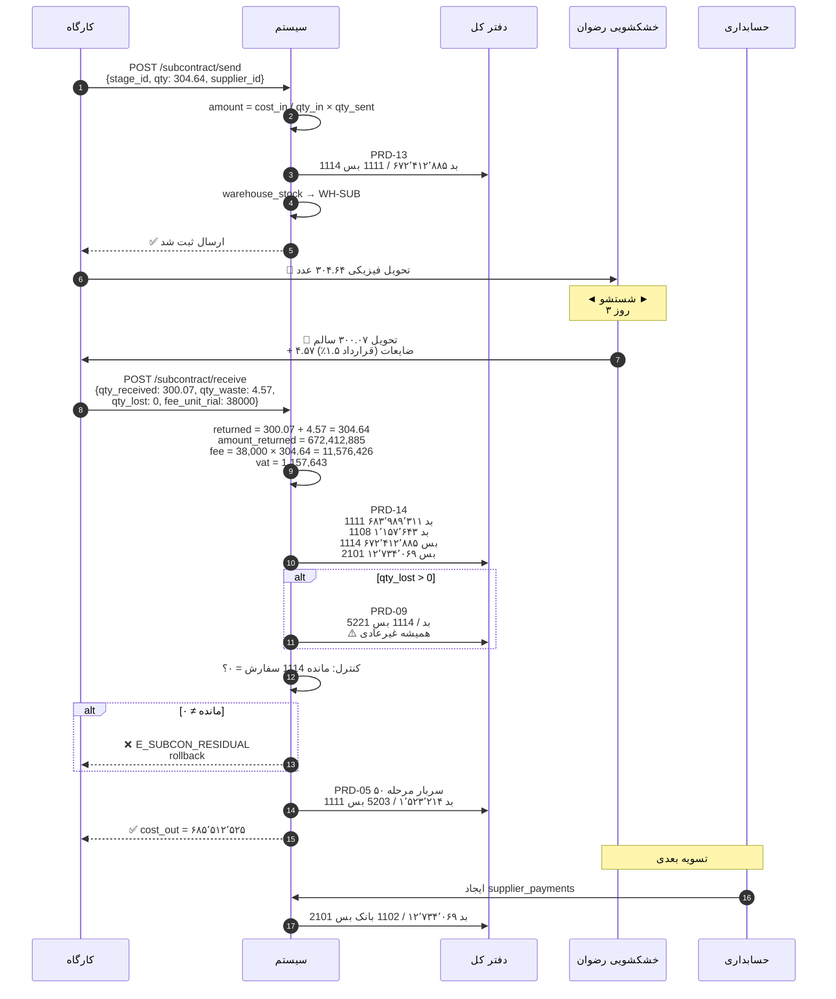
```mermaid
sequenceDiagram
    autonumber
    participant W as کارگاه
    participant S as سیستم
    participant G as دفتر کل
    participant C as خشکشویی رضوان
    participant A as حسابداری

    W->>S: POST /subcontract/send<br/>{stage_id, qty: 304.64, supplier_id}
    S->>S: amount = cost_in / qty_in × qty_sent
    S->>G: PRD-13<br/>1114 بد ۶۷۲٬۴۱۲٬۸۸۵ / 1111 بس
    S->>S: warehouse_stock → WH-SUB
    S-->>W: ✅ ارسال ثبت شد
    W->>C: 🚚 تحویل فیزیکی ۳۰۴.۶۴ عدد

    Note over C: ◄ شستشو ►<br/>۳ روز

    C->>W: 🚚 تحویل ۳۰۰.۰۷ سالم<br/>+ ۴.۵۷ ضایعات (قرارداد ۱.۵٪)
    W->>S: POST /subcontract/receive<br/>{qty_received: 300.07, qty_waste: 4.57,<br/> qty_lost: 0, fee_unit_rial: 38000}

    S->>S: returned = 300.07 + 4.57 = 304.64<br/>amount_returned = 672,412,885<br/>fee = 38,000 × 304.64 = 11,576,426<br/>vat = 1,157,643
    S->>G: PRD-14<br/>1111 بد ۶۸۳٬۹۸۹٬۳۱۱<br/>1108 بد ۱٬۱۵۷٬۶۴۳<br/>1114 بس ۶۷۲٬۴۱۲٬۸۸۵<br/>2101 بس ۱۲٬۷۳۴٬۰۶۹

    alt qty_lost > 0
        S->>G: PRD-09<br/>5221 بد / 1114 بس<br/>⚠️ همیشه غیرعادی
    end

    S->>S: کنترل: مانده 1114 سفارش = ۰؟
    alt مانده ≠ ۰
        S-->>W: ❌ E_SUBCON_RESIDUAL<br/>rollback
    end

    S->>G: PRD-05 سربار مرحله ۵۰<br/>1111 بد ۱٬۵۲۳٬۲۱۴ / 5203 بس
    S-->>W: ✅ cost_out = ۶۸۵٬۵۱۲٬۵۲۵

    Note over A,C: تسویه بعدی
    A->>S: ایجاد supplier_payments
    S->>G: 2101 بد ۱۲٬۷۳۴٬۰۶۹ / 1102 بانک بس
```

---

## ۱۶. Workflow MRP

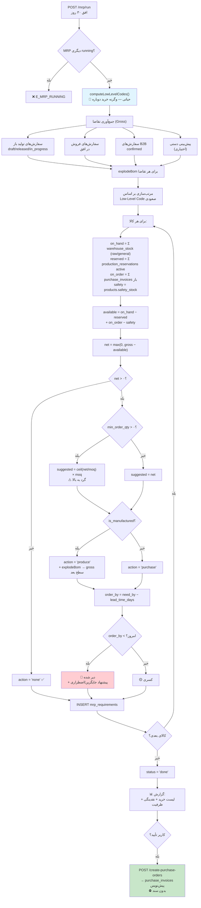
```mermaid
flowchart TD
    A[POST /mrp/run<br/>افق ۳۰ روز] --> B{"MRP دیگری running؟"}
    B -->|بله| C[❌ E_MRP_RUNNING]
    B -->|خیر| D["computeLowLevelCodes()<br/>🔑 حیاتی — وگرنه خرید دوباره"]

    D --> E["جمع‌آوری تقاضا (Gross)"]
    E --> F["سفارش‌های تولید باز<br/>draft/released/in_progress"]
    E --> G["سفارش‌های فروش<br/>در افق"]
    E --> H["سفارش‌های B2B<br/>confirmed"]
    E --> I["پیش‌بینی دستی<br/>(اختیاری)"]

    F --> J["explodeBom برای هر تقاضا"]
    G --> J
    H --> J
    I --> J

    J --> K["مرتب‌سازی بر اساس<br/>Low-Level Code صعودی"]
    K --> L["برای هر کالا:"]
    L --> M["on_hand = Σ warehouse_stock (raw/general)<br/>reserved = Σ production_reservations active<br/>on_order = Σ purchase_invoices باز<br/>safety = products.safety_stock"]
    M --> N["available = on_hand − reserved<br/>+ on_order − safety"]
    N --> O["net = max(0, gross − available)"]
    O --> P{"net > ۰؟"}
    P -->|خیر| Q["action = 'none' ✅"]
    P -->|بله| R{"min_order_qty > ۰؟"}
    R -->|بله| S["suggested = ceil(net/moq) × moq<br/>⚠️ گرد به بالا"]
    R -->|خیر| T["suggested = net"]
    S --> U
    T --> U{"is_manufactured؟"}
    U -->|بله| V["action = 'produce'<br/>+ explodeBom → gross سطح بعد"]
    U -->|خیر| W["action = 'purchase'"]

    V --> X
    W --> X["order_by = need_by − lead_time_days"]
    X --> Y{"order_by < امروز؟"}
    Y -->|بله| Z["🔴 دیر شده<br/>+ پیشنهاد جایگزین/اضطراری"]
    Y -->|خیر| AA["🟡 کسری"]

    Q --> AB
    Z --> AB
    AA --> AB["INSERT mrp_requirements"]
    AB --> AC{"کالای بعدی؟"}
    AC -->|بله| L
    AC -->|خیر| AD["status = 'done'"]
    AD --> AE["📊 گزارش:<br/>لیست خرید + نقدینگی + ظرفیت"]
    AE --> AF{"کاربر تأیید؟"}
    AF -->|بله| AG["POST /create-purchase-orders<br/>→ purchase_invoices پیش‌نویس<br/>⛔ بدون سند"]

    style D fill:#e1f5fe
    style Z fill:#ffcdd2
    style AG fill:#c8e6c9
```

---

## ۱۷. جریان ارزش (Value Flow) — نمای کلی

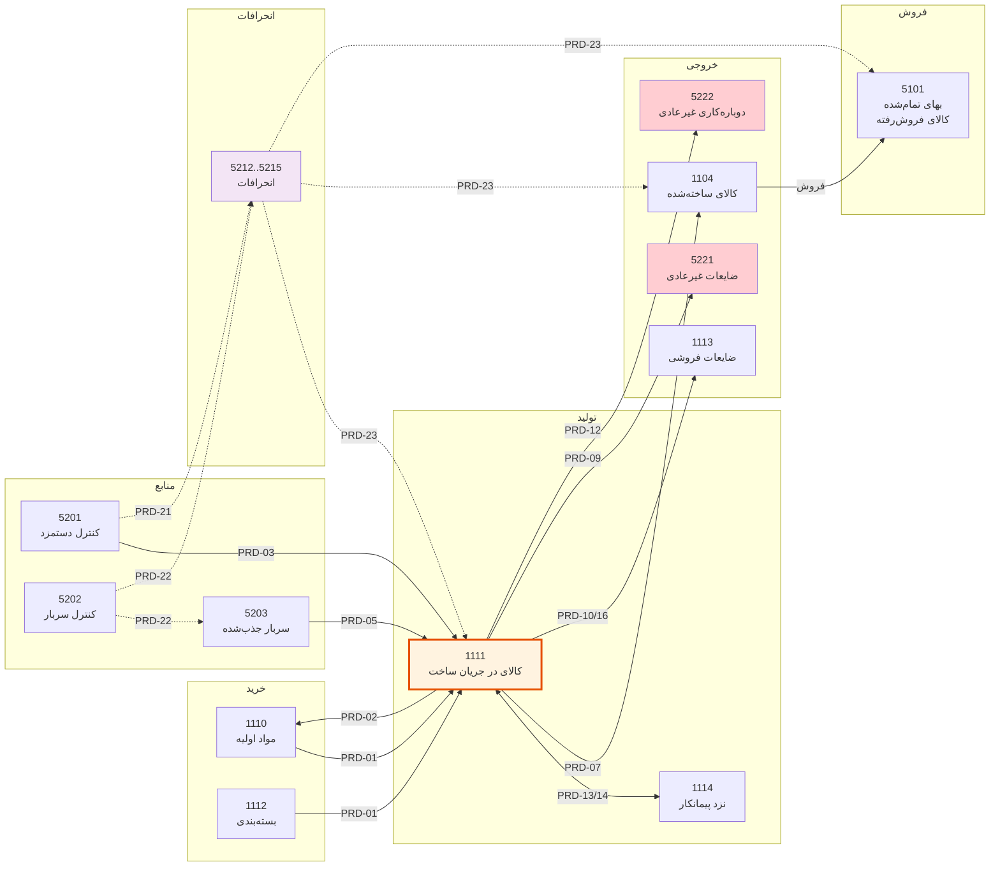
```mermaid
flowchart LR
    subgraph P["خرید"]
        RM["1110<br/>مواد اولیه"]
        PK["1112<br/>بسته‌بندی"]
    end

    subgraph L["منابع"]
        LC["5201<br/>کنترل دستمزد"]
        OC["5202<br/>کنترل سربار"]
        OA["5203<br/>سربار جذب‌شده"]
    end

    subgraph W["تولید"]
        WIP["1111<br/>کالای در جریان ساخت"]
        SUB["1114<br/>نزد پیمانکار"]
    end

    subgraph O["خروجی"]
        FG["1104<br/>کالای ساخته‌شده"]
        SC["1113<br/>ضایعات فروشی"]
        AB["5221<br/>ضایعات غیرعادی"]
        RW["5222<br/>دوباره‌کاری غیرعادی"]
    end

    subgraph S["فروش"]
        COGS["5101<br/>بهای تمام‌شده<br/>کالای فروش‌رفته"]
    end

    subgraph V["انحرافات"]
        VAR["5212..5215<br/>انحرافات"]
    end

    RM -->|PRD-01| WIP
    PK -->|PRD-01| WIP
    WIP -->|PRD-02| RM
    LC -->|PRD-03| WIP
    OA -->|PRD-05| WIP
    WIP <-->|PRD-13/14| SUB
    WIP -->|PRD-07| FG
    WIP -->|PRD-10/16| SC
    WIP -->|PRD-09| AB
    WIP -->|PRD-12| RW
    FG -->|فروش| COGS

    OC -.PRD-22.-> OA
    OC -.PRD-22.-> VAR
    LC -.PRD-21.-> VAR
    VAR -.PRD-23.-> WIP
    VAR -.PRD-23.-> FG
    VAR -.PRD-23.-> COGS

    style WIP fill:#fff3e0,stroke:#e65100,stroke-width:3px
    style AB fill:#ffcdd2
    style RW fill:#ffcdd2
    style VAR fill:#f3e5f5
```

---

## ۱۸. ماتریس تصمیم — کدام آنالیز؟

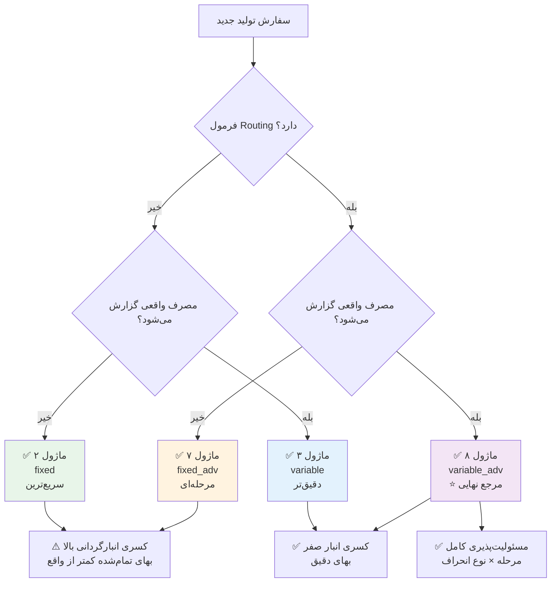
```mermaid
flowchart TD
    A["سفارش تولید جدید"] --> B{"فرمول Routing دارد؟"}
    B -->|خیر| C{"مصرف واقعی گزارش می‌شود؟"}
    B -->|بله| D{"مصرف واقعی گزارش می‌شود؟"}

    C -->|خیر| E["✅ ماژول ۲<br/>fixed<br/>سریع‌ترین"]
    C -->|بله| F["✅ ماژول ۳<br/>variable<br/>دقیق‌تر"]
    D -->|خیر| G["✅ ماژول ۷<br/>fixed_adv<br/>مرحله‌ای"]
    D -->|بله| H["✅ ماژول ۸<br/>variable_adv<br/>⭐ مرجع نهایی"]

    E --> I["⚠️ کسری انبارگردانی بالا<br/>بهای تمام‌شده کمتر از واقع"]
    G --> I
    F --> J["✅ کسری انبار صفر<br/>بهای دقیق"]
    H --> J
    H --> K["✅ مسئولیت‌پذیری کامل<br/>مرحله × نوع انحراف"]

    style E fill:#e8f5e9
    style F fill:#e3f2fd
    style G fill:#fff3e0
    style H fill:#f3e5f5
```

**مسیر توصیه‌شده برای ترنم:**
```
فاز ۱ (ماه ۱-۲):  ماژول ۲  → سیستم راه بیفتد، عادت شود
فاز ۲ (ماه ۳-۴):  ماژول ۷  → خط ۶ مرحله‌ای + پیمانکاری
فاز ۳ (ماه ۵+):   ماژول ۸  → وقتی برشکار گزارش دقیق می‌دهد ⭐
```
